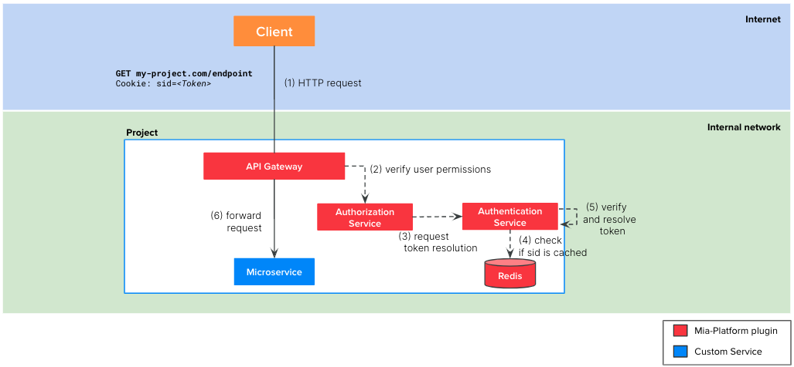

This scenario is very similar to the [Scenario 2](/console/tutorials/configure-marketplace-components/auth-architecture/external-idp.md), with only one difference: the use of the Mia-Platform Plugin JWT Token Validator instead of the custom authentication manager service.

## Definition

The [`JWT Token Validator`](/runtime_suite/jwt-token-validator/10_overview_and_usage.md) is a plugin available via the Mia-Platform Marketplace: it will be the one in charge of validating the JWT Token that the client has provided in the Request.



The involved microservices in the flow are:

1. `API Gateway`: Mia-Platform plugin available in [Nginx](/runtime_suite/api-gateway/10_overview.md) or [Envoy](/runtime_suite/envoy-api-gateway/overview.md)
2. [`Authorization Service`](/runtime_suite/authorization-service/10_overview.md): Mia-Platform Plugin
3. [`JWT Token Validator`](/runtime_suite/jwt-token-validator/10_overview_and_usage.md): Mia-Platform Plugin to validate the incoming JWT Token.
4. The microservice connected to the endpoint

The picture above illustrates the steps of the auth flow: these are the same described in the [Scenario 2](/console/tutorials/configure-marketplace-components/auth-architecture/external-idp.md#definition), with the only difference that the validation of the JWT Token is performed by the JWT Token Validator via the External Identity Provider configured.

## Tutorial steps

:::note
We suppose that you have already created an API Gateway in your project and you already have some endpoints you want to secure.
:::

In order to implement the flow depicted above, you can perform the following steps on Mia-Platform Console:

1. Create the [`Authorization Service`](/runtime_suite/authorization-service/10_overview.md) plugin from Marketplace

   - Click on `Microservices`
   - Click on `Create a Microservice` and select `From Markeplace`
   - Search `authorization` in the search bar
   - Select `Authorization Service`
   - Click on `Create`
   - Update the values of the following environment variables:

     | Variable                       | Value                                                                        |
     | ------------------------------ | ---------------------------------------------------------------------------- |
     | USERINFO_URL                   | http://jwt-token-validator/verify                                            |
     | CUSTOM_USER_ID_KEY             | appid                                                                        |
     | HEADERS_TO_PROXY               | <header of the client's request containing the token> (e.g. `Authorization`) |
     | AUTHORIZATION_HEADERS_TO_PROXY | <header of the client's request containing the token> (e.g. `Authorization`) |
     | USER_PROPERTIES_TO_PROXY       | miauserproperties                                                            |

2. Create the [`JWT Token Validator`](/runtime_suite/jwt-token-validator/10_overview_and_usage.md) plugin from Marketplace. The Environment variables of the Plugin are already set up correctly; the only thing that needs to be edited is the ConfigMap `issuer-config.json`. Following is an example with Azure Active Directory as Identity Provider:

```json
{
  "jwtConfig": [
    {
      "JWKSSignatureEndpoint": "https://login.windows.net/common/discovery/keys",
      "requiredClaims": "aud,iss,appid",
      "issuer": "https://sts.windows.net/{{ACTIVE-DIRECTORY-TENANT-ID}}/",
      "audience": ["{{CONFIGURED-AUDIENCE}}"]
    }
  ]
}
```

3. Secure the endpoint
   - Select the endpoint you want to secure in the `Endpoints` section of your project
   - In the Endpoint Settings section, click on the `Security` tab
   - Click on the checkbox next to `Authentication required` - this action will force the `API Gateway` to call the `Authorization Service` created before to check that the user that is calling the endpoint is using a valid authentication method. In particular, for our example, the Authorization Service will ask to the `JWT Token Validator` to check the JWT Token that the client is using in the `Authorization` header.
