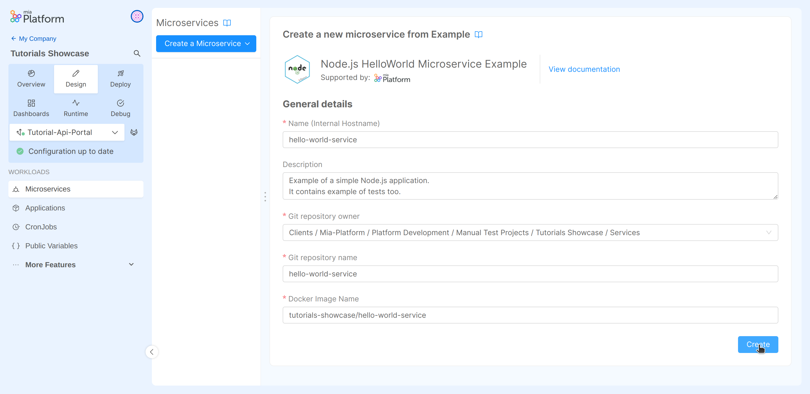
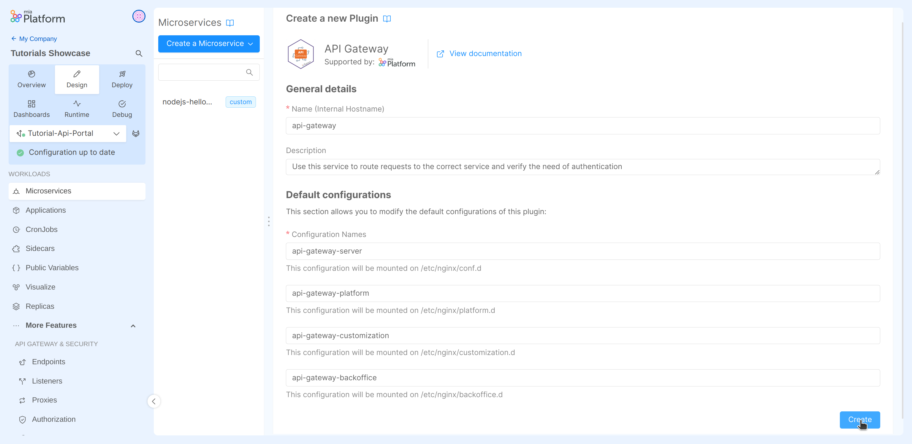
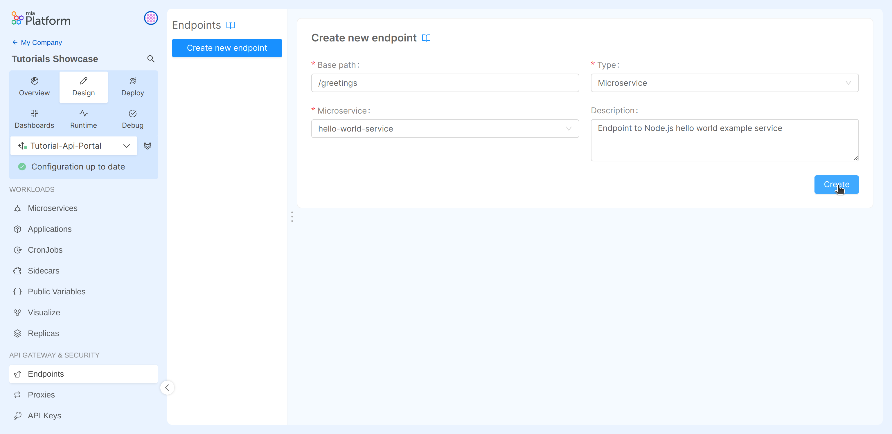

import VideoBox from "../../../../src/components/VideoBox";

In this tutorial we are going create and expose to the outside of the cluster a service using Mia-Platform Console. The service will simply reply to an HTTP request with an "Hello World" message.

## What we will build

We will create a simple Hello World service starting from [a marketplace example](https://github.com/mia-platform-marketplace/Node.js-Hello-World-Microservice-Example) that exposes a simple "Hello World" endpoint to the outside of the cluster.
In particular, we will:

- Create a new microservice from a Marketplace example;
- Check the microservice configuration and code;
- Create a gateway microservice from a Marketplace plugin;
- Expose the "Hello World" microservice API by creating an endpoint;
- Deploy the project and test the result by contacting it via `curl`.

## Prerequisites

Before starting, we will assume that, you already have a clean project in Mia-Platform Console. In order to know how to create a project on Mia-Platform Console, read [this guide](/console/project-configuration/create-a-project.mdx).

The project must:

- Be integrated with a [deploy pipeline](/infrastructure/self-hosted/pipeline-configuration.md);
- Have an [ingress route](/infrastructure/paas/tools/traefik.md) with "api-gateway" as `service`.
- Be aware of your project domains. If the project links has been configured, you can find them in the "Environments" section of the "Project Overview" area, under the "Application" column.

:::tip
If your are using a Mia-Platform Console in PaaS and the project has been created using the "Mia-Platform Basic Project Template", the project is already configured as needed.
:::

Moreover, you need at least:

- `developer` role on the project you want to use to reproduce the steps;
- `maintainer` role on the environment of the project you want to deploy on.

## Create a new microservice

In this section we will discover how use Mia-Platform Console to create a simple microservice exposing an endpoint always replying with an "Hello World" message.

In order to start the tutorial, you must be in the _design_ section of the project in the [Microservices section](/development_suite/api-console/api-design/services.md) from the left side menu.

In the left area of this section you can find a button to add new microservices and the list of all services currently included in the project. In our case this list is empty since we started from scratch.

In order to create the microservice:

1. Click on the _Create a Microservice_ button;
1. In the dropdown menu, select _From Marketplace_ option;
1. On the right side, you will see a catalogue of plugin, templates and examples;
1. Type **Node.js HelloWorld Microservice Example** in the search bar;
1. Select the card from the list of result;
1. Change the service name to `hello-world-service`;
1. Click on the _Create_ button applying the default fields values and then on _Continue_ to confirm the creation of the git repository.
1. **Save the changes by committing**. Please, take a quick look at [Mia-Platform handbook](/getting-started/handbooks/project/usage.md#save-changes) first.

Congratulations, you have created your first Microservice! 🎉



:::tip
To find more about this microservice, in the Console, click on the book icon next to its name or [here](https://github.com/mia-platform-marketplace/Node.js-Hello-World-Microservice-Example).
:::

## Check the microservice configuration and code

Until now we have created a microservice, but how is it working?

The whole service configuration is now shown on the right side of the screen. There you can find all the details, like the used docker image, the resources assigned to the service, the ports exposed by the container, configurations for kubernetes probes, environment variables, etc. In order to know all the details of the various fields you can read the section about [Microservice Configuration](/development_suite/api-console/api-design/services.md#manage-microservices).

Mia-Platform Console has created a git repository on the git provider linked to the project. In order to access to the microservice code, you can simply click on the "View Repository" link in the top-right corner of your service.

Moreover, the Console has linked a build pipeline to the service. You can check it on the pipeline manager linked to your project. Build pipeline are usually triggered on pushes to master branch, so the one building the image of the service we have just created should be running at this point.

:::tip
If you are using Mia-Platform Console in PaaS, you can check the execution of your build pipeline in the CI/CD area of the same GitLab repository containing the code of the service we have just created.
:::

## Create a gateway microservice

At this point the service we have created is only reachable inside the project, which is clearly not so useful. So we want to expose the route externally, but to do so we first need to create a **gateway service**, so let's create it!

In order to add your API Gateway service:

1. Go back to Mia-Platform Console;
1. Click on the _Create a Microservice_ button;
1. In the dropdown menu, select _From Marketplace_ option;
1. On the right side, you will see a catalogue of plugin, templates and examples;
1. Type "API Gateway" in the search bar;
1. Select the card titled "API Gateway" from the list of results;
1. Click on the _Create_ button applying the default fields values.
1. Save the changes to make them persistent.



:::tip
You can select your preferred API Gateway for your projects. We are using the nginx-based "API Gateway" only for demonstration purposes.
:::

By doing this, we have configured an API Gateway responsible to handle the requests arriving from outside the project. Incoming request to the API Gateway could either arrive from within the cluster network or, since the project we are using includes an [ingress route configuration](#prerequisites), they may come from outside the cluster in which the project is deployed in.

## Expose the "Hello World" microservice API

Now the last remaining piece is to inform the API gateway of the presence of our routes to redirect requests to it.

In order to do so:

1. Navigate to the _endpoints_ section from the left side menu.
1. Click on the _Create new endpoint_ button;
1. Fill the input:
   - **Base path**: `/greetings`
   - **Type**: in the dropdown menu "_Microservice_"
   - **Microservice**: in the dropdown menu "hello-world-service"
1. Click on the _Create_ button.
1. In the generated configuration, check that the "Rewrite Base Path" is set to `/`;
1. Save the changes to make them persistent.



By doing this, we have configured the API Gateway so that all the incoming requests having `/greetings` as prefix in the path, are forwarded to the "hello-world-service" without the previously mentioned prefix (e.g. `/greetings/hello` will be received as `/hello` by the service).

We have completed the design of our first project! Now the last step is to deploy it and test the developed functionality.

## Deploy the project

In this last step of the tutorial we will [deploy](/development_suite/deploy/overview.md) all the committed configurations. That means to create a new Kubernetes Pod for each service.

To sum up, the services we are going to deploy are:

- The "hello-world-service" microservice;
- The API gateway with the endpoint configurations.

We can now deploy the project! If you do not know how to do it, take a quick look at [Mia-Platform handbook](/getting-started/handbooks/project/usage.md#deploy-changes) first.

A pipeline will be triggered by the Console to start the deploy of your project.

At the end of the pipeline, go to the _Runtime_ section and wait for your pod to be ready. If you do not know how to do it, take a quick look at [Mia-Platform handbook](/getting-started/handbooks/project/usage.md#monitor-runtime-system) first.

Now we are ready to test the endpoint!
Replace `<project-domain>` with the correct one and try it:

```sh
curl https://<project-domain>/greetings/hello
```
