# Onboarding Guide: Company Setup in Console

## Onboarding Tutorial Introduction 

Configuring a **Company** is the initial process required to set up the platform's operational foundation. A Company acts as an isolated tenant that serves as the root for governance, representing your organization or a specific business unit. Within it, all centralized resources (such as infrastructure, tools and standards) are defined to enable development teams to operate autonomously, quickly and securely.

Before any project can be created or deployed, this initial setup must be completed. It consists of four sequential phases:

1.  **Configure Cluster**: Connect the Kubernetes infrastructure that will host the applications.
2.  **Configure Providers**: Integrate external tools (defined as **Providers**) for code, secret and pipeline management.
3.  **Configure Environments**: Define logical deployment destinations (e.g., Development, Production).
4.  **Configure Blueprints**: Standardize the creation of new projects through pre-configured templates.

This tutorial guides the user through each phase to make the Company fully operational. For an overview of the Console's architecture, you can consult the [general overview](/development_suite/overview-dev-suite.md).

### Prerequisites

Before starting, ensure you have the following:
* An active and functioning Kubernetes cluster. We recommend a version between **1.25** and **1.33**. For more details on specific requirements, you can consult the [architectural prerequisites](/infrastructure/self-hosted/self-hosted-requirements.md#architectural-prerequisites).
* A Git provider (e.g., GitLab, GitHub) with an account that has sufficient permissions to generate access tokens.
* The necessary credentials and endpoints for all the external tools you intend to connect.

:::info
**Scope of this Tutorial**

This guide illustrates a "Bring Your Own Infrastructure" (BYOI) scenario. We will use a pre-existing **Azure Kubernetes Service (AKS)** cluster and a single **GitLab** instance acting as Git Provider, CI/CD Tool, and Secret Manager.

The configuration process may vary slightly for other providers or cluster types. Configuring a Company on a PaaS version of the platform might require a support ticket, while a self-hosted Console installation could have different initial conditions.
:::

---

## Step 1: Configure Cluster

The first step is to connect a Kubernetes cluster. This cluster will be the runtime environment where your applications are deployed and managed. The platform does not create a new cluster but connects to an **existing and pre-configured one** under your management.

:::info
The Console also allows you to create new infrastructure, including clusters, through the [**Infrastructure Project**](/console/project-configuration/infrastructure-project.md) feature. However, for the purpose of this onboarding tutorial, we will assume that a pre-configured cluster already exists.
:::

### Connect a new cluster

Inside your Company, navigate to **Infrastructure** > **Clusters** and click **New cluster connection**.

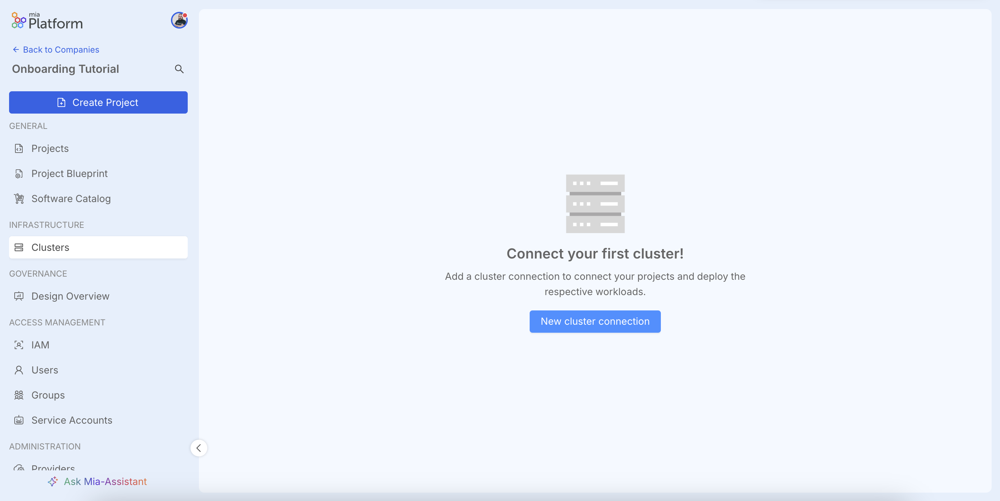

A wizard will open. In the first step, **Runtime Service**, you need to specify the type of cluster you are connecting to. The platform supports major managed cloud services (like GKE on Google Cloud, AKS on Azure, or EKS on AWS, etc), but you can connect any **Kubernetes** distribution, including on-premise, by selecting the generic Kubernetes option. This choice helps the Console to pre-configure the necessary fields in the following steps.

The other two fields are optional: **Geographics** serves as a metadata label to indicate the cluster's geographical region (note that this does not control the actual region, which is managed by your cloud provider), while **Description** can provide more context on its purpose.

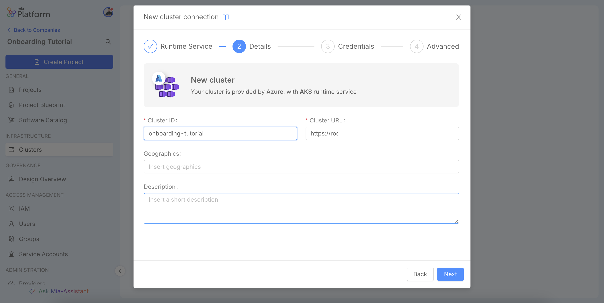

The third step, **Credentials**, is crucial for authorizing the Console to perform actions on your behalf. The required credentials vary depending on the chosen provider and authentication method. In this example, for an Azure AKS cluster, we are using the `Client credentials` authentication type. This method requires you to provide the `Access token URL` for obtaining the OAuth2 token, along with the `Client ID` and `Client secret` from your application registered on Azure AD and finally the required permissions `Scope`.

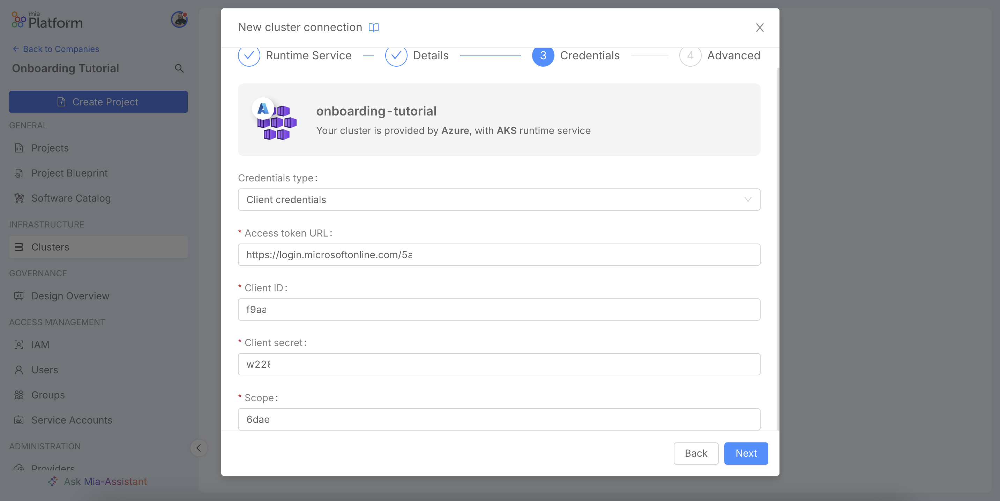

The final **Advanced** step allows you to configure options for specific network scenarios. You can add a `Certificate authority` to ensure a secure TLS connection, which is necessary if your cluster uses a self-signed certificate. You can also configure a `Proxy` if the Console needs it to reach the cluster's API server. Once finished, click **Add cluster**.

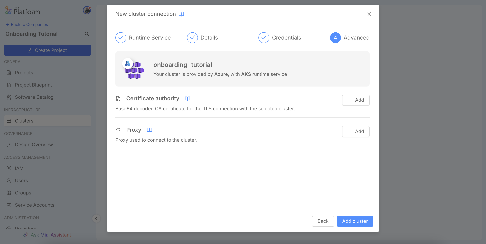

Upon completion, the Console will attempt to establish a connection with the cluster. If the provided parameters are correct, a success message will confirm that the connection is active. Should any issues arise during this validation, such as incorrect credentials or network problems, a descriptive error message will be shown, allowing you to go back and adjust the configuration accordingly.

You will be redirected to the cluster's detail page, where you can view a summary of the configuration. For more details on cluster management, refer to the [official documentation](/console/company-configuration/clusters-management/connect-and-manage-cluster.mdx).

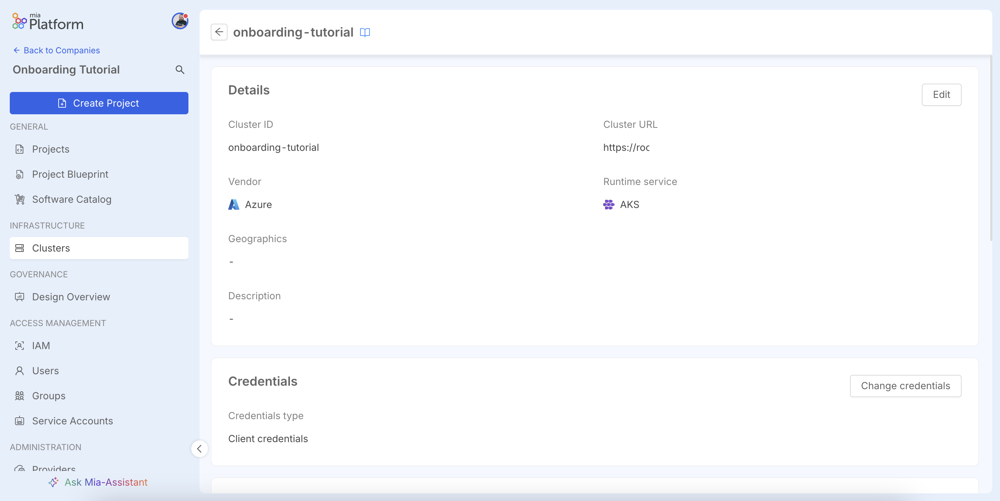

---

## Step 2: Configure Providers

The next step is to configure **Providers**: connections to external services essential for the software lifecycle, such as Git providers, secret managers, or CI/CD tools.

For a complete list of supported providers and their specific requirements, please refer to the [official documentation](/console/company-configuration/providers/overview.md).

### Connect a new Provider

Navigate to **Administration** > **Providers** and click **Add Provider connection**.

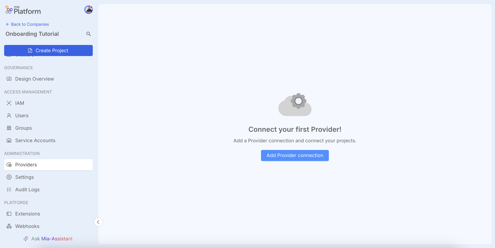

In the first step, **Provider Services**, you will select the external tool you wish to integrate. The Console supports a variety of services, including popular Git providers like GitLab and GitHub, CI/CD tools such as Jenkins and secret managers like Vault.

:::info
For the purpose of this tutorial, we will configure a single GitLab instance to handle all three core capabilities: **Git Provider**, **CI/CD Tool** and **Secret Manager**. It is important to note that the platform is designed to be flexible. You can configure multiple, distinct providers and assign them to different capabilities, allowing you to adopt a "best-of-breed" approach (for example, using GitHub for source control, GitLab for CI/CD pipelines and Vault for secret management).
:::

Your choice here will tailor the subsequent configuration steps to the specific requirements of the selected service.

A single service can offer multiple functionalities, or **capabilities**, allowing a single tool (e.g., GitLab) to act as a Git Provider, Secret Manager and CI/CD Tool. Select the capabilities you intend to enable.

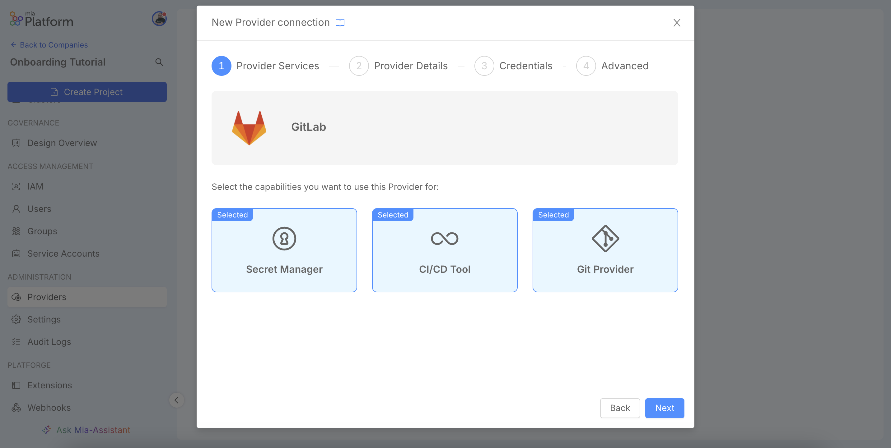

In the **Provider Details** step, you will provide the specific connection details for the service you are integrating. For this GitLab example, you must first assign a unique **Provider name** to identify this connection within the Console. You will then need to provide the **API Base URL**, which is the root endpoint for the provider's API (e.g., `https://gitlab.yourcompany.com/api/v4`), and the **Base URL**, which is the main web address used to generate direct links. Optionally, you can define a **Repository path template** to standardize the path structure for new repositories. Finally, you will set the **Default visibility for repositories** (Internal, Public, or Private) to enforce security policies for any new project created through the platform.

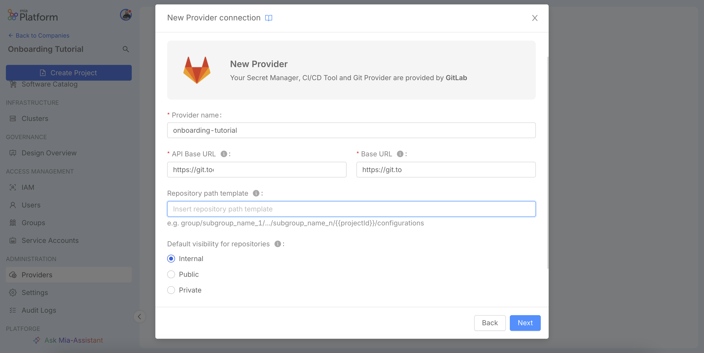

In the **Credentials** step, provide the credentials (e.g., an Access Token). Ensure the token has the necessary scopes for the selected capabilities.

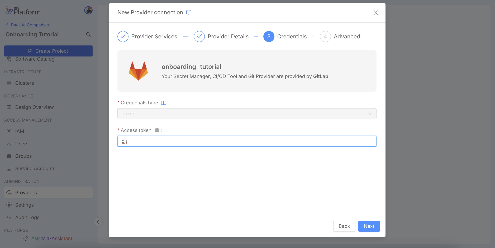

Before finalizing the setup, the **Advanced** step offers options for specific network configurations. Here you can add a custom **Certificate Authority** if your provider uses a self-signed TLS certificate, or configure a **Proxy** if the Console needs to route its connection. Once you have reviewed these settings, click **Add Provider** to complete the configuration.

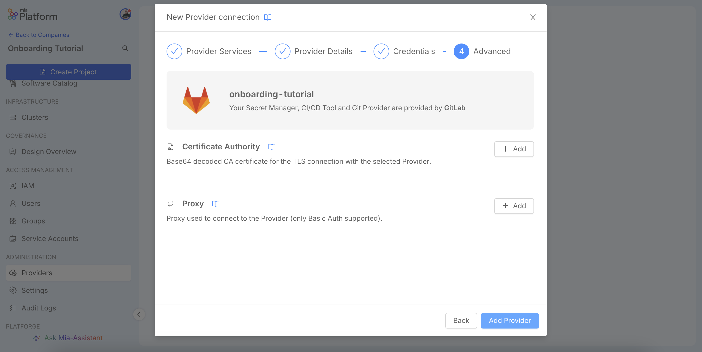

A success message will confirm the creation.

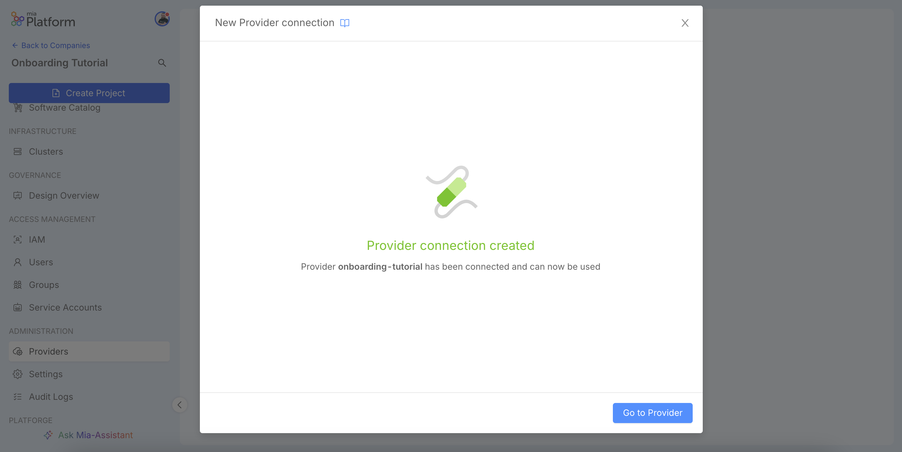

You will be redirected to the provider's detail page, where you can review its configuration. For more details on supported providers and their specific configurations, you can consult the [official documentation](/console/company-configuration/providers/overview.md).

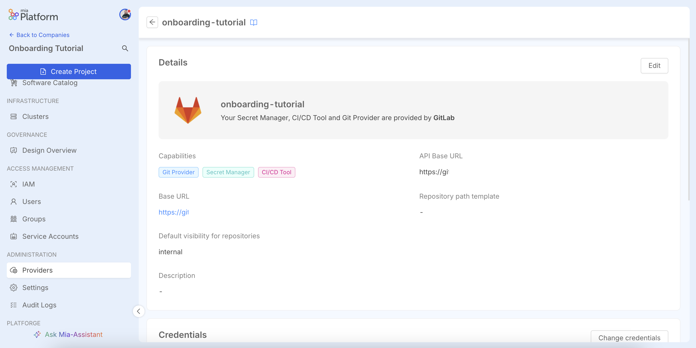

### Define Default Providers

Once configured, define the providers as **default** for the Company. They will be automatically pre-selected when creating new projects.

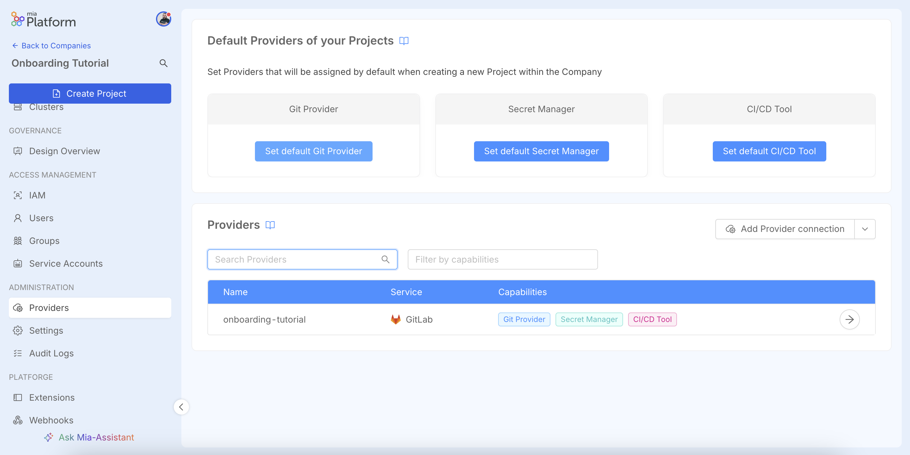

Click **Set default Git Provider**, select the desired provider and save.

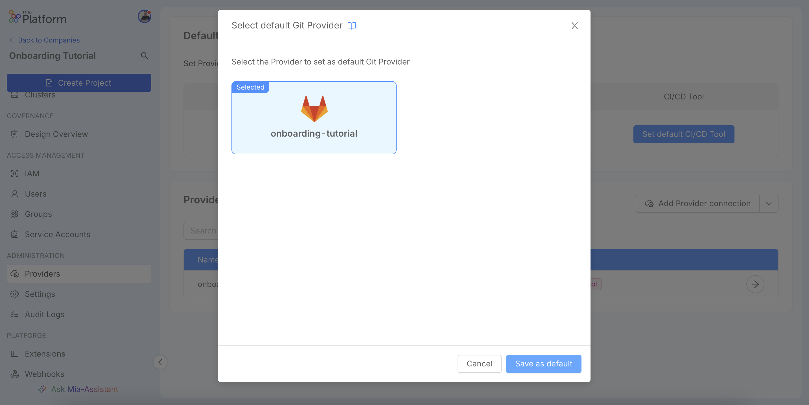

Repeat the process for the other capabilities, such as **Secret Manager** and **CI/CD Tool**. For more details, consult the [Providers documentation](/console/company-configuration/providers/configure-provider.mdx#set-a-default-provider).

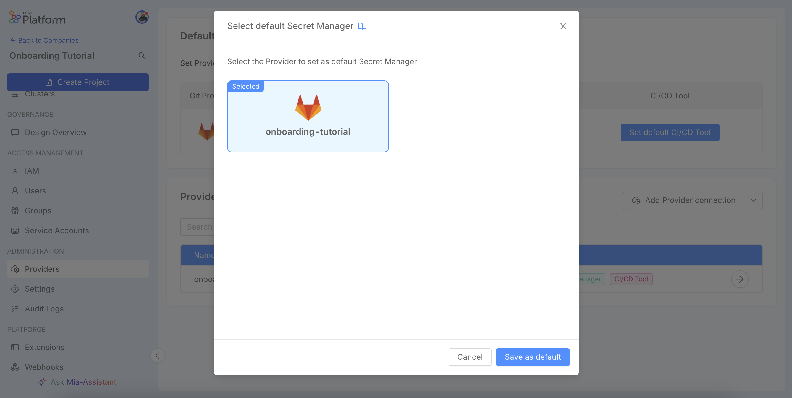
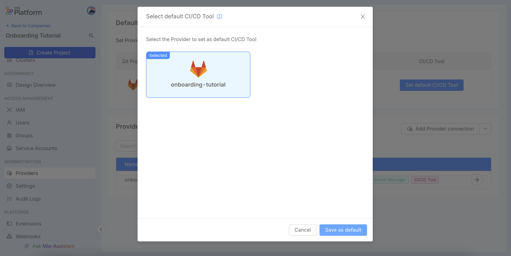

---

## Step 3: Configure Environments

An **Environment** defines a logical deployment destination that corresponds to a specific stage in the software development lifecycle. While common examples include `Development`, `Staging`, and `Production`, you can create any number of custom environments to match your team's workflow.

The platform's key strength lies in its ability to map each logical environment to a specific physical cluster. This enables powerful workload isolation strategies. For example, you can ensure your `Development` environment deploys to a shared, low-cost test cluster, while your `Production` environment targets a highly-available, secure cluster with dedicated resources. These clusters can even reside in different regions or be managed by different cloud providers, offering true hybrid and multi-cloud flexibility.

For the purpose of this tutorial, we will configure a single `Production` environment, but the process can be repeated to build out your complete delivery pipeline.

### Create a new Environment

Navigate to **Project Blueprint** > **Environments** and click **Add new environment**.

In the configuration window, fill in the required fields, including the **Name**, **Environment ID**, and the **Cluster ID** to associate the environment with. The **Cluster namespace** field supports input variables like `%projectId%` to create dynamic and isolated namespaces. Upon creation, the platform will also generate a set of specific output variables for the cluster connection, which will be visible on the details page. For more details on all the available configuration options, you can refer to the [official documentation on environments](/console/company-configuration/project-blueprint).

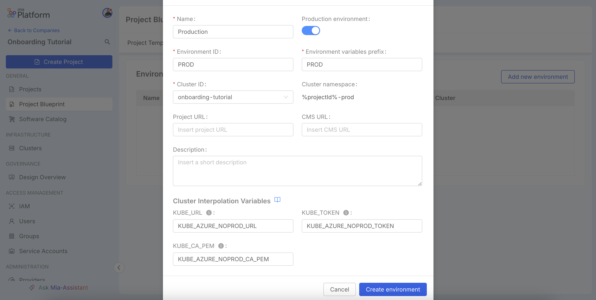

A success message will confirm that the environment has been created. 

:::info
You will also notice a warning message, which serves as an important reminder: for the environment to work without further manual configuration within a project, it must be properly defined within a template. This is a key concept that we will address in the next configuration step, where we will define our Blueprints.
:::

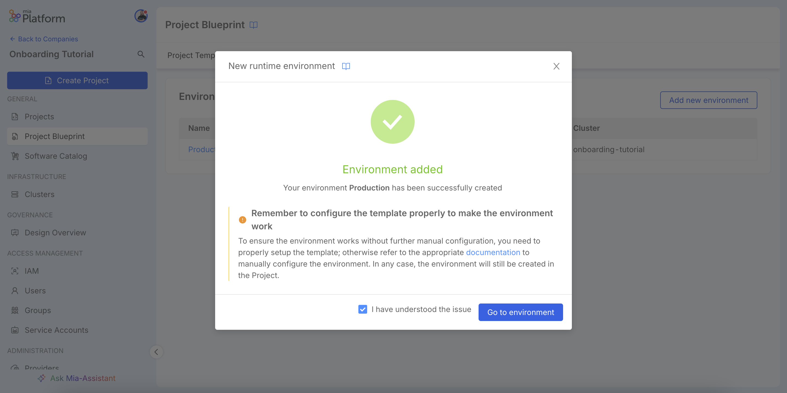

The detail page displays the **Cluster Interpolation Variables**. These are output variables (e.g., `KUBE_URL`) that the platform exposes to be used in CI/CD pipelines, automating authentication and deployment to the correct cluster.

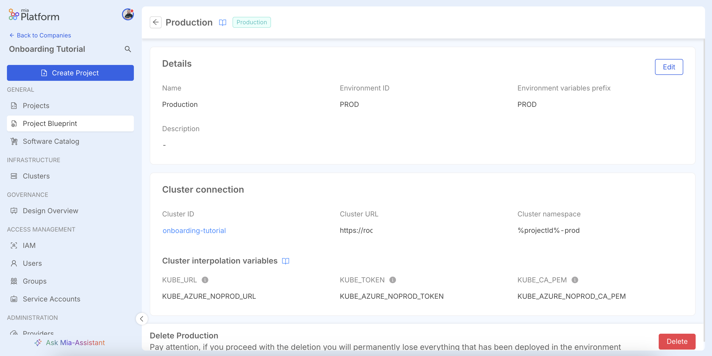

---

## Step 4: Configure Blueprints

The next step is to define **Blueprints**. A Blueprint is a project model (labeled as **Project Template** in the UI) that standardizes the creation of new applications.

> **What is a Blueprint?**
> A Blueprint is based on a Git repository containing the basic structure of a project, including CI/CD pipelines (e.g., `.gitlab-ci.yml`), base manifests and Console configuration (e.g., `mlp.yaml`). It allows you to apply "infrastructure as code" practices to project definitions as well.

### Create a new Blueprint

Navigate to **Project Blueprint** > **Project Templates** and click **Add template**.

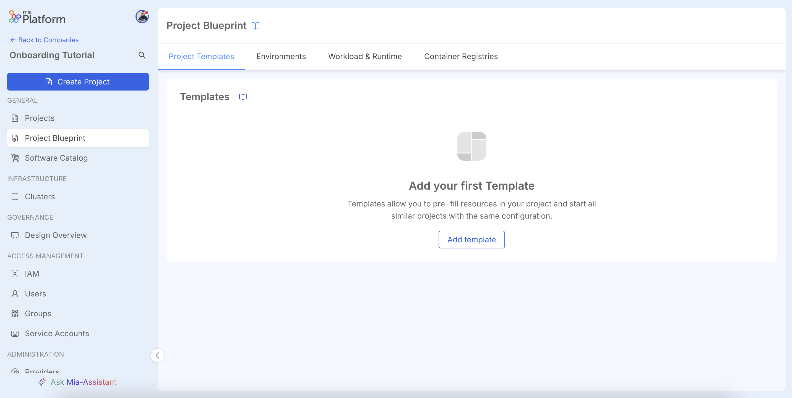

In the configuration window, you will define all the properties of the Blueprint. First, give it a descriptive **Name** and provide the **Archive URL**, which is the link to the `.tar.gz` archive of your template repository. Next, you must select a **Deployment strategy**: choose **Push mode** for a traditional CI/CD approach where the pipeline builds an artifact and pushes it to the cluster, or **Pull mode** for a GitOps-based strategy where an agent within the cluster pulls changes directly from the repository. You will also select the **Pipeline runner**, which is the CI/CD tool (configured in Step 2) responsible for executing the jobs defined in your template. Finally, you can add an optional **Description** to provide more context.

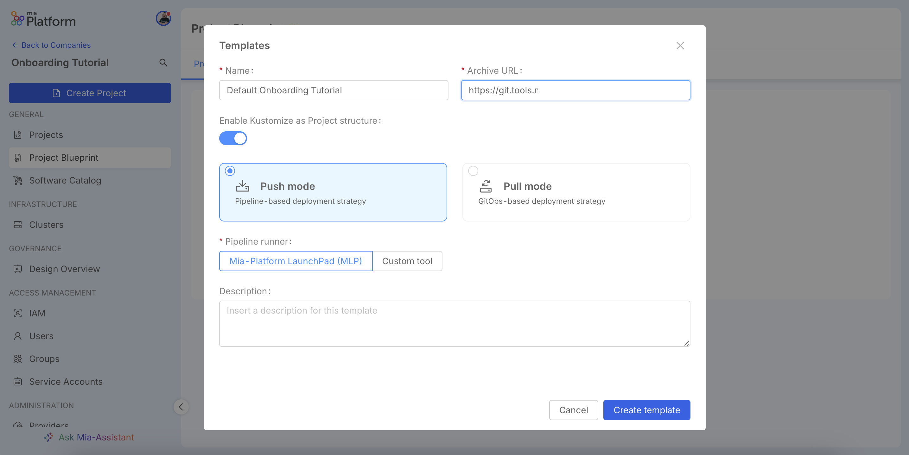

To learn how to structure your own repository and create a valid Blueprint, refer to the page [How to create a project archive](/console/company-configuration/project-blueprint.md#how-to-create-a-project-archive).

A success message will confirm the template's creation.

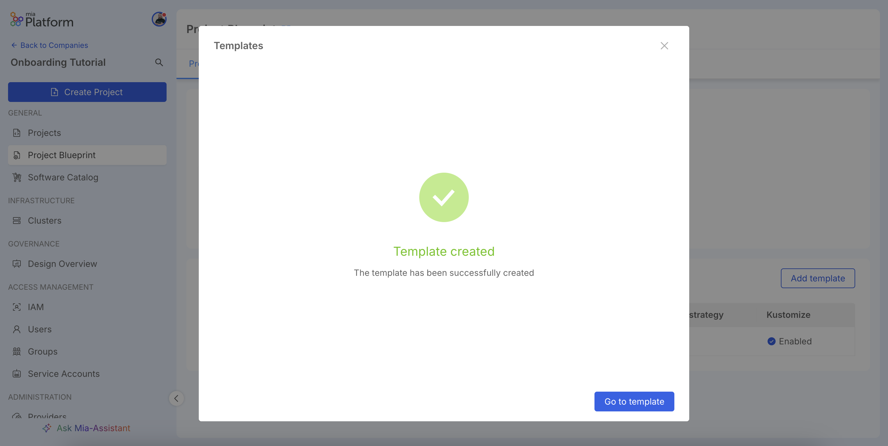

### Set a Default Blueprint

Set a Blueprint as **default** to speed up the creation of new projects. Click **Set default Template**.

Select the desired Blueprint and save.

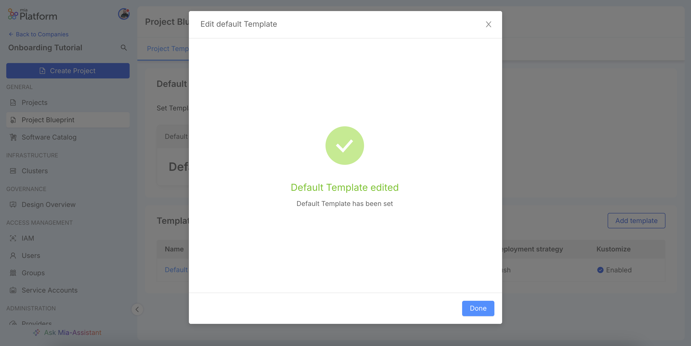

The default Blueprint will now be highlighted. 

:::info
To learn how to create your own templates, refer to the [guide on creating Blueprints](/console/company-configuration/project-blueprint.md).
:::

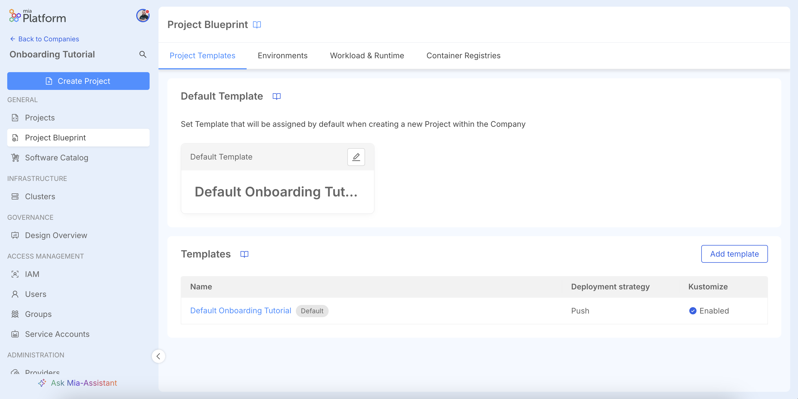

---

## Step 5: Validate the Configuration with a Test Project

After configuring the Company, it is advisable to create a test project to validate that all integrations are working correctly.

### Project Creation

From the main menu, click **Create Project**. In the first step, **General**, you will define the project's basic information. Select the **Project type** (in this case, `Application`) and provide a unique **Project name**. Below this, you will find the **Project workflow** section. The **Enhanced Workflow** is the default and recommended option for all new projects. You can also add an optional description to provide more context.

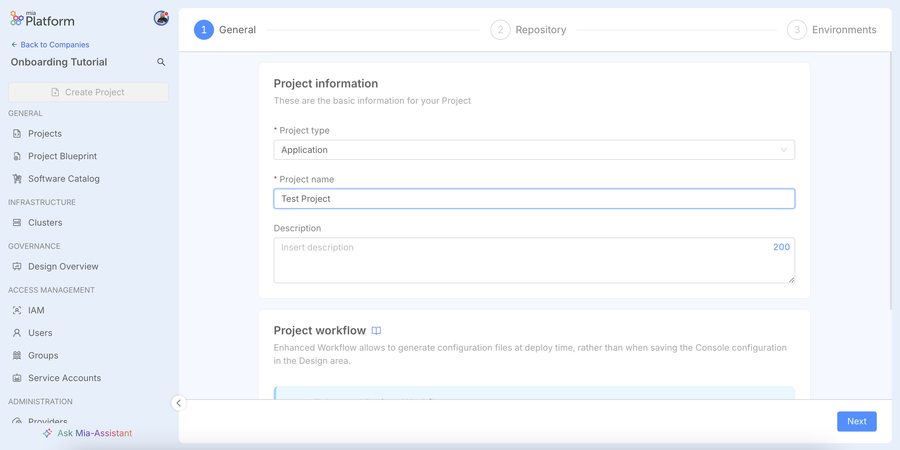

In the **Repository** step, you will notice that the default Git Provider and Blueprint are already pre-selected.

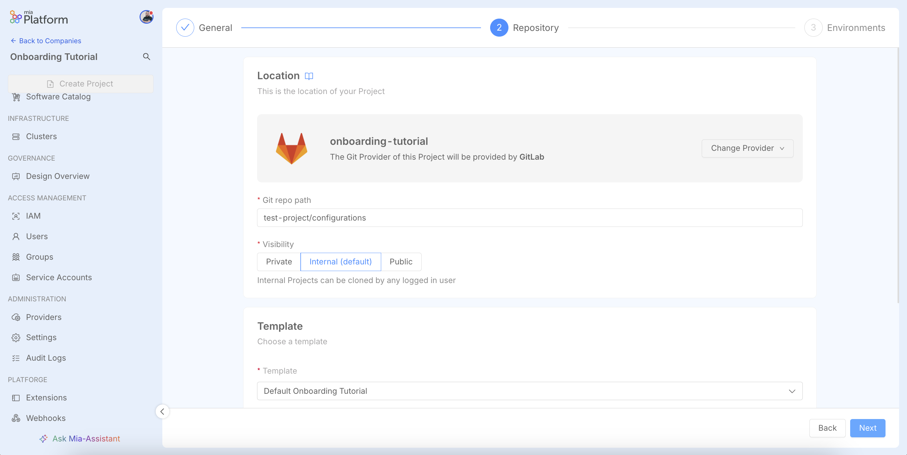

In the **Environments** step, the previously configured environment will be available. Click **Done** to create the project.

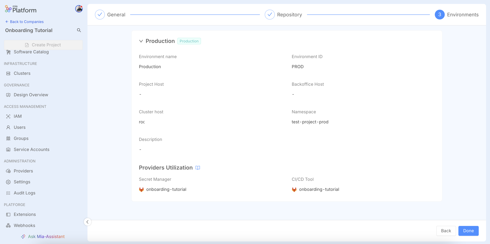

Once the project is created, you can proceed with deploying a service to ensure the pipeline runs correctly. 

:::info
For a detailed guide, refer to the [documentation on creating a project](/console/project-configuration/create-a-project.mdx).
:::

## Conclusion

By following these steps, you have configured your Company's operational foundation. The infrastructure is connected, tools are integrated, deployment environments are defined and project standards are set via Blueprints.

At this point, the platform is ready. The next step is to invite development teams, who can now create new projects in just a few clicks, automatically inheriting all the configuration you have prepared.
