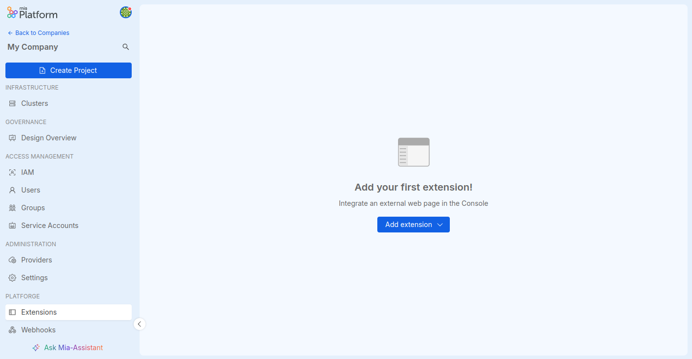
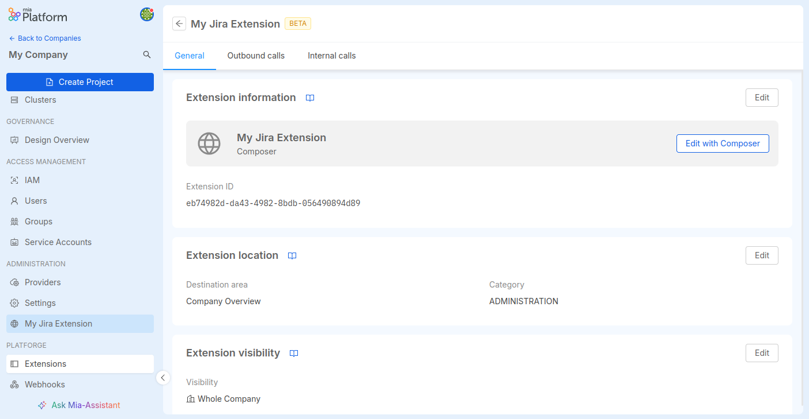
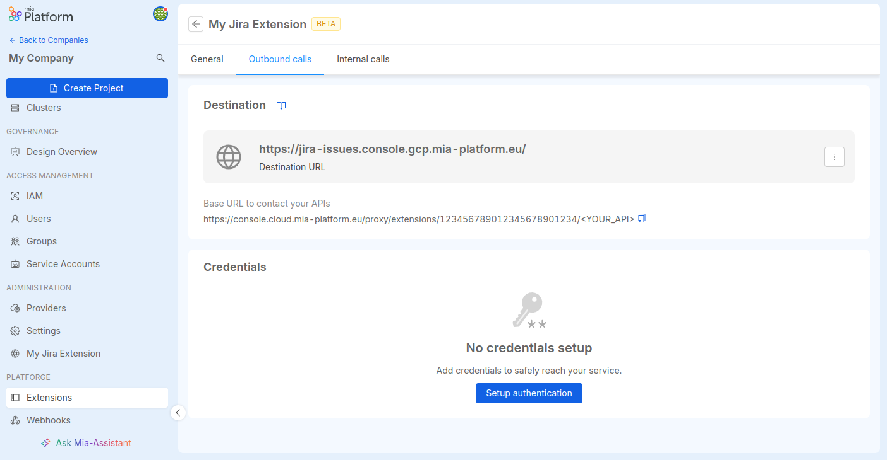
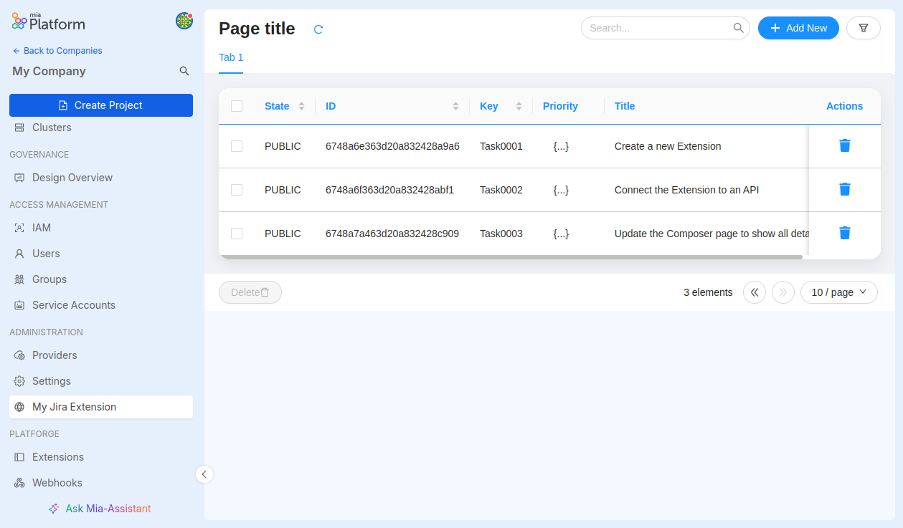

This tutorial is dedicated to the management of [extensions](/console/company-configuration/extensions.md),
a feature that allows you to customize your company and/or your projects inside the Mia-Platform Console by including customized pages
inside your Company page, the Project overview page or the Project Runtime page.

And to do so, you will be using to create using only [miactl](/cli/miactl/10_overview.md), the command line interface application to communicate with the Mia-Platform Console APIs.

## What you will build

You are going to customize the sidebar of a Mia-Platform project by adding a new menu and a new link that, when clicked, will show an integrated Composer page.
<!-- TODO: Should the Integration Connector Agent be part of the official Docs? Why can't I find it? -->
This page will include a table with data extracted from an API coming from another project that uses the [Integration Connector Agent](https://github.com/mia-platform/integration-connector-agent/blob/main/docs/10_overview.md) to connect to a [Jira](https://www.atlassian.com/software/jira) Data Source.

The have the _Integration Connector Agent_ to work properly, you need a configured account on Jira, as well as a [MongoDB instance](https://www.mongodb.com/) available as a database support for the service.

This tutorial will explain how to create an extension using the Mia-Platform Console, but there will be also small instruction using [`miactl`](/cli/miactl/10_overview.md),
the official command line interface to access with the Mia-Platform APIs.

## Prerequisites

This guide requires that you have full access to a Company on which you are Company Owner.
The Company should include a project reachable externally (you can set up one by following the instructions in this [guide](/console/project-configuration/create-a-project.mdx))
that will be configured to include the _Integration Connector Agent_.

Additionally, you might want to have miactl tool installed consulting the guide on this [link](/cli/miactl/20_setup.md).

## Steps

### 1. Prepare the Integration Connector Agent in your Project

The first part of the tutorial is not related to the extensions, but to prepare the project that you will use to connect with and to extract the Jira documents from.

The project requires to the following services:

- the _Integration Connector Agent_ service, available, configured as explained in [the related documentation](https://github.com/mia-platform/integration-connector-agent/blob/main/docs/20_install.md)
- the [_API Gateway_](/runtime_suite/api-gateway/10_overview.md) service, to expose the API that the extension will call.
- the [_CRUD Service_](/runtime_suite/crud-service/10_overview_and_usage.md) to expose the endpoint used by the extension and to allow you to call it with some appropriate filters.

All the three services are available on the Mia-Platform [Marketplace](/marketplace/overview_marketplace.md): you can select the latest available version of each service without issues.

Moreover, it is important to create the following endpoints:

- an endpoint connected to the _Integration Connector Agent_ and with base path the [Jira webhook](https://developer.atlassian.com/server/jira/platform/webhooks/) created to communicate with the Jira APIs (e.g. `agent/webhook/jira`)
- an endpoint connected to the _CRUD Service_, pointing to the CRUD collection that will store the documents extracted from Jira (e.g. `/jira-issues`);
also consider if you need to have this endpoint can be protected by authentication or not

:::info
Remember to configure the project to correctly use the Ingress Route to expose the APIs, using [Traefik](/infrastructure/paas/tools/traefik.md) as example.
:::

Finally, deploy the project and check that the services are up and running to be sure that the APIs are exposed and ready to communicate with the extension.

### 2. Create the extension

Once that all requisites are satisfied and the API is ready to be called, you can create the extension.
You can do that by accessing to your company page and, in the sidebar menu, clicking the `Extensions` option.



From this page you will see the list of existing extensions, if there are, otherwise you'll be see a screen that suggest you to create your first extension.
In any way, a button _Add extension_ is available and, after the click, a menu will show up to allow you to choose which type of extension you want to create.

In this case, you will go with _Create with Composer_.

In the modal that will show up, you can create the extension by choosing:

- the name of the extension (e.g. _My Jira Extension_)
- the _Template_, which is a starting template for your composer page (you can start with a table by selecting _Table: base table_)
- the _Destination Area_, in which section of the console the extension will be visible (select _Company Overview_ to have it viewable on the Company page)
- the _Category_, which is the group where the extension will be located (e.g. select _Administration_)

The _Visibility_ should be automatically selected to _Whole Company_ to indicate that the extension is visible for those who will access to the Company page.

:::tip
You can limit extension visibility based on Console User Capabilities;
for instance, if you want to show your extension only to users who can deploy a project, you can configure the `permissions` key defined in this way:

```js
{
  "permissions": ["console.company.project.environment.deploy.trigger"]
}
```

You can find out available capabilities in the [Identity and access management page](/development_suite/identity-and-access-management/console-levels-and-permission-management.md#identity-capabilities-inside-console).
:::

Finally, click on _Add extension_ to create your first extension and to be automatically redirected to its detail page.



The page will recap some information regarding the new extension, such is name, its identifier and where it will be shown.
Also, you might notice that a new voice is available in the page sidebar, and it has the same name of the extension.

This menu is in fact the extension you have just created. You can access to it, to show an empty table with a loader that, unfortunately, will not load anything.
This happens because, right now, the table have no indication on where to find the data to show.
But you are going to fix that.

### 3. Configure the Outbound calls

First of all, you need to configure the extension to ensure that can execute server request to the API connected to the _Integration Connector Agent_, created [in the project that we previously configured](#1-prepare-the-integration-connector-agent-in-your-project).

To do that, you need to return to the page with the detail of the extension.
If you are not there anymore, you can return there clicking to the _Extensions_ voice in the sidebar, then clicking on the name of the extension you just created.

When you are there, click on the tab _Outbound calls_.
It will open a new page where you can configure call to external APIs, such as the CRUD collection endpoint of the project connected to Jira.

To configure such call, you need to click on the _Setup outbounds calls_ button. A modal will show up, prompting you to add the following information:

- _Destination URL_: it is the URL that includes the API to call. In this case, it is the URL of the project connected to Jira which depends on how you configured the project (e.g. `https://jira-issues.console.gcp.mia-platform.eu/`)
<!-- TODO: Should I suggest to use authentication? -->
- _Authentication required_: if activated, requires authentication to communicate with the API. If the endpoint requires authentication then leave it activated, otherwise you can disable it.

If the authentication is required you will be required to include:

- _Authentication endpoint_: the full URL of the endpoint to send the credentials to authenticate
- _Authentication Type_: the type of authentication between those available:
  - _Client ID / Client Secret_: using client credentials, other two fields will be available where you will be prompted to add the _Client ID_ and the _Client Secret_
  - _Username / Password_: easily understandable, you will also have to include username and password before to create the configuration

Once you selected anything you need to successfully communicate with your external API, you can click to _Save Changes_ and right away see the configuration of the outbound calls updated.



You will notice right away that a new URL will be shown in this page that you have not configured by yourself: it just below the label _Base URL to contact your APIs_.

In fact, when you will try to call the API, you will not use the URL of the external project, but a specific Mia-Platform Console API (that will include the `/proxy/extensions/` path)
that will call used as a dynamic gateway to find the API, handle authentication (if necessary) and execute the requests.
The URL ends with the `<YOUR_API>` letters, to be replaced with the endpoint you want to connect to (in this case to `/v2/jira-issues`).

### 4. Update the Composer page

<!-- TODO: How do I add the CRUD Client using the UI? -->
Now that we can finally connect to the API, it is finally time to update the Composer page to include the [CRUD Client component](/microfrontend-composer/back-kit/60_components/100_crud_client.md) to allow the table to fetch the data to show.

Go back to the _General_ tab to see to details of the extension and click to the _Edit with Composer_ button.
From there, you will be redirected to a page where you can see the current configuration of the composer page.

From the `Advanced` section, find the list of the table elements and add the following JSON configuration:

```json
{
    "tag": "bk-crud-client",
    "properties": {
        "basePath": "/proxy/extensions/123456789012345678901234/v2/jira-issues",
        "dataSchema": {
            "$ref": "#/definitions/dataSchema"
        }
    },
    "attributes": {
        "data-mia-label": "CRUD Client"
    }
}
```

This will attach the _CRUD Client_ component to the table, by fetching data from an URL defined in the `basePath` property (remember to update its value with the proxy URL created by the extension),
and using as a data schema the schema automatically defined in the _Shared Properties_ tab.

:::tip
You can update the Data Schema whenever you want by moving to the _Shared Properties_ tab and selecting _Data Schema_ from the table.
:::

Remember to save your changes by clicking the _Apply_ button from the _Advanced_ tab when you finish these updates, then to finalize the configuration of the Composer page with the _Publish all changes_ button at the top-right side of the page.

### 5. Call the extension

After every update, the extension is automatically updated.
After updating the Composer page, we can finally move to the Extension and see the table with all data coming from Jira.



### Manage extensions with miactl

#### Create and activate the extension

You can also replicate the tutorial by creating the extension via _miactl_. In your CLI type the following command:

```sh
miactl extensions apply --endpoint https://<my-console-domain>/ --company-id my-tenant-id -f ./<relative-path>/my-extension.json
```

where `my-tenant-id` is the identifier of the company, and the `my-extension.json` is a JSON file includes the following content:

```json
{
  "name": "My Extension",
  "type": "composer-page",
  "destination": {
    "id": "tenant",
    "path": "/"
  },
  "activationContexts": [
    "company"
  ],
  "iconName": "PiProjectorScreenChartLight",
  "configuration": "{\"version\": \"0.1.0\", ...",
  "menu": {
    "id": "jira-issues",
    "labelIntl": {
      "en": "Jira Issues",
      "it": "Issue su Jira"
    }
  },
  "category": {
    "id": "administration",
  }
}
```

You must ensure that the `configuration` field includes a valid Composer configuration for the page you want to show.

:::info
It is not possible for now, to include the configuration of outbounds calls and internal calls in JSON files to be used with miactl.
:::

After the creation, you have to activate the extension.
While this command is automatically executed from the Mia-Platform console, if you use _miactl_ you have to manually launch it using the `activate` command:

```sh
miactl extensions activate --endpoint https://<my-console-domain>/ --company-id my-tenant-id --extension-id extension-id
```

Replacing `my-tenant-id` and `extension-id` with the identifier of your company and the identifier of your extension.

:::tip

In case you need to update the extension using _miactl_, you can always use the `apply` command by including the `--extension-id` flag:

```sh
miactl extensions apply --endpoint https://<my-console-domain>/ --company-id my-tenant-id -f ./<relative-path>/my-extension.json --extension-id extension-id 
```

:::

#### Check if the extension exists

You can use the `list` and `get` commands to verify that the registration is done correctly:

```sh
# Show the list of all extensions
miactl extensions list --endpoint https://<my-console-domain>/ --company-id my-tenant-id

# Show the extension by specific id
miactl extensions get --endpoint https://<my-console-domain>/ --company-id my-tenant-id --extension-id extension-id
```

You can use this any time you need to check what extensions exists and are activated to further check if create/delete operations executed have been successful.

#### Deactivate and delete extensions

To remove extensions, you can decide to _deactivate_ them (the extension still exists but it is not visible in Console anymore) or to definitely _delete_ them.

To deactivate the extension, you can use the `deactivate` command:

```sh
miactl extensions deactivate --endpoint https://<my-console-domain>/ --company-id my-tenant-id --project-id my-project-id --extension-id extension-id
```

Now, the extension should no longer be visible in the Console.
To completely remove the extension, you can use the `delete` command:

```sh
miactl extensions delete --endpoint https://<my-console-domain>/ --company-id my-tenant-id --extension-id extension-id
```

You can use [the `list` and `get` command](#check-if-the-extension-exists) to verify that the extension has been successfully removed.
