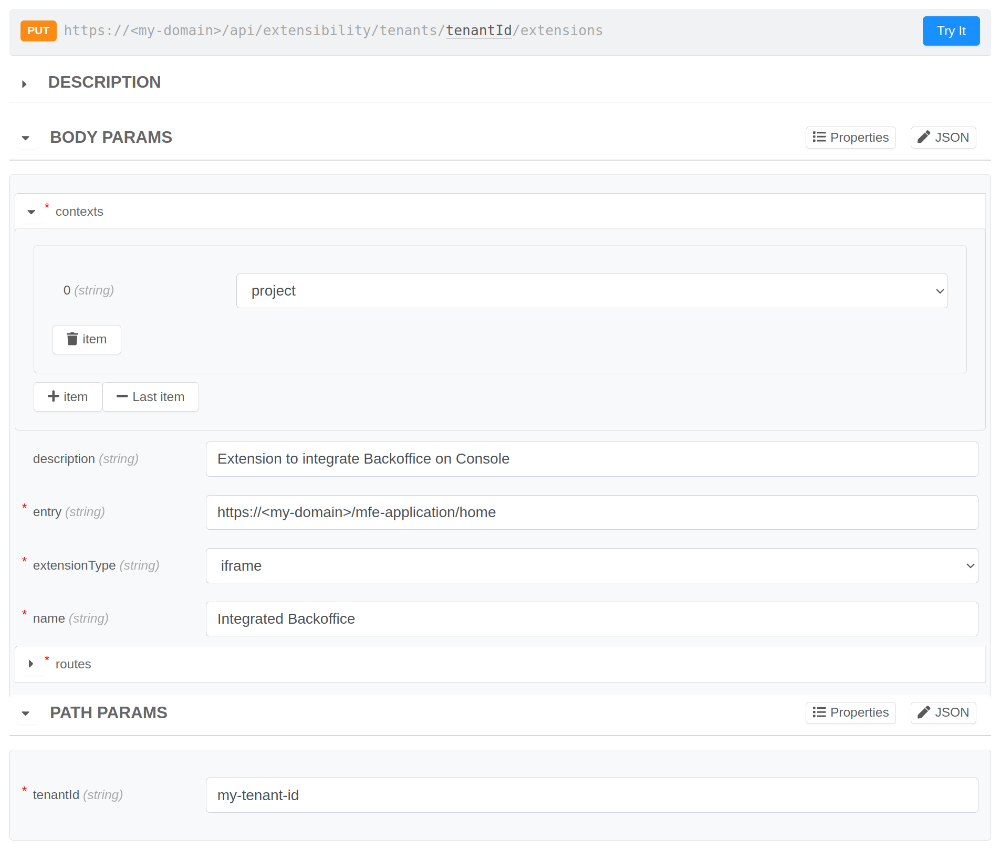
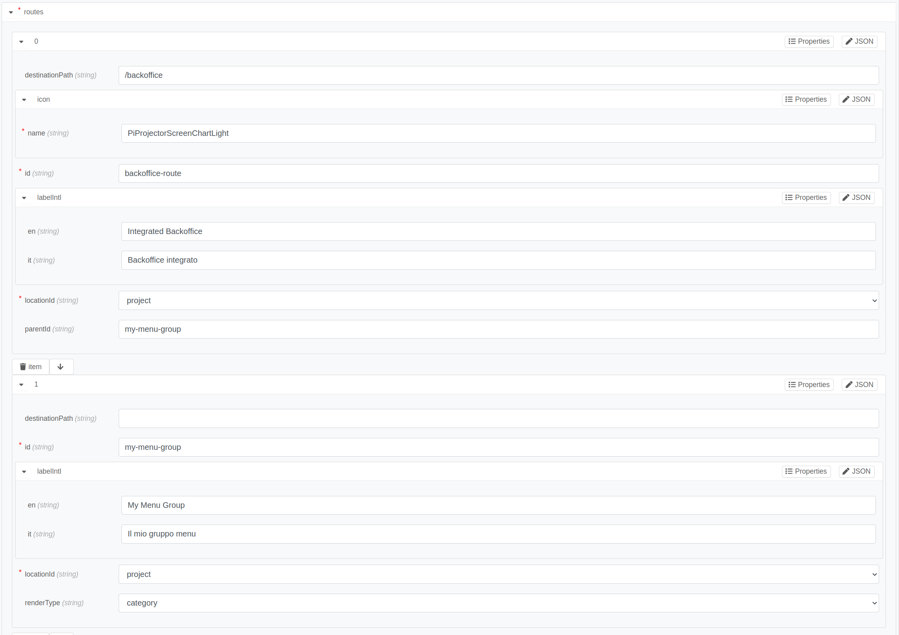
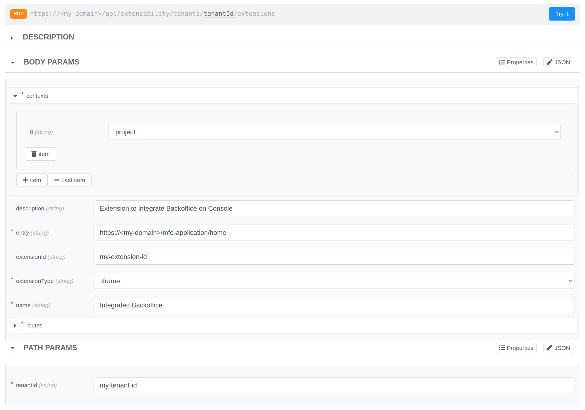
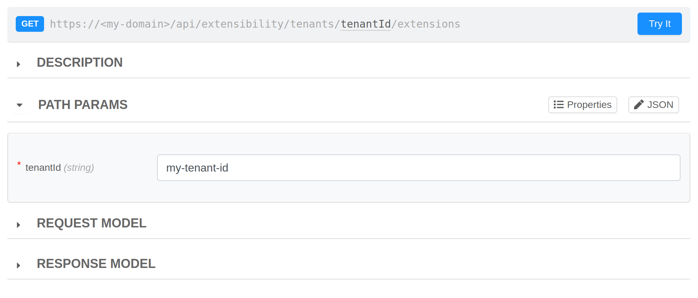
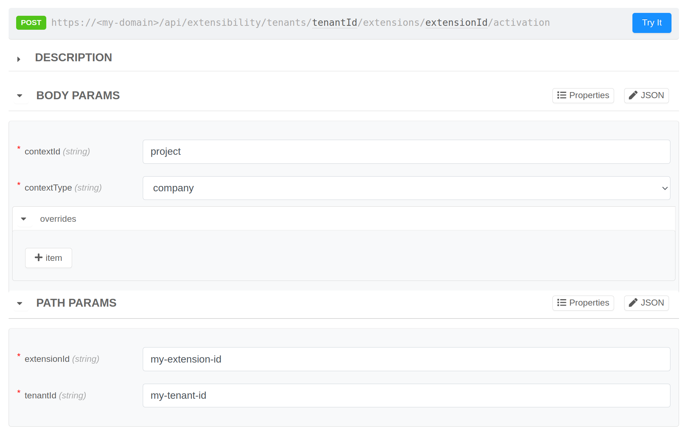
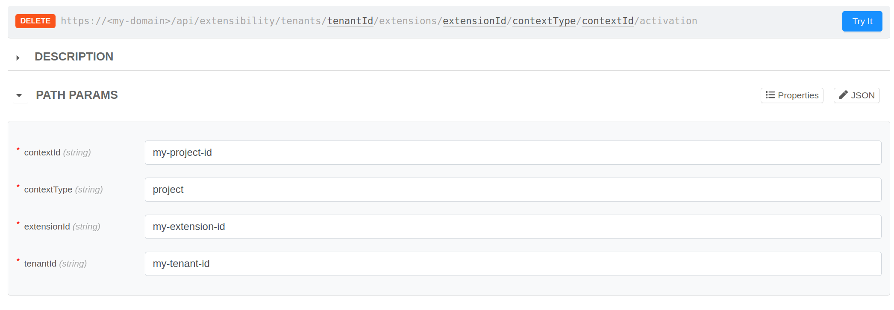

# Create your extension

Following this tutorial you will learn how to add the Backoffice as an extension within a Project, in order to consult it directly from the Console.

## Prerequisites

This guide requires that you have:

- A Company on which you are Company Owner. Its identifier should be used each time there is the `my-tenant-id` occurrence.
- The Company has a project reachable externally, otherwise create one by referring to this [guide](/console/project-configuration/create-a-project.mdx).
- The `Microfrontend Composer Toolkit` application created and exposed to view the Backoffice frontend. Follow this section of the [guide](/microfrontend-composer/tutorials/basics.mdx#setup-the-microservices) to do so.
- The response from the Backoffice endpoint can be embedded within an iframe. See this [link](/development_suite/api-console/api-design/endpoints.md#manage-advanced-endpoint-parameters) for more information.


## 1. Register Backoffice Extension

Once that all requisites are satisfied, you can register the Backoffice as an extension using the [PUT /api/extensibility/tenants/{tenantId}/extensions API](/console/console-extensibility/registration.md#how-to-register-your-extension):




**Path Params**
```json
{
  "tenantId": "my-tenant-id"
}
```

**Body Params**
```json
{
  "contexts": ["project"],
  "description": "Extension to integrate Backoffice on Console",
  "entry": "https://<my-domain>/mfe-application/home",
  "extensionType": "iframe",
  "name": "Integrated Backoffice",
  "routes": [
    {
      "destinationPath": "/backoffice",
      "icon": {
        "name": "PiProjectorScreenChartLight"
      },
      "id": "backoffice-route",
      "labelIntl": {
        "en": "Integrated Backoffice",
        "it": "Backoffice integrato"
      },
      "locationId": "project",
      "parentId": "my-menu-group"
    },
    {
      "id": "my-menu-group",
      "labelIntl": {
        "en": "My Menu Group",
        "it": "Il mio gruppo menu"
      },
      "locationId": "project",
      "renderType": "category"
    }
  ]
}
```

:::tip
You can limit extension visibility based on Console User Capabilities; for instance, if you want to show your extension only to users who can deploy a project, you can configure the `permissions` key defined in this way:

```js
{
  "permissions": ["console.company.project.environment.deploy.trigger"]
}
```

You can find out available capabilities in the [Identity and access management page](/development_suite/identity-and-access-management/console-levels-and-permission-management.md#identity-capabilities-inside-console).
:::

:::info
These registered routes are rendered as a menu item with label `Integrated Backoffice` that is attached to a `category` menu group with label `My menu group`. If you do not want to introduce new menu group, you can remove the second route from routes array and edit the `parentId` field of the remained route with one of that options:
- `undefined`, so that the menu item will not be attached on any menu group 
- parentId of the [existing menu groups](/console/console-extensibility/locations.md) corresponding to the chosen location (e.g. `runtime` for the project location)
:::


**Response on success**
```json
{
    "extensionId":"my-extension-id"
}
```

### Edit the registered extension

If you need to correct or modify your newly registered extension, you can do so using the same API, but remember to specify the `extensionId` within the body (see [here](/console/console-extensibility/registration.md#edit-registered-extension) for more info).



<details>
  <summary>See the complete example</summary>

**Path Params**
```json
{
  "tenantId": "my-tenant-id"
}
```

**Body Params**
```json
{
  "contexts": ["project"],
  "extensionId": "my-extension-id",
  "description": "Extension to integrate Backoffice on Console",
  "entry": "https://<my-domain>/mfe-application/home",
  "extensionType": "iframe",
  "name": "Integrated Backoffice",
  "routes": [
    {
      "destinationPath": "/backoffice",
      "icon": {
        "name": "PiProjectorScreenChartLight"
      },
      "id": "backoffice-route",
      "labelIntl": {
        "en": "Integrated Backoffice Edited",
        "it": "Backoffice integrato Modificato"
      },
      "locationId": "project",
      "parentId": "my-menu-group"
    },
    {
      "id": "my-menu-group",
      "labelIntl": {
        "en": "My Menu Group",
        "it": "Il mio gruppo menu"
      },
      "locationId": "project",
      "renderType": "category"
    },
  ]
}
```

**Response on success**: 
```
204 No Content
```

In this example, the `labelIntl` of the menu item has been modified.

</details>

## 2. Check that the new extension is registered

You can use the [GET /api/extensibility/tenants/{tenantId}/extensions API](/console/console-extensibility/registration.md#get-registered-extensions) to verify that the registration is done correctly:



**Path Params**
```json
{
  "tenantId": "my-tenant-id"
}
```

**Response on success**
```json
[
  {
    "extensionId":"my-extension-id",
    "name":"Integrated Backoffice",
    "description":"Extension to integrate Backoffice on Console"
  }
]
```

## 3. Activate the extension

After registering you can proceed with its activation on a project using the [POST /api/extensibility/tenants/{tenantId}/extensions/{extensionId}/activation API](/console/console-extensibility/activation.md#activate-extensions):




**Path Params**
```json
{
  "tenantId": "my-tenant-id",
  "extensionId": "my-extension-id"
}
```

**Body Params without overrides (Option 1)**
```json
{
  "contextId": "my-project-id",
  "contextType": "project",
  "overrides": []
}
```

**Body Params with overrides (Option 2)**
```json
{
  "contextId": "project",
  "contextType": "company",
  "overrides": [
    {
      "routeId": "backoffice-route",
      "icon": {
        "name": "PiAcorn"
      }
    },
    {
      "routeId": "my-menu-group",
      "labelIntl": {
        "en": "Overrided Label for menu group",
        "it": "Etichetta Sovrascritta per gruppo menu"
      }
    }
  ]
}
```

**Response on success**
```json
{
    "activationId": "my-activation-id"
}
```

:::info
The extension can be activated on any projects inside the Company `my-tenant-id`.
:::

## 4. Enjoy the final result

Once that the new extension is correctly registered and activated (without overrides), the final result should be similar to this:


## 5. Deactivate the Backoffice extension

To restore the initial state of the Console, you can deactivate the new extension using the [DELETE /api/extensibility/tenants/{tenantId}/extensions/{extensionId}/{contextType}/{contextId}/activation API](/console/console-extensibility/activation.md#deactivate-an-extension):



**Path params**
```json
{
  "tenantId": "my-tenant-id",
  "extensionId": "my-extension-id",
  "contextType": "project",
  "contextId": "my-project-id"
}
```

**Response on success**
```
204 No Content
```

Now, the extension should no longer be visible in the Console.

## 6. Remove definitely the Backoffice extension

To perform a complete cleanup and remove the newly registered extension, you can use the [DELETE /api/extensibility/tenants/{tenantId}/extensions/{extensionId} API](/console/console-extensibility/registration.md#remove-registered-extension):


**Path Params**
```json
{
  "tenantId": "my-tenant-id",
  "extensionId": "my-extension-id"
}
```

**Response on success**: 
```
204 No Content
```

You can repeat [step 2](#2-check-that-the-new-extension-is-registered) to verify that the extension has been successfully removed.