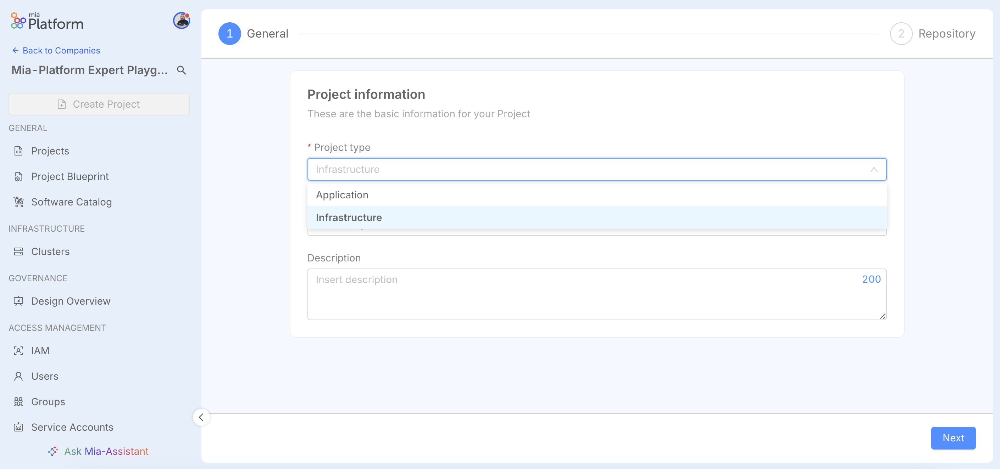
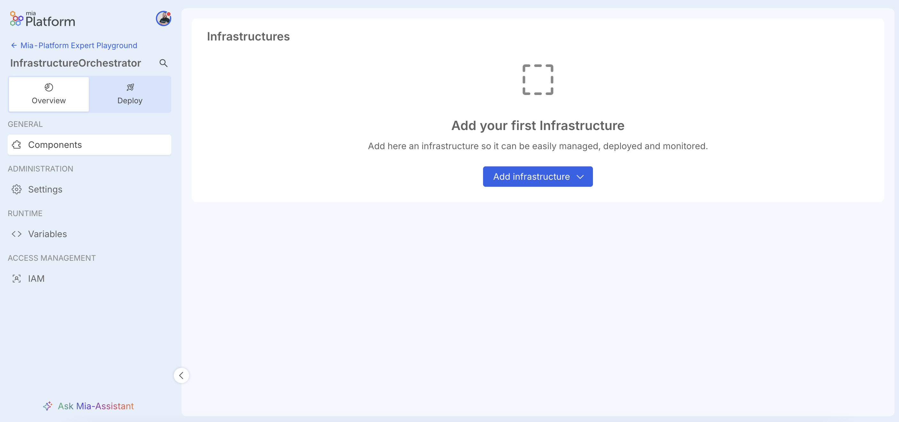
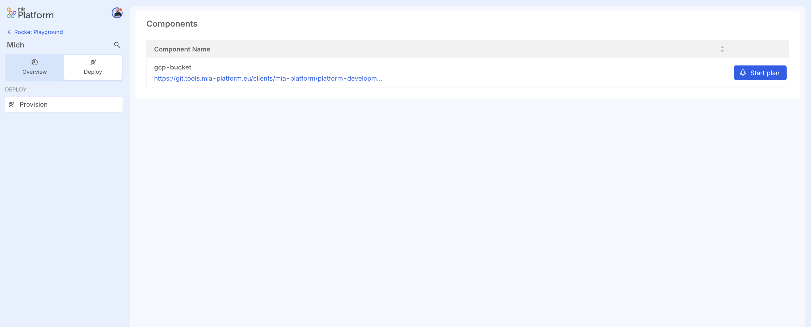
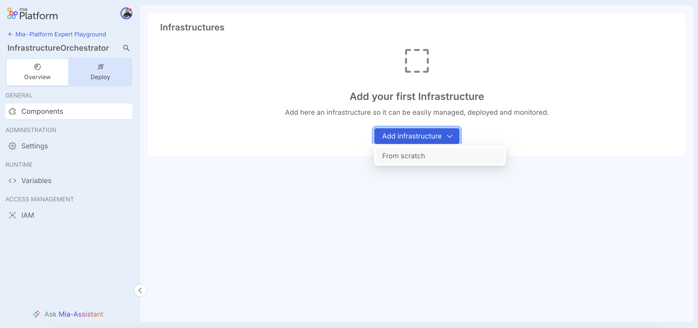
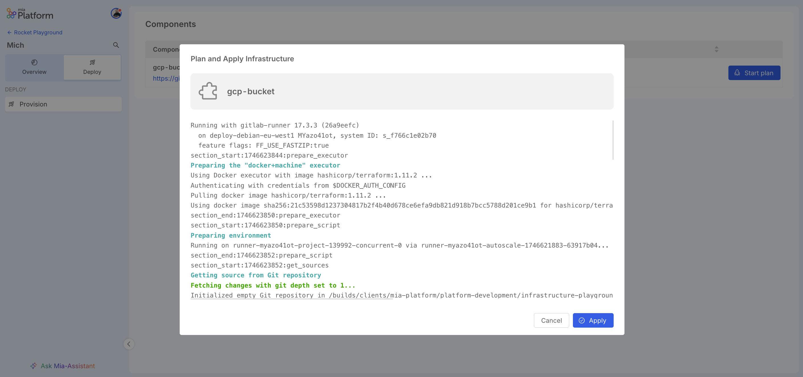

# Infrastructure Project How To

## Introduction
The "Infrastructure Project" is a new type of project that allows centralized management of infrastructure resources.
This type of project is exclusively dedicated to managing infrastructure resources and offers specific functionalities for creating, deploying, and managing these resources.

## Creating a Infrastructure Project


From v14 it is possible to create a new type of Project called "Infrastructure Project".
To create a new project, simply access the Console, enter a specific Company, and click on "Create Project".



In the General step, under "Project type", select the "Infrastructure" option.

This choice modifies the standard project creation flow, omitting the Environments step. Unlike traditional Application Projects, an Infrastructure project is not based on a single central repository. Instead, configuration occurs at the group level (or folder level, for providers like GitLab that support this structure). This group serves as a logical container for all repositories associated with the infrastructure project you are creating. You will still be able to configure the visibility of this group.



The newly created project will differ from standard ones, as it will only have functionalities dedicated to managing infrastructure resources.
This means, for example, that the Design section (among others) will not be present, and the sidebar menu will only include entries relevant to this type of project.

Specifically, the available console sections will be:
- Overview: where you can manage Settings, Variables, IAM, and Components, which allow management of infrastructure components.
- Deploy: which will contain a list of initialized Infrastructure Components available for deployment.



The Deploy section is very different from the standard one; here, there is no branch selection, environment choice, deploy button, or last deploy information.
Instead, it contains a list of Infrastructure Components initialized in this project that can be deployed.

## Creating a New Infrastructure Resource



In the Overview section, there is a "Components" page that allows management of Infrastructure Components.

By clicking the "Add Infrastructure" button, currently the only available option is to create a new resource from scratch.

In the future, it will be possible to create a new resource from a Marketplace of ready-to-use infrastructure components.


In the resource creation screen, the following must be specified:
- Resource name: the name to assign to the resource
- Repository URL: the git repository containing the Terraform/OpenTofu code of the resource
- Git ref name: the branch in the git repository where the Terraform/OpenTofu code is located
- Repository project ID: the project ID of the git repository

## Repository example Cloud Storage Bucket

In the following sections, we will provide an example of a git repository containing Terraform/OpenTofu code for creating a Google Cloud Storage bucket.

:::info
These are example snippets. Always adapt them to your specific requirements, thoroughly validate all settings (especially variables and secrets), and remember that many effective solutions can be designed differently.
:::

<details>
<summary>Cloud Storage Bucket</summary>
<p>

```
# Specify the Google Cloud provider
provider "google" {
  project = "my-gcp-project-123"   # Example GCP project ID
  region  = "europe-west3"         # Example default region
}

# Create a Google Cloud Storage bucket
resource "google_storage_bucket" "demo_bucket" {
  name          = "tf-demo-bucket-xyz"  # Example unique global bucket name
  location      = "EUROPE-WEST3"        # Example bucket location (region)
  storage_class = "NEARLINE"            # Example storage class

  # Enable or disable object versioning
  versioning {
    enabled = true   # Enable versioning to keep object history
  }

  # Lifecycle rule to transition or delete old objects
  lifecycle_rule {
    action {
      type = "SetStorageClass"  # Transition objects to a cheaper storage class
      storage_class = "COLDLINE"
    }
    condition {
      age = 30                   # Apply transition after objects are older than 30 days
    }
  }
}
```

</p>
</details>

## Example of a terraform code for creating a GKE Cluster in Google

In the following sections, we will provide an example of a git repository containing terraform code for creating a GKE Cluster in Google.

:::info
These are example snippets. Always adapt them to your specific requirements, thoroughly validate all settings (especially variables and secrets), and remember that many effective solutions can be designed differently.
:::


<details>
<summary>GKE Cluster</summary>
<p>

```
# Configure the Google Cloud provider provider
provider "google" {
  project = "my-gcp-project-123"   # Replace with your GCP project ID
  region  = "europe-west3"         # Default region for resources
}

# Create a GKE cluster without the default node pool
resource "google_container_cluster" "demo_gke" {
  name                     = "tf-demo-gke-cluster"  # Cluster name
  location                 = "europe-west3"         # Cluster location (region or zone)
  remove_default_node_pool = true                   # We’ll create a custom node pool below

  networking {
    network = "default"                             # Use the default VPC; for a custom network, reference a google_compute_network resource
  }

  # Enable Kubernetes API services
  addons_config {
    http_load_balancing {}
    horizontal_pod_autoscaling {}
  }
}

# Create a dedicated node pool for the cluster
resource "google_container_node_pool" "demo_nodes" {
  name       = "tf-demo-node-pool"
  cluster    = google_container_cluster.demo_gke.name
  location   = google_container_cluster.demo_gke.location
  node_count = 3                                            # Number of VM instances in this pool

  node_config {
    machine_type = "e2-medium"                              # VM size
    oauth_scopes = [
      "https://www.googleapis.com/auth/cloud-platform",     # Full access to GCP APIs (consider narrower scopes for production)
    ]
    labels = {
      env = "demo"
    }
    tags = ["k8s-node"]
  }

  # Auto-upgrade and auto-repair for node instances
  management {
    auto_upgrade = true
    auto_repair  = true
  }
}

```

</p>
</details>

## Example of a terraform code for creating a database MongoDB Atlas

In the following sections, we will provide an example of a git repository containing terraform code for creating a MongoDB Atlas database.

:::info
These are example snippets. Always adapt them to your specific requirements, thoroughly validate all settings (especially variables and secrets), and remember that many effective solutions can be designed differently.
:::

<details>
<summary>MongoDB Atlas</summary>
<p>

```
## Configure the MongoDB Atlas provider
provider "mongodbatlas" {
  # IMPORTANT: Replace with your actual API keys.
  # For better security, consider using environment variables:
  # export MONGODB_ATLAS_PUBLIC_KEY="your_public_key"
  # export MONGODB_ATLAS_PRIVATE_KEY="your_private_key"
  public_key  = "<ATLAS_PUBLIC_KEY>"  # Your Atlas API public key
  private_key = "<ATLAS_PRIVATE_KEY>" # Your Atlas API private key
}

# Create an Atlas Project
resource "mongodbatlas_project" "demo_project" {
  name   = "tf-demo-project"  # Logical name of your project
  # IMPORTANT: Replace with your actual Atlas Organization ID.
  # For better security, consider using environment variables:
  # export MONGODB_ATLAS_ORG_ID="your_org_id"
  org_id = "<ATLAS_ORG_ID>" # Your Atlas Organization ID
}

# Create an Atlas MongoDB cluster
resource "mongodbatlas_cluster" "demo_cluster" {
  project_id                  = mongodbatlas_project.demo_project.id
  name                        = "tf-demo-cluster"           # Unique cluster name
  provider_name               = "AWS"                       # Cloud provider for the cluster (e.g., AWS, GCP, AZURE)
  provider_region_name        = "EU_CENTRAL_1"              # Region (e.g., EU_CENTRAL_1 for Frankfurt on AWS)
  provider_instance_size_name = "M10"                       # Cluster tier (e.g., M10, M20, M30)
  backup_enabled              = true                        # Enable continuous backups

  # (Optional) Specify advanced settings
  replication_factor          = 3                           # Number of nodes in replica set
  disk_size_gb                = 20                          # Storage per node
  auto_scaling_disk_gb_enabled = true                      # Enable disk auto-scaling

  # For M10 and higher tiers, auto_scaling_compute_enabled might also be desired for compute scaling
  # auto_scaling_compute_enabled = true
  # provider_auto_scaling_compute_min_instance_size = "M10"
  # provider_auto_scaling_compute_max_instance_size = "M20"
}

# Create a database user for your application
resource "mongodbatlas_database_user" "app_user" {
  username           = "tf_app_user"
  # IMPORTANT: Replace with a strong, unique password. DO NOT commit this in plain text.
  # Consider using environment variables or a secrets manager.
  password           = "<STRONG_PASSWORD>"
  project_id         = mongodbatlas_project.demo_project.id
  roles {
    role_name       = "readWrite"
    database_name   = "admin" # Consider limiting to a specific database for production
  }
  auth_database_name = "admin" # The authentication database for the user
  labels = {
    env = "demo"
  }
}

```
</p>
</details>

## Deploying the Infrastructure Resource


From the Deploy section, you can deploy infrastructure resources.

Inside, you can see a table listing the created infrastructure resources, with their name and git repository.

The "Start Plan" button performs a plan operation on the resource, which analyzes the terraform code in the repository and shows what would happen if the described changes were applied.

The plan essentially informs what will be created, modified, or destroyed in case of applying the resource.



Once the plan is executed, its result will show the changes that will occur if the resource is applied.

If the plan is successful, the resource can be deployed by clicking the "Apply" button.

## Example of GitLab CI Pipeline to Deploy the Resources

Of course, the GitLab CI pipeline is essential for deploying the resources. In the following sections, we will provide an example of a GitLab CI pipeline that can be used to deploy the resources.

:::info
These are example snippets. Always adapt them to your specific requirements, thoroughly validate all settings (especially CI/CD variables and secrets), and remember that many effective solutions can be designed differently.
:::

<details>
<summary>Pipeline</summary>
<p>

```
# GitLab CI/CD OpenTofu Pipeline: Your Lean Starting Point
#
# Hey there! This pipeline is your foundation for automating OpenTofu with GitLab.
# We're covering the essentials: validating your code, planning changes, and
# applying them safely.
#
# Before you dive in, a few key things you'll need to tailor:
#
# 1. OpenTofu Version: Find `image: ghcr.io/opentofu/opentofu:1.8.2` and set your team's version.
# 2. Cloud Provider Authentication: This is crucial! Look for the `CRITICAL: Cloud Provider Authentication`
#    section in `before_script`. You'll need to add your specific cloud login steps there.
# 3. .opentofu.rc (Optional): If you use a custom `.opentofu.rc` for things like private provider
#    registries, you can load it using the `TF_CONFIG_RC_CONTENT` CI/CD variable.
# 4. Target Workspace: We use `TF_WORKSPACE` (defaulting to "default"). Set this as a CI/CD
#    variable in GitLab to switch between environments like 'dev', 'staging', or 'production'.

workflow:
  rules:
    - if: $CI_COMMIT_BRANCH
    - if: $CI_MERGE_REQUEST_ID

default:
  image: ghcr.io/opentofu/opentofu:1.8.2 # SET YOUR PREFERRED OPENTOFU VERSION HERE

  before_script:
    - |
      if [ -n "${TF_CONFIG_RC_CONTENT}" ]; then
        echo "${TF_CONFIG_RC_CONTENT}" > "${HOME}/.opentofu.rc" # Changed to .opentofu.rc
        echo "INFO: OpenTofu CLI configuration (.opentofu.rc) applied from CI/CD variable." # Changed message
      fi
    - |
      echo "INFO: Preparing for cloud provider authentication..."
      # --- YOUR AUTHENTICATION SCRIPT GOES HERE ---
      # Example for Google Cloud using a Service Account JSON key:
      # if [ -n "${GCP_SA_KEY_JSON}" ]; then
      #   echo "${GCP_SA_KEY_JSON}" > /tmp/gcp-sa-key.json
      #   export GOOGLE_APPLICATION_CREDENTIALS="/tmp/gcp-sa-key.json"
      #   echo "INFO: GCP authentication configured."
      # else
      #   echo "ERROR: GCP_SA_KEY_JSON CI/CD variable not set. Cloud operations will likely fail."
      #   exit 1
      # fi
      # --- END OF YOUR AUTHENTICATION SCRIPT ---

variables:
  TF_IN_AUTOMATION: "true"
  TF_WORKSPACE: "default"
  GIT_DEPTH: 10

.opentofu_cache: &opentofu_cache_definition # Changed cache name
  cache:
    key: "${CI_PROJECT_ID}-${CI_COMMIT_REF_SLUG}-${TF_WORKSPACE}-opentofu" # Changed cache key name
    paths:
      - .opentofu # Changed path
      - .opentofu.lock.hcl # Changed path
    policy: pull-push

stages:
  - validate
  - plan
  - apply

validate:
  stage: validate
  extends: .opentofu_cache # Changed extends
  script:
    - tofu init -reconfigure -input=false -no-color # Changed 'terraform' to 'tofu'
    # You can insert additional static analysis or linter scripts here before `fmt` and `validate`.
    # Example: tfsec . --no-color
    - tofu fmt -check -recursive -diff -no-color # Changed 'terraform' to 'tofu'
    - tofu validate -no-color # Changed 'terraform' to 'tofu'
  rules:
    - if: '$CI_PIPELINE_SOURCE == "merge_request_event"'
    - if: '$CI_COMMIT_BRANCH == $CI_DEFAULT_BRANCH'

plan:
  stage: plan
  extends: .opentofu_cache # Changed extends
  script:
    - tofu init -reconfigure -input=false -no-color # Changed 'terraform' to 'tofu'
    - |
      # Ensure the target workspace exists
      if ! tofu workspace select "${TF_WORKSPACE}" -no-color; then # Changed 'terraform' to 'tofu'
        tofu workspace new "${TF_WORKSPACE}" -no-color # Changed 'terraform' to 'tofu'
      fi
    # Here you could add scripts to dynamically generate .tfvars files or other preparations.
    # Example: ./scripts/generate-tfvars.sh > environment.auto.tfvars
    - tofu plan -out=tfplan -input=false -no-color # Changed 'terraform' to 'tofu'
  artifacts:
    paths:
      - tfplan
    expire_in: 1 day
  rules:
    - if: '$CI_PIPELINE_SOURCE == "merge_request_event"'
    - if: '$CI_COMMIT_BRANCH == $CI_DEFAULT_BRANCH'

apply:
  stage: apply
  extends: .opentofu_cache # Changed extends
  script:
    - tofu init -reconfigure -input=false -no-color # Changed 'terraform' to 'tofu'
    - tofu workspace select "${TF_WORKSPACE}" -no-color # Changed 'terraform' to 'tofu'
    # Custom pre-apply commands (e.g., notifications, last policy controls)
    # Example: ./scripts/notify-pre-apply.sh
    - tofu apply -auto-approve "tfplan" -input=false -no-color # Changed 'terraform' to 'tofu'
    # Custom post-apply commands (e.g., CMDB updates, notifications)
    # Example: ./scripts/run-smoke-tests.sh
  dependencies:
    - plan
  rules:
    - if: '$CI_COMMIT_BRANCH == $CI_DEFAULT_BRANCH'
      when: manual
      allow_failure: false

```

</p>
</details>

## Infrastructure Resource Repository

As already mentioned, the infrastructure resource repository is a git repository that contains the terraform code of the resource and the pipelines needed to deploy it.

Some key files in your repository are:
- main.tf: the main terraform file, which contains the resource definition and variables required for deployment.
- .gitlab-ci.yml: the GitLab pipeline configuration file, which contains the necessary pipelines to deploy the resource.
- scripts (folder): contains utility scripts necessary for the proper functioning of the project in the console.

### Scripts folder utility

The scripts folder can contains utility scripts that are used in the GitLab CI pipeline to perform various tasks, such as:

* Automate GitLab interactions: Programmatically trigger pipelines, monitor job statuses (like "plan" and "apply"), and fetch logs.
* Simplify Terraform output analysis: Scripts can display "plan" logs directly in the Console. This is crucial for reviewing proposed infrastructure changes before confirming an "apply".
* Enable a controlled deployment workflow: After reviewing the plan, the deployment automation prompts the user for confirmation before proceeding with applying changes, ensuring a deliberate and informed deployment process.
* Centralize configuration and utilities: This includes managing API tokens, initializing Terraform with the correct backend settings, and providing reusable utility functions and type definitions.

## Troubleshooting

If you encounter issues during the deployment process, consider the following steps:

- Ensure your Git repository is accessible and contains valid Terraform code.
- Check if the Git ref (branch or tag) exists and is spelled correctly.
- Review the output of the plan for any potential conflicts or errors.
- Confirm that the .gitlab-ci.yml includes all required jobs for the deployment process.
