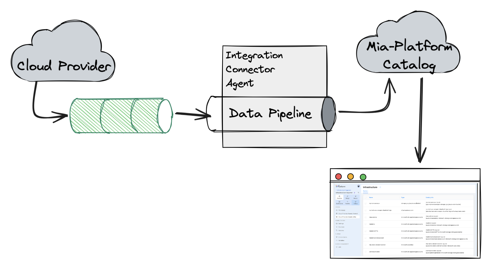
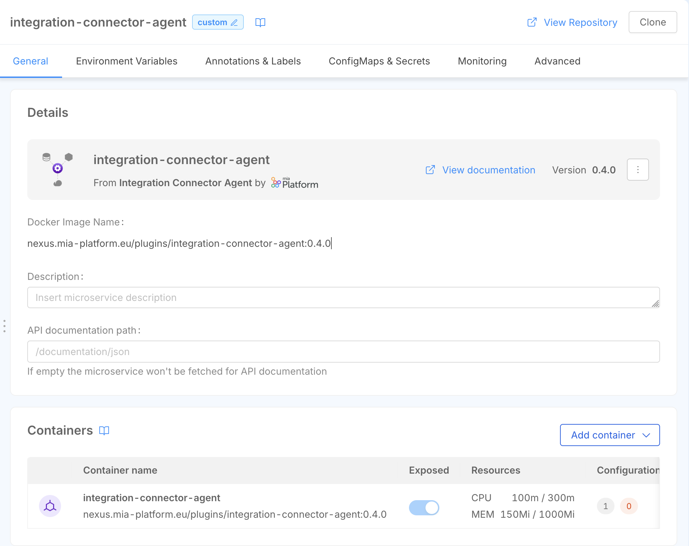
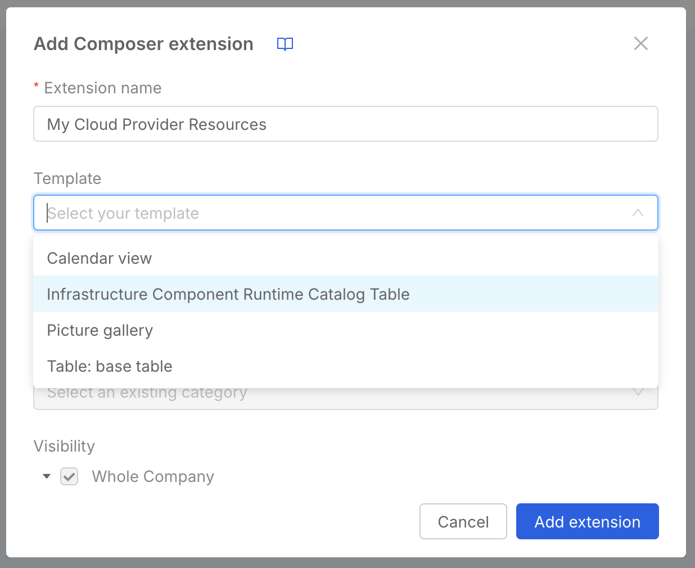
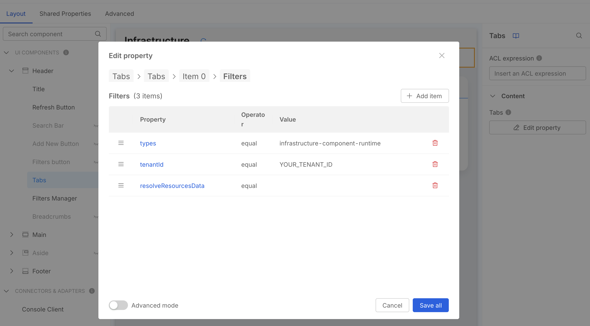

import Tabs from '@theme/Tabs';
import TabItem from '@theme/TabItem';

This tutorial will show you how to collect runtime data from your cloud provider and make it available to the your final user in Console.

The tutorial assumes you have the following prerequisites in place:

- you have created an [Infrastructure Project](/console/project-configuration/infrastructure-project.md#creating-an-infrastructure-project)
- you are using a supported Provider (see [this page](/console/project-configuration/infrastructure-project.md#technical-limitations))
- you have a repository with a [Terraform](https://www.hashicorp.com/en/products/terraform)/[OpenTofu](https://opentofu.org/) project in place that can produce a terraform plan file using the `show` command

## Architectural overview

The objective of this tutorial is to:

- use the Integration Connector Agent to collect runtime data from your cloud provider and save them within the Mia-Platform Catalog
- display the runtime data in the Console using Platforge Composer-based extensions.

Data will be processed by the Integration Connector Agent following an event-driven approach,
which means that the agent will listen to events coming from the Cloud Provider and will process them to update the runtime data in the Catalog.

To receive events from the Cloud Provider, we will create a bunch of resources in the Cloud Provider first (such as a Pub/Sub topic in GCP, and EventBridge rule in AWS or an EventHub in Azure),
then we will configure the Integration Connector Agent to listen to these events and process them.

Therefore, to reach this goal, we will have to setup the following components:

- setup Cloud Provider to send events
- configure the Integration Connector Agent to listen to these events and save them in the Catalog
- create a Platforge Composer-based extension to visualize the data in the Console



### Setup Cloud Provider integration

As mentioned above, we will need to create some resources in the Cloud Provider to receive events from it.

Every Cloud Provider has its own way to send events, so you will have to follow the specific instructions for your Cloud Provider.

:::tip
In order to create such resources we have created a Terraform module that will help you preparing the cloud provider environment.

You can find the modules in the following repository
TODO: LINK HERE
:::

<Tabs>
<TabItem value="aws" label="AWS" default>
You will need to:

- create a new CloudTrail;
- create a new SQS queue that will be used to receive events by the Integration Connector Agent;
- create a new EventBridge rule that will listen to the CloudTrail events and send them to the SQS queue.

:::info
Find out more about the specific steps to create these resources in the [Integration Connector Agent documentation](/runtime_suite/integration-connector-agent/use-cases/infrastructure-import/20_aws_infrastructure_import.md).
:::

</TabItem>

<TabItem value="gcp" label="GCP">
You will need to:

- enable the Cloud Asset Management API;
- create a Pub/Sub topic that will be used to receive events by the Integration Connector Agent;
- create a feed to send events from the Asset Management API to the Pub/Sub topic.

:::info
Find out more about the specific steps to create these resources in the [Integration Connector Agent documentation](/runtime_suite/integration-connector-agent/use-cases/infrastructure-import/10_gcp_infrastructure_import.md).
:::

</TabItem>

<TabItem value="azure" label="Azure">

TODO

:::info
Find out more about the specific steps to create these resources in the [Integration Connector Agent documentation](/runtime_suite/integration-connector-agent/use-cases/infrastructure-import/30_azure_infrastructure_import.md).
:::

</TabItem>
</Tabs>

### Configure the Integration Connector Agent

Now that we are done with the Cloud Provider, we can configure the Integration Connector Agent to listen to the events coming from the Cloud Provider and save them in the Catalog.

To do so you can create a new microservice in your Project starting from the [Integration Connector Agent](/runtime_suite/integration-connector-agent/10_overview.md) plugin.



Based on the Cloud Provider you are using some configurations may differ, in the example below you can find a configuration example for AWS, GCP and Azure.

To create the Integration Connector Agent data pipeline we are going to user the following components:

- vendor-specific source: there are three different sources depending on the Cloud Provider you are using:
  - `aws-cloudtrail-sqs` for AWS
  - `gcp-cloud-asset-pubsub` for GCP
  - `azure-event-hub` for Azure
  All of them will listen to the events coming from the Cloud Provider and will produce events that will be processed by the Integration Connector Agent.
  Furthermore they also provide a webhook that can be used to trigger a full import
- `cloud-vendor-aggregator` processor: this processor will aggregate the events coming from the Cloud Provider and will produce a single event for each resource.
- `mapper` processor: this processor will map the event produced by the `cloud-vendor-aggregator` processor to the format expected by the Catalog.
- `console-catalog` sink: this sink will save the event in the Catalog, using the `infrastructure-component-runtime` item type.

:::note
We are saving the items using the `infrastructure-component-runtime` item type, which is a specific item type that is used to store runtime data for infrastructure components.

You can find out more information about this item type in the [Catalog documentation](/software-catalog/items-manifest/infrastructure-component-runtime.md).
:::

<Tabs>

<TabItem value="aws" label="AWS" default>

```json
{
  "integrations": [
    {
      "source": {
        "type": "aws-cloudtrail-sqs",
        "queueUrl": "https://sqs.REGION.amazonaws.com/ACCOUNT_ID/QUEUE_NAME",
        "region": "REGION",
        "accessKeyId": "{{AWS_ACCESS_KEY_ID}}",
        "secretAccessKey": { "fromEnv": "AWS_SECRET_ACCESS_KEY" },
        "webhookPath": "/aws"
      },
      "pipelines": [
        {
          "processors": [
            {
              "type": "cloud-vendor-aggregator",
              "cloudVendorName": "aws",
              "authOptions": {
                "accessKeyId": "{{AWS_ACCESS_KEY_ID}}",
                "secretAccessKey": { "fromEnv": "AWS_SECRET_ACCESS_KEY" }
              }
            },
            {
              "type": "mapper",
              "outputEvent": {
                "name": "{{name}}",
                "runtimeData": {
                  "name": "{{name}}",
                  "type": "{{type}}",
                  "provider": "{{provider}}",
                  "location": "{{location}}",
                  "relationships": "{{relationships}}",
                  "tags": "{{tags}}",
                  "timestamp": "{{timestamp}}"
                }
              }
            }
          ],
          "sinks": [
            {
              "type": "console-catalog",
              "url": "https://your-console-url.com",
              "tenantId": "TENANT_ID",
              "clientId": "CLIENT_ID",
              "clientSecret": { "fromEnv": "CONSOLE_SERVICE_ACCOUNT_CLIENT_SECRET" },
              "itemType": "infrastructure-component-runtime",
              "itemIdTemplate": "{{runtimeData.provider}}-{{runtimeData.name}}-{{runtimeData.type}}",
              "itemNameTemplate": "{{name}} ({{runtimeData.provider}})"
            }
          ]
        }
      ]
    }
  ]
}
```

</TabItem>

<TabItem value="gcp" label="GCP">

```json
{
  "integrations": [
    {
      "source": {
        "type": "gcp-inventory-pubsub",
        "projectId": "GCP_PROJECT_ID",
        "topicName": "GPC_PUBSUB_TOPIC_NAME",
        "subscriptionId": "GCP_PUBSUB_SUBSCRIPTION_ID",
        "ackDeadlineSeconds": 15,
        "credentialsJson": { "fromEnv": "GCP_CREDENTIALS_JSON" },
        "webhookPath": "/gcp"
      },
      "pipelines": [
        {
          "processors": [
            {
              "type": "cloud-vendor-aggregator",
              "cloudVendorName": "gcp",
              "authOptions": {
                "credentialsJson": { "fromEnv": "GCP_CREDENTIALS_JSON" }
              }
            },
            {
              "type": "mapper",
              "outputEvent": {
                "name": "{{name}}",
                "runtimeData": {
                  "name": "{{name}}",
                  "type": "{{type}}",
                  "provider": "{{provider}}",
                  "location": "{{location}}",
                  "relationships": "{{relationships}}",
                  "tags": "{{tags}}",
                  "timestamp": "{{timestamp}}"
                }
              }
            }
          ],
          "sinks": [
            {
              "type": "console-catalog",
              "url": "https://your-console-url.com",
              "tenantId": "TENANT_ID",
              "clientId": "CLIENT_ID",
              "clientSecret": { "fromEnv": "CONSOLE_SERVICE_ACCOUNT_CLIENT_SECRET" },
              "itemType": "infrastructure-component-runtime",
              "itemIdTemplate": "{{runtimeData.provider}}-{{runtimeData.name}}-{{runtimeData.type}}",
              "itemNameTemplate": "{{name}} ({{runtimeData.provider}})"
            }
          ]
        }
      ]
    }
  ]
}
```

</TabItem>

<TabItem value="azure" label="Azure">

```json
{
  "integrations": [
    {
      "source": {
        "type": "azure-activity-log-event-hub",
        "subscriptionId": "AZURE_SUBSCRIPTION_ID",
        "eventHubNamespace": "AZURE_EVENT_HUB_NAMESPACE",
        "eventHubName": "AZURE_EVENT_HUB_NAME",
        "checkpointStorageAccountName": "AZURE_CHECKPOINT_STORAGE_ACCOUNT_NAME",
        "checkpointStorageContainerName": "AZURE_CHECKPOINT_STORAGE_CONTAINER_NAME",
        "tenantId": "AZURE_TENANT_ID",
        "clientId": { "fromEnv": "AZURE_CLIENT_ID" },
        "clientSecret": { "fromEnv": "AZURE_CLIENT_SECRET" },
        "webhookPath": "/azure"
      },
      "pipelines": [
        {
          "processors": [
            {
              "type": "cloud-vendor-aggregator",
              "cloudVendorName": "azure",
              "authOptions": {
                "tenantId": "AZURE_TENANT_ID",
                "clientId": { "fromEnv": "AZURE_CLIENT_ID" },
                "clientSecret":{ "fromEnv": "AZURE_CLIENT_SECRET" }
              }
            },
            {
              "type": "mapper",
              "outputEvent": {
                "name": "{{name}}",
                "runtimeData": {
                  "name": "{{name}}",
                  "type": "{{type}}",
                  "provider": "{{provider}}",
                  "location": "{{location}}",
                  "relationships": "{{relationships}}",
                  "tags": "{{tags}}",
                  "timestamp": "{{timestamp}}"
                }
              }
            }
          ],
          "sinks": [
            {
              "type": "console-catalog",
              "url": "https://your-console-url.com",
              "tenantId": "CONSOLE_TENANT_ID",
              "clientId": "CLIENT_ID",
              "clientSecret": { "fromEnv": "CONSOLE_SERVICE_ACCOUNT_CLIENT_SECRET" },
              "itemType": "infrastructure-component-runtime",
              "itemIdTemplate": "{{runtimeData.provider}}-{{runtimeData.name}}-{{runtimeData.type}}",
              "itemNameTemplate": "{{name}} ({{runtimeData.provider}})"
            }
          ]
        }
      ]
    }
  ]
}
```

</TabItem>
</Tabs>

### Composer page

Now that we have configured everything needed to gather runtime data and push it to the Catalog, we can create a Composer page to visualize the data in the Console.

You can create a new [Composer page Extension](/console/company-configuration/extensions.md) in your Company using the *Infrastructure Component Runtime Catalog Table* template.



:::caution
The *Infrastructure Component Runtime Catalog Table* template is meant to consume resources from the Catalog of a specific tenant,
therefore you will have to set the `tenantId` filter in order for the page to work properly.

You **MUST** set the filter value in the `Runtime` Tab filters settings, to get there you need to

- click on `Tabs` in the layout page left sidebar
- in the right sidebar, under Content, press `Edit property`
- this will open a modal where you can see the list of the available Tabs, select `Runtime`
- now press the `Edit property` button in the *filters* sections
- you should now see the preset filters (see the screenshot below), one being `tenantId` with a placeholder value, change it according to your actual Company ID


:::
