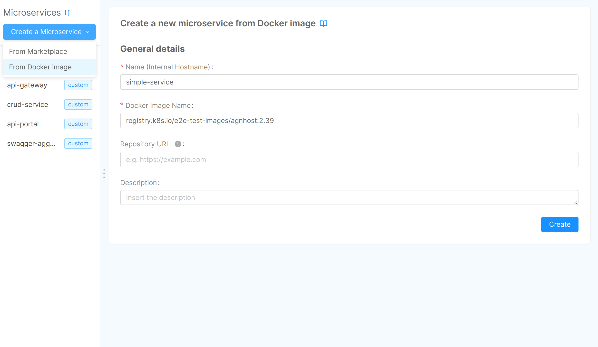
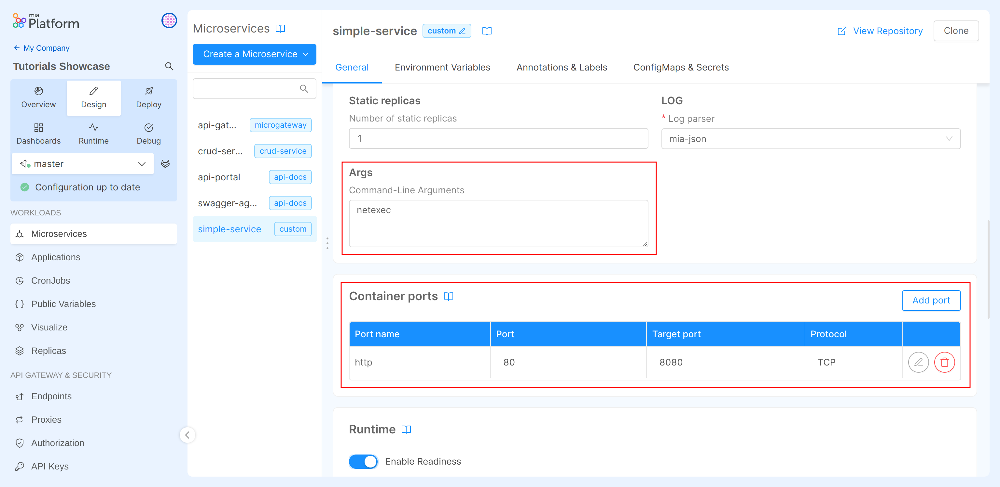
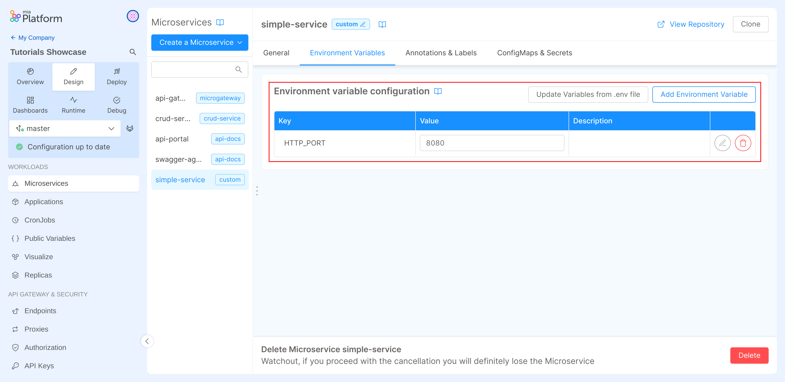
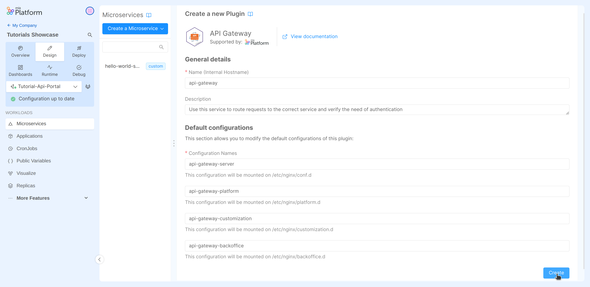
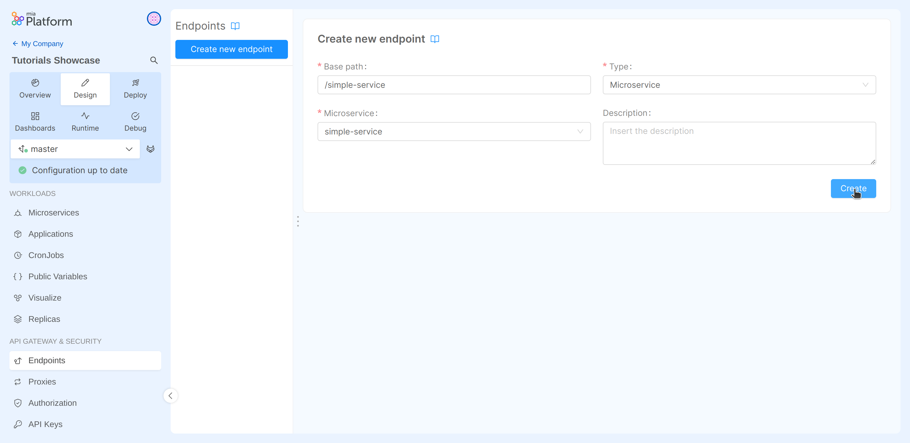

In this tutorial, we will create and expose a service to the outside of the cluster using the Mia-Platform Console. We will start with a pre-packaged Docker image. The service will expose a route that returns the timestamp of the API invocation.

## What we will build

We will create a new microservice using the Docker image `registry.k8s.io/e2e-test-images/agnhost:2.39`. The service will expose a route that returns the timestamp of the API invocation.

## Prerequisites

Before starting, we will assume that, you already have a clean project in Mia-Platform Console. To know how to create a project on Mia-Platform Console, read [this guide](/console/project-configuration/create-a-project.mdx).

To follow this tutorial correctly, it is necessary to have configured a Docker Registry within the Mia-Platform Console. To learn how to configure a Docker Registry, please follow [this](/console/project-configuration/docker-registry-configuration.md) guide.

The project must:

- Be integrated with a [deploy pipeline](/infrastructure/self-hosted/pipeline-configuration.md);
- Have an [ingress route](/infrastructure/paas/tools/traefik.md) with "api-gateway" as `service`;
- Be aware of have configured your project domain to be called. If the project links have been configured, you can find them in the "Environments" section of the "Project Overview" area, under the "Application" column;
- Have a properly configured API Portal.
- Have a properly configured CRUD Service.

Better to have:

- Some familiarity with **API** and **REST** concepts. More information about API is available [here](/getting-started/guidelines/rest-api-vademecum.md).
- Basic **Docker** knowledge. More information about Docker is available [here](/getting-started/guidelines/docker-vademecum.md)

:::tip
If your are using a Mia-Platform Console in PaaS and the project has been created using the "Mia-Platform Basic Project Template", the project is already configured as needed.
:::

## Create a new microservice from a Docker image

The only requirement to import an external Microservice is that the Docker Image needs to be already built.
Once you select the card to upload a Docker image, you can see a new tab where you need to fill in the following information:

* **Name** (*required*): this is the internal hostname (`simple-service` for our purpose);  

* **Docker Image Name** (*required*): the complete docker image name of the service. The docker image repository must be accessible by the cluster k8s (`registry.k8s.io/e2e-test-images/agnhost:2.39` for our purpose);

:::info
  Docker image names have the format `hostname/imagename:tag`, where hostname and tag are optional.
  - `hostname` is the registry hostname where the docker image is hosted
  - `imagename` is the docker image name
  - `tag` is the version of the docker image
:::

* **Repository URL** (*optional*): the URL to the repository hosting the microservice code. The user will be able to easily clone the repository from the service detail page later.

* **Description** (*optional*): this is the description of your microservice.



Finally to create the Microservice push **create**.

:::info
To explore service management within the Mia-Platform console, please refer to the [dedicated documentation page](/development_suite/api-console/api-design/services.md).
:::

## Configure the service 

To ensure that the newly created _simple-service_ functions correctly, we need to modify some service configurations.
The first step is to set `netexec` as a command-line argument through the _Microservice Configuration_ section in the _Args_ field.
Next, in the _Container Ports_ section, you should change the default port by modifying the _Target Port_ from `3000` to `8080`.



The final step is to modify the _Environment variables_ of the service by changing the value of the key `HTTP_PORT` to `8080`.



## Create a gateway microservice

At this point the service we have created is only reachable inside the project, which is clearly not so useful. So we want to expose the route externally, but to do so we first need to create a **gateway service**, so let's create it!

In order to add your API Gateway service:

1. Go back to Mia-Platform Console;
1. Click on the _Create a Microservice_ button;
1. In the dropdown menu, select _From Marketplace_ option;
1. On the right side, you will see a catalogue of plugin, templates and examples;
1. Type "API Gateway" in the search bar;
1. Select the card titled "API Gateway" from the list of results;
1. Click on the _Create_ button applying the default fields values.
1. Save the changes to make them persistent.



:::tip
You can select your preferred API Gateway for your projects. We are using the nginx-based "API Gateway" only for demonstration purposes.
:::

## Expose the route

Now the last remaining piece is to inform the API gateway of the presence of our routes to redirect requests to it.

In order to do so:

1. Navigate to the _endpoints_ section from the left side menu.
1. Click on the _Create new endpoint_ button;
1. Fill the input:
   - **Base path**: `/simple-service`
   - **Type**: in the dropdown menu "_Microservice_"
   - **Microservice**: in the dropdown menu "_simple-service_"
1. Click on the _Create_ button.
1. In the generated configuration, check that the "Rewrite Base Path" is set to `/`;
1. Save the changes to make them persistent.



By doing this, we have configured the API Gateway so that all the incoming requests having `/simple-service` as prefix in the path, are forwarded to the "_simple-service_" without the previously mentioned prefix.

We have completed the design of our first project! Now the last step is to deploy it and test the developed functionality.

## Deploy the project

In this last step of the tutorial we will [deploy](/development_suite/deploy/overview.md) all the committed configurations. That means to create a new Kubernetes Pod for each service.

To sum up, the services we are going to deploy are:

- The "delivery-service" microservice;
- The API gateway with the endpoint configurations.

We can now deploy the project! If you do not know how to do it, take a quick look at [Mia-Platform handbook](/getting-started/handbooks/project/usage.md#deploy-changes) first.

A pipeline will be triggered by the Console to start the deploy of your project.

At the end of the pipeline, go to the _Runtime_ section and wait for your pod to be ready. If you do not know how to do it, take a quick look at [Mia-Platform handbook](/getting-started/handbooks/project/usage.md#monitor-runtime-system) first.

Now we are ready to test the endpoint!
Replace `<project-domain>` with the correct one and try it:

```sh
curl https://<project-domain>/simple-service
```