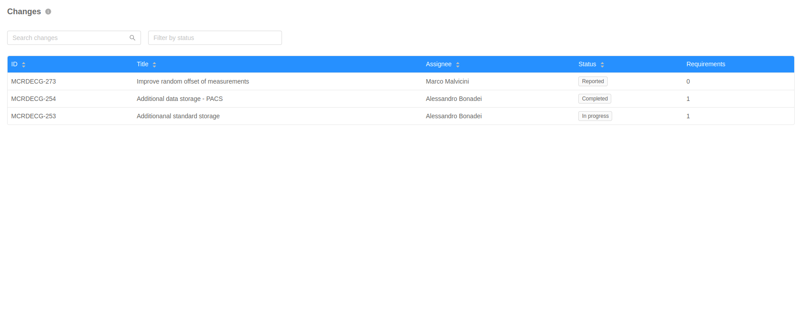
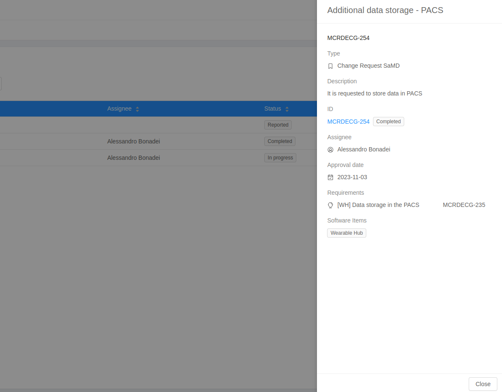

The **Changes Table** shows all the changes issues of the project. It is possible to sort, search and filter the issues. Clicking on a table row a specific requirement is expanded in a Drawer on the right, displaying additional info. 

## Changes table

The reported changes fields are: 

- **ID**: unique Id of the issue;
- **Title**: summary of the issue;
- **Assignee**: user-account who works on the issue;
- **Status**: status of the change;
- **Requirements**: number of requirements associated to the change;

## Changes Drawer

The drawer of a specific change contains additional information about the issue:

- **Type**: type of change;
- **Description**: a verbose description of the change;
- **Approval date**: date of approval of the change;
- **Requirements**: list of requirements associated to the change;
- **Software items**: Software items associated to the change;

