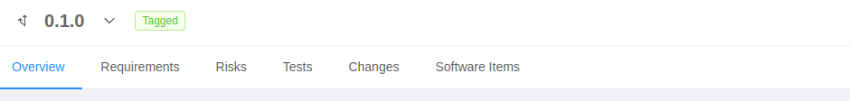
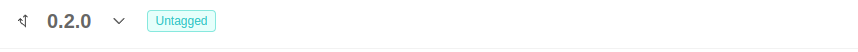

This section provides information about the top level version indicator and navigation bar of the **P4SaMD** Web Application.

## Version Tag

At the top left corner of the dashboard the selected project version is indicated. All the information displayed in the App reference the selected version. With a dropdown menu it is possible to switch between available versions. 

The Tagged/Untagged flag indicates if the selected project version has already a tag to be deployed with.

## Navigation bar

Right below the version indicator lies the navigation bar, which allows the user to navigate between the **P4SaMD** boards:

- [**Overview**](./overview.md): it includes top-level information about the project and a completion progress bar. This is the landing page of the App;
- [**Requirements**](./requirements.md): table of the requirements;
- [**Risks**](./risks.md): table of the risks;
- [**Tests**](./tests.md): table of the tests;
- [**Changes**](./changes.md): table of the changes;
- [**Software Items**](./software_items.md): table of the software items;