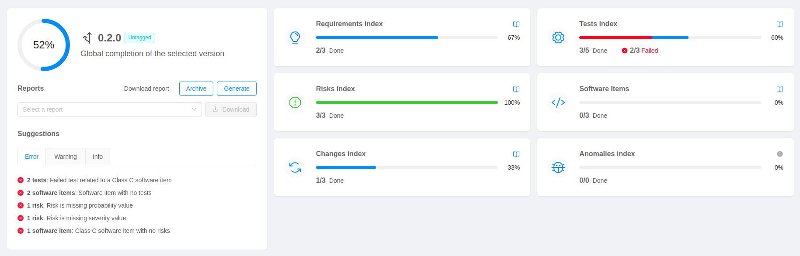

The **Overview dashboard** is the landing page of the **P4SaMD** Web Application. It shows to the user all the most relevant data about the project, including its healthiness and the completion progression bar, and allows to generate, archive and download documentation.

In the Overview we can see three main sections:
* [**Global completion**](#global-completion)
* [**Suggestions**](#suggestions)
* [**KPIs**](#kpis)

## Global completion

In the *global completion* card is visualized a progress bar that shows the completion state of the selected version. Moreover, it is also possible to generate the documentation related to the [Technical Dossier](../reports/release_notes.md). In particular, a user can:
  * Generate all the reports
  * Archive the documentation
  * Download all the reports
  * Download a specific report

The download buttons will be disabled if the documentation has not been generated yet (*Generate report* button).
When the documentation is archived (*Archive* button) it is not possible to re-generate the reports, and the downloaded files will be fetched from a repository dedicated to the **Archived Documentation**. All the archived documentation will be downloaded in a zip file.

## Suggestions

The *Suggestion* card displays useful insights about the errors, warnings and info of the project.

The following tables give an overview of the rules implemented by the **P4SaMD** platform.

| Level | Affected Entities | Rule | Description |
| :--: | :--: | :-- | :-- |
| **error** | Risks | Risk is missing severity value | All risks should have a severity value |
| **error** | Risks | Risk is missing probability value | All risks should have a probability value |
| **error** | Risks | Risk is missing components/SW items | All risks should refer to at least one component (SW item) |
| **error** | Global | Issue has been updated after the freeze of the version | Issues belonging to a version that has been archived should not be changed |

| Level | Affected Entities | Rule | Description |
| :--: | :--: | :-- | :-- |
| **warning** | Requirements | Closed requirement with no linked stories | A *closed* requirement with no linked stories could be a problem |
| **warning** | Requirements | In progress requirement with linked stories | An *in progress* requirement with linked stories could be a problem |
| **warning** | Risks | Closed risk with no linked requirements | A *closed* risk with no linked requirements could be a problem |

## KPIs

The *KPIs* card displays different indicators that allows users to perform gap analysis, in order to better understand what is missing to complete the selected version; The KPIs refers to different entities:
  * **Requirements Index**: the requirements card shows the progress bar of the requirements issues, indicating the percentage of successfully completed requirements;
  * **Risks Index**: the risks card shows the progress bar of the risks issues, indicating the percentage of successfully addressed risks;
  * **Changes Index**: the changes card shows the progress bar of the changes issues, indicating the percentage of successfully implemented changes;
  * **Tests Index**: the tests card shows the progress bar of the tests issues, indicating the percentage of executed tests and the number of successful and failed ones;
  * **Software items Index**: the software items card shows the progress bar of the software items, indicating the percentage of completed ones;
  * **Anomalies Index**: the anomalies card shows the progress bar of the bug issues, indicating the percentage of successfully fixed bugs.