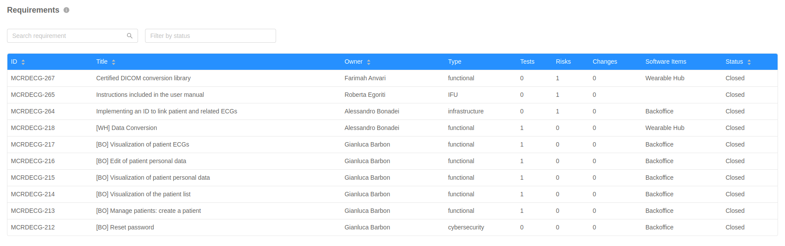
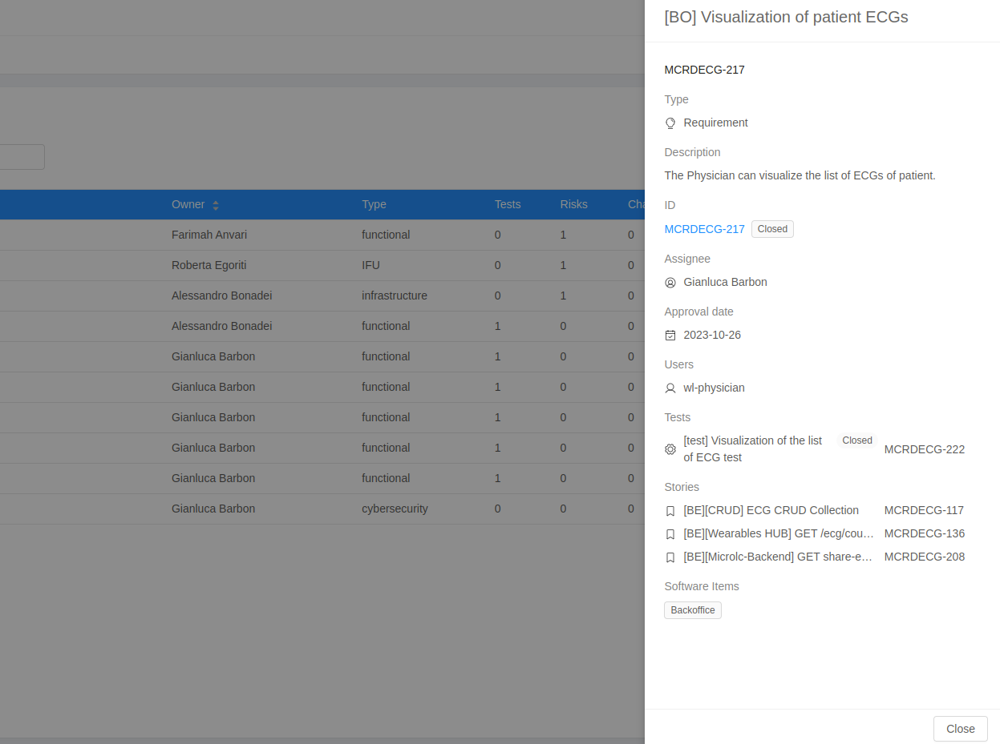

The **Requirements Table** shows all the Requirement issues of the project. It is possible to sort, search and filter the issues. Clicking on a table row a specific requirement is expanded in a Drawer on the right, displaying additional info. 

## Requirements table

The reported requirements fields are: 

- **ID**: unique Id of the issue;
- **Title**: summary of the issue;
- **Owner**: user-account who owns the issue;
- **Type**: type of requirement;
- **Tests**: number of tests associated to the requirement;
- **Risks**: number of risks associated to the requirement;
- **Changes**: number of changes associated to the requirement;
- **Software items**: Software items associated to the requirement;
- **Status**: status of the requirement;

## Requirements Drawer

The drawer of a specific requirement contains additional information about the issue:

- **Description**: a verbose description of the requirement;
- **Assignee**: user-account who works on the requirement;
- **Users**: final users of the feature described in the requirement;
- **Tests**: list of tests associated to the requirement;
- **Stories**: list of user stories associated to the requirement;

