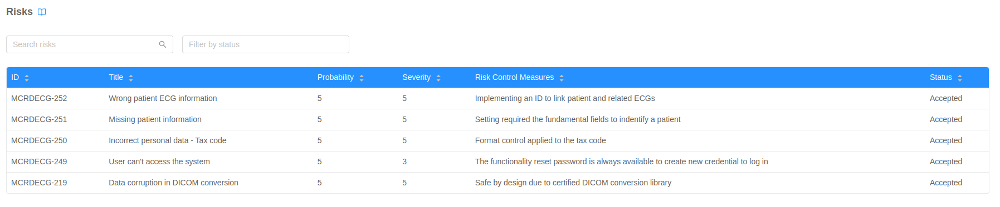
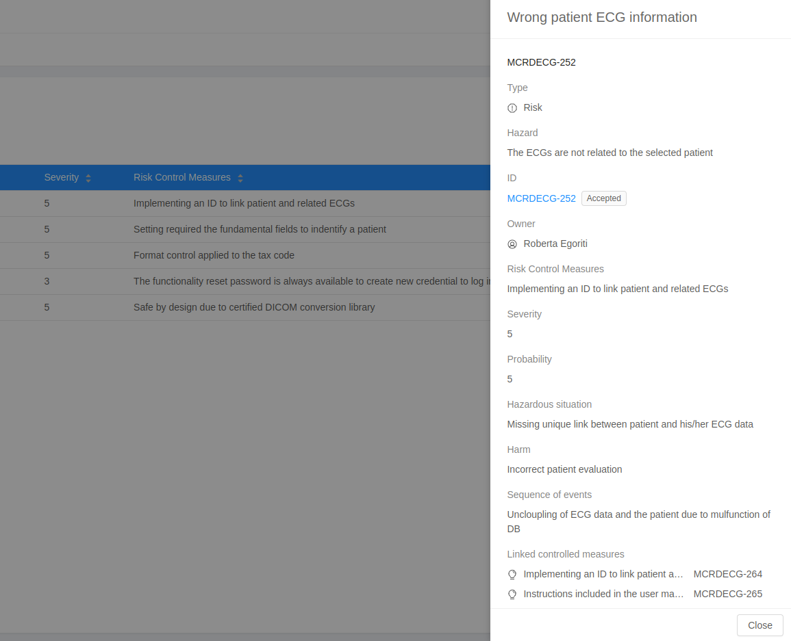

The **Risks Table** shows all the Risks issues of the project. It is possible to sort, search and filter the issues. Clicking on a table row a specific risk is expanded in a Drawer on the right, displaying additional info. 

## Risks table

The reported risks fields are: 

- **ID**: unique Id of the issue;
- **Title**: summary of the issue;
- **Probability**: risk probability, included in the range [1,5];
- **Severity**: risk severity, included in the range [1,5];
- **Risk Control Measures**: verbose description of how to mitigate the risk;
- **Status**: status of the risk;

## Risks Drawer

The drawer of a specific risk contains additional information about the issue:

- **hazard**: hazard caused by the risk;
- **Owner**: user-account who owns the issue;
- **Hazardous situation**: scenarios when the risk can occur;
- **hazard**: consequences of the risk;
- **Sequence of events**: sequence of actions that can cause the risk to occur;
- **Linked controlled measures**: requirements associated to the risk;

