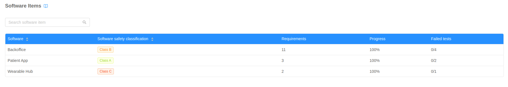
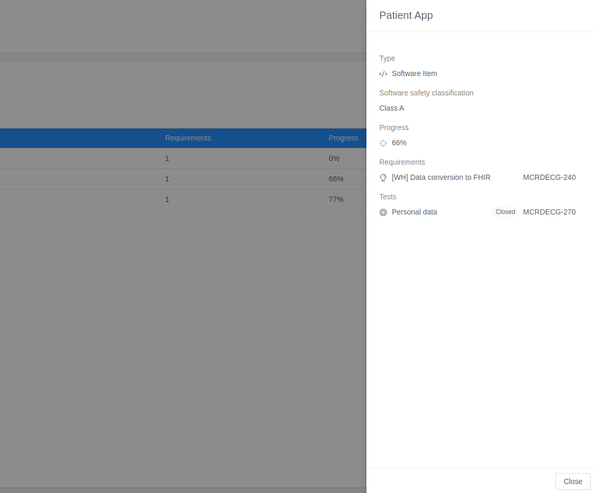

The **Software items Table** shows all the Software items of the project. Clicking on a table row a specific software item is expanded in a Drawer on the right, displaying additional info. 

## Software items table

The reported software items fields are: 

- **Software**: name of the software item;
- **Software safety classification**: safety class of the software item;
- **Requirements**: number of requirements associated to the software item;
- **Progress**: percentage of completed issues associated to the software item;
- **Failed tests**: number ratio of failed tests associated to the software item;

## Software items Drawer

The drawer of a specific requirement contains additional information about the issue:

- **Requirements**: list of requirements associated to the software item;
- **Tests**: list of test associated to the software item;

