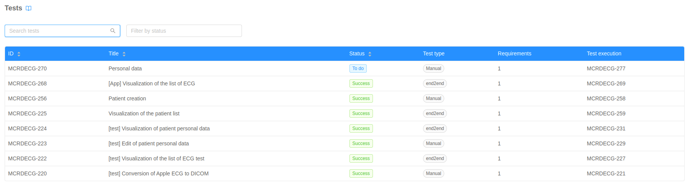
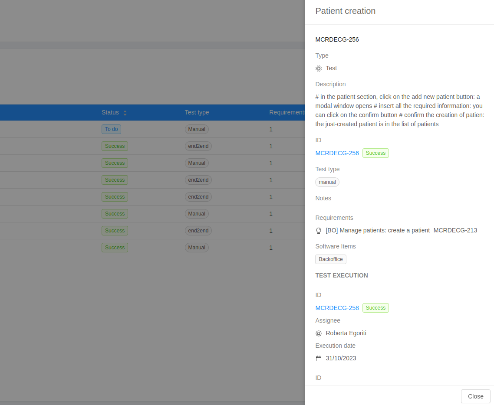

The **Tests Table** shows all the tests issues of the project. It is possible to sort, search and filter the issues. Clicking on a table row a specific test is expanded in a Drawer on the right, displaying additional info. 

## Tests table

The reported tests fields are: 

- **ID**: unique Id of the issue;
- **Title**: summary of the issue;
- **Status**: status of the last test execution;
- **Test type**: type of the test;
- **Requirements**: number of requirements associated to the test;
- **Test execution**: id of the last test execution associated to the test;

## Tests Drawer

The drawer of a specific test contains additional information about the issue:

- **Description**: a verbose description of the test;
- **Notes**: additional notes about the test;
- **Requirements**: list of requirements associated to the test;
- **Software items**: software items associated to the test;
- **Test executions**: list of test executions of the test;

