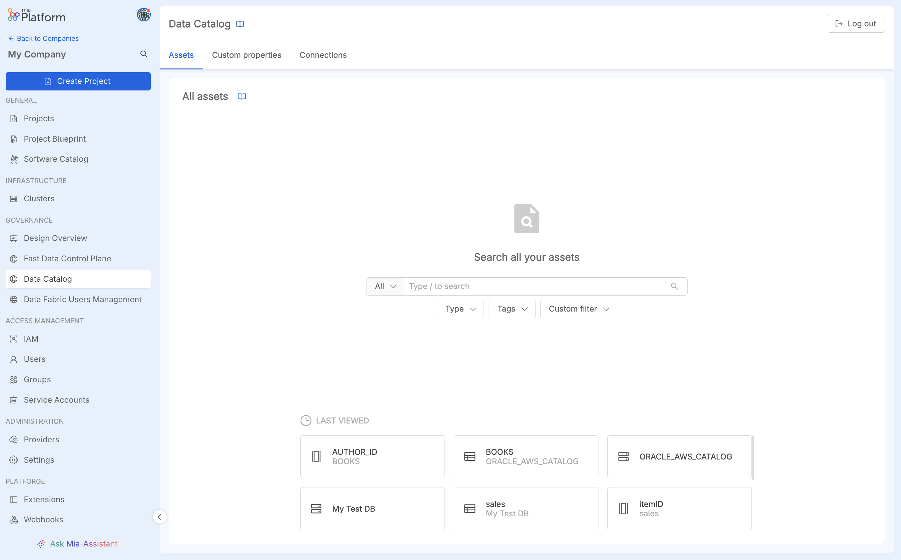
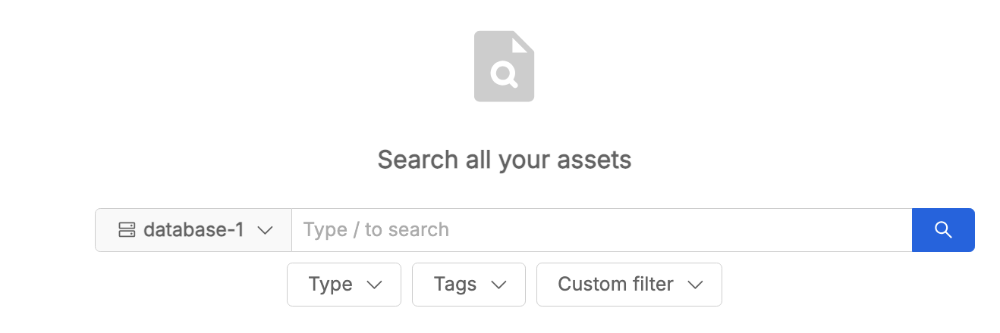
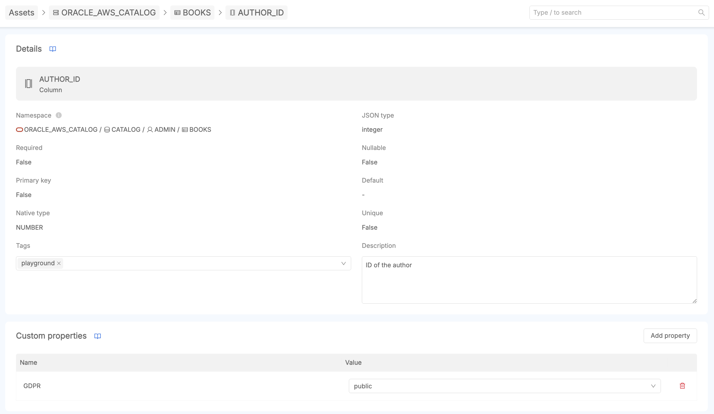
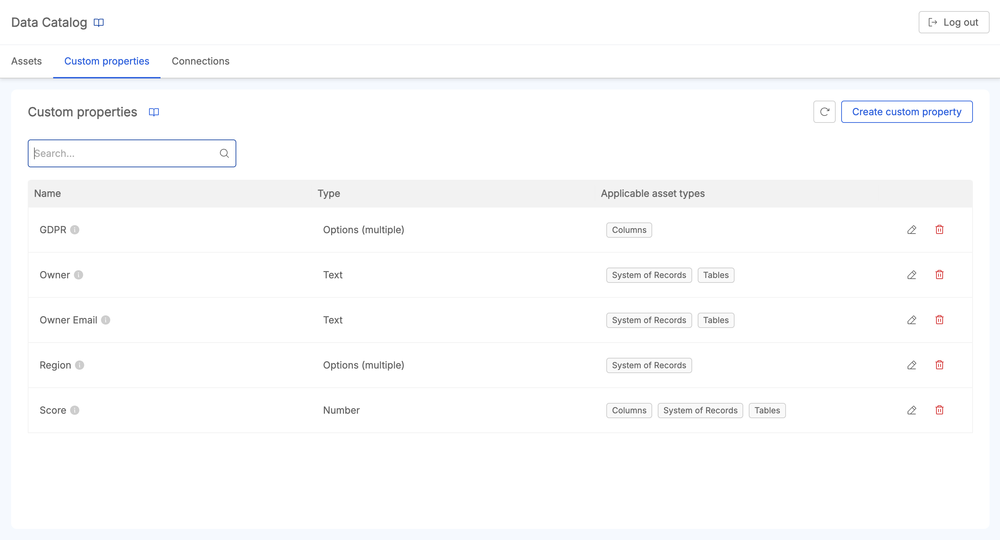
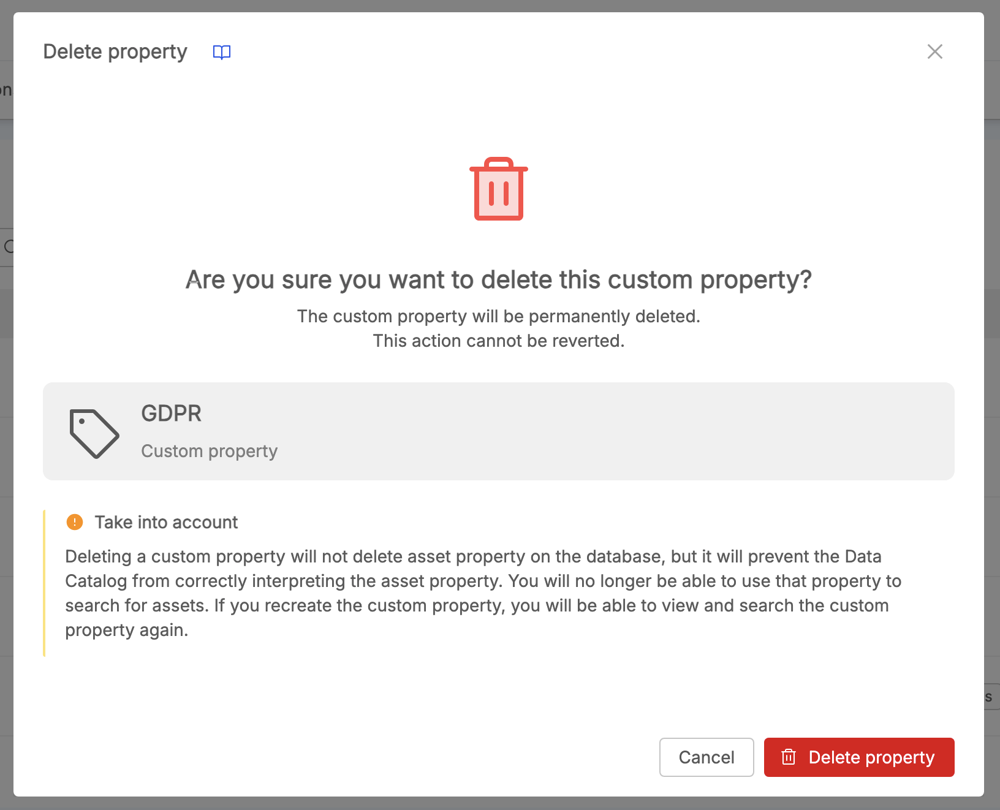

**Mia-Platform Data Catalog** solution provides a centralized place wherein users can have a detailed overview of the available data assets, facilitating the consultation and allowing to perform metadata enrichment on them.  
Data Catalog frontend communicates with [Open Lineage](/data_catalog/data_catalog_open_lineage.mdx) backend
via [Fabric BFF](/data_catalog/data_catalog_fabric_bff.mdx) component.

## Features

Mia-Platform Data Catalog frontend offers a user-friendly UI that allows users to navigate data assets and to perform a series of actions useful for data governance and metadata enrichment.  
In particular, when navigating the catalog, it is possible to identify three different asset types:  
* **SoR** (System of Records)
* **Table** (tables belonging to a specific SoR)
* **Column** (columns retrieved for a specific table).  

In the following paragraphs, all Data Catalog features are described in detail.

### Asset discovery

When accessing Data Catalog frontend, user lands to the home section of the Data Catalog, where there is a searchbar that represents the starting point to navigate among Data Catalog assets.

Given the large cardinality of assets that can be retrieved on this tool (SoR, Tables, Columns), it is possible to fine-tune search results through both the search-context setting and advanced search filtering options.  

#### Search-context

Next to the search bar, the search context can be set to better circumscribe the search scope. For example, if the System of Records within which you want to perimeter the search results is already known, you can from the search context enter that specific SoR. All results returned from the search will be assets belonging to the context of that specific SoR. To refine the search scope even more, it is also possible from the context to select a table.

#### Advanced filters

To refine the search to make it even more granular, it is also possible to apply filters:

- by **asset types** (SoR, Table, Column): only results that match the selected asset type are returned;
- by **tags**: only assets that contains at least one of the chosen tags are returned;
- by **custom filters**: only assets that present a match with all the values defined on the selected custom properties are returned (in [this paragraph](#custom-properties-management), the custom property concept is well-described).

#### Search results

In the following image, it is possible to see how results of a search are displayed.

The `Matches` column helps the user to identify which are the search elements that fit the search query.  
The research is very powerful. What is entered as input to the search bar is searched not only on the asset name, but also on all the metadata in the information of the specific assets. As a result, therefore, it can be observed from the example that the search returns not only match results relatively to the name, but also to other information present in other assets with names which differ from the search input content.  

To start a completely new search, users can easily click on the `Clear all` button at the top-right of the search page to reset all the previously setup search parameters.

### Asset details navigation 

Once the searched asset is found among the search returned elements, click on it to enter its details page.  

At the top of the page a bredcrumb helps users to easily understand the background structure of Data Catalog navigation patterns. In the example, user has entered the table `orders-details` detail page; from the breadcrumb it is noticeable that table `orders-details` belongs to System of Records `crud-books`.

In case the user wants to easily move from table `orders-details` to SoR `crud-books` without coming back to the search page to find `crud-books` asset, with a simple click on `crud-books` user can enter its detail page.

In case the user wants to go back to the page with the items returned by the search query, a click on the `Assets` button located at the beginning of the breadcrumb will take back to the Assets tab where there is the result of the last search performed.  

In case user wants to perform a quick search among assets without using al the Advanced search capabilities of the home section of the Data Catalog, anywhere during assets navigation there is the possibility to perform a new search from searchbar located at the top-right page.

Finally, at the bottom of Data Catalog homepage, the **Last Viewed** section shows the last visited assets by the user. In this way, it is very easy to go back to a recent visited asset.

#### SoR detail page

The SoR detail page shows the following two tabs:
* **General**, that shows a first **Details** section with asset details about name, provider info, number of contained tables, tags and description of the asset. Moreover, below the Details, there is the **Custom Properties** section, where user can choose among the available custom properties for performing metadata enrichment. This topic is described in details in the [metadata enrichment](#metadata-enrichment) documentation section.
* **Tables**, that shows the list of tables that belong to that SoR. By clicking on one element of the list, user enters that table detail page.

#### Table detail page

The Table detail page shows the following two tabs:
* **General**, that shows a first **Details** section with asset details about name, its SoR name, number of table columns, tags and description of the asset. Moreover, below the Details, there is the **Custom Properties** section, where user can choose among the available custom properties for performing metadata enrichment. This topic is described in details in the [metadata enrichment](#metadata-enrichment) documentation section.
* **Columns**, that shows the list of tables that belong to that SoR. By clicking on one element of the list, user enters that table detail page.

#### Column detail page

The Column detail page shows a first **Details** section with asset details such as name, its table name, tags, description of the asset, and many other retrieved info. Moreover, below the Details, there is the **Custom Properties** section, where user can choose among the available custom properties for performing metadata enrichment. This topic is described in details in the [metadata enrichment](#metadata-enrichment) documentation section.

### Custom Properties Management

One of the core features of Mia-Platform Data Catalog is the full management of custom properties for metadata enrichment on assets.

By accessing the Custom Properties area, users with enough permissions can define and manage properties that can be associated to assets in order to perform metadata enrichment.  
A custom property can be associated to one or more asset type (SoR, Table, Column).  
There are different types of custom properties supported:
* Text
* Integer
* Number 
* Boolean
* URL
* Date
* Options
    * Single choice allowed
    * Multiple choice allowed

#### Create custom property

In the following image, the creation of a new custom property is diplayed. In addition to the Name, Type and Applicable asset types fields, it is possible to optionally add a description to the custom property.  

Once created, the specific custom property can be applicable on each asset that fits the asset type defined for the property. For example, the property can be applied on solely Table asset type. Therefore, when accessing any table present on Data Catalog, user can add this property on it and insert a value compliant with its custom property type for metadata enrichment on that specific table.

#### Edit custom property

Users with enough permissions can modify a custom property.

:::caution 
Pay attention when editing a custom property, it may already be applied and valorized on many assets!  
Modifications on a custom property may lead to inconsistencies on metadata retrieval for those assets. In this case, the frontend may no more be able to correctly interpret that metadata. Anyway, when this scenario happens, <u>the information on the asset is not lost</u>, it remains saved on DB, but on the UI that metadata will be located inside the **Unknown custom properties** section of the asset, that is described [here](#unknown-custom-properties).
:::

#### Delete custom property

Users with enough permissions can delete a custom property.

:::caution 
Pay attention when deleting a custom property, it may already be applied and valorized on many assets!  
The deletion of a custom property may lead to inconsistencies on metadata retrieval for those assets. In this case, the frontend may no more be able to correctly interpret that metadata. Anyway, when this scenario happens, <u>the information on the asset is not lost</u>, it remains saved on DB, but on the UI that metadata will be located inside the **Unknown custom properties** section of the asset, that is described [here](#unknown-custom-properties).
:::

### Metadata Enrichment

Once custom properties have been defined, metadata data can be applicable on the assets.  
As previously described on the [Asset details navigation](#asset-details-navigation) documentation section, for all the asset types (SoR, Table, Column) it is possible to perform metadata enrichment.  
In particular, on the asset it is possible to enter tags, description and to add/edit/remove metadata based on those custom properties applicable to that specific asset type.  
To do this, simply click the `Add property` button of the **Custom properties** section in the General table of an asset.  
Once clicked, a popover lets user to choose among a list of applicable custom properties; one selected one property, it is possible to enter a metadata value for enriching that asset info.  
Then, once added, user can modify the value previously inserted or decide to remove it from that asset.

:::info
Take in consideration that it is possible to empty the value of the field only for custom properties of type Text (*empty string*) and of type Options (*empty array*), without the need to remove the custom property from the specific asset.
:::

:::caution
Please note that removing a custom property means removing a metadata value saved on DB for that specific asset. The custom property remains applicable on all the other assets that match the expected asset type, and it is possible to re-assign and valorize that custom property on that asset.
:::

#### Unknown custom properties

Sometimes, it may happen that some users with enough permissions [modify](#edit-custom-property) or [delete](#delete-custom-property) a custom property.  
Modifications or deletions can lead to inconsistencies on metadata retrieval for some assets that have been enriched with that custom property.  

Mismatches could be due to:
* changes on the custom property name
* changes on the asset types for which the custom property is applicable
* changes on the custom property type (or range of values allowed to be defined for that custom properties; i.e. custom properties of type options)  

For all these cases, the frontend can no more be able to correctly interpret a metadata defined on the asset. Anyway, when this scenario happens, <u>the information on the asset is not lost</u>, it remains saved on DB, but on the UI that metadata will be located inside the **Unknown custom properties** section of the asset.

In these cases, users with enough permissions can decide to restore the custom property to be newly interpretable by the frontend or to remove the metadata from the asset.

##### Restore unknown custom property

A custom property that cannot be correctly interpreted by frontend can be restored.

The result of this action leads to a re-creation of the custom property.  

In case the type mismatches, or the value is no more compliant with how the custom property is configured, user with enough permissions can instead enter the [Custom Properties](#management-of-custom-properties) section and arrange and modify accordingly the existent custom property in order to allow the info to be correctly interpreted by frontend.  

:::caution
Please pay attention when modifying an existent custom property. The main reasons have been already reported in the [Edit custom property](#edit-custom-property) section.
:::

##### Remove unknown custom property

In case the unknown metadata is no more consistent or useful on the specific asset, users can opt for its removal.

:::caution
Please note that this action leads to the removal of the metadata value saved on DB for that specific asset. The custom property remains instead applied on all the other assets that match the expected asset type.
:::

### Bulk Actions

Data Catalog UI allows to perform bulk actions on metadata enrichment.  
From the search list results, user can decide to select one or more assets; then click the `Bulk edit` button.

A modal opens showing the number and type of assets selected (SoR, table, column). Then the user can choose which fields are to be bulk edited: you can select the asset details description, tags, or choose a list of custom properties that are consistent with the type of assets that have been selected for bulk edit.  

In particular, for each selected field, the user can choose to clear the field value on all those selected assets, or to overwrite the any already existent value with a new one set by the user during the bulk edit flow.

## Configuration

In this section is explained how the Control Plane service should be configured in order to properly satisfy the requests.

### Environment Variables

Data Catalog UI can be customized using the following environment variables:

| Name        | Required | Description                                           | Default Value    |
|-------------|----------|-------------------------------------------------------|------------------|
| `BASE_PATH` | &check;  | Path prefix to be added to all the frontend resources | `/data-catalog/` |

As effect of them, by default the Data Catalog application exposes its frontend over the `/data-catalog/` base path.
This value can be overridden by changing the environment variable `BASE_PATH` with `/<your-base-path>/` as value.

Bear in mind that changing the `BASE_PATH` environment variable requires to change also the [rewrite base path](/development_suite/api-console/api-design/endpoints.md#about-rewrite-base-path)
of exposed endpoint to `/<your-base-path>`.

### Endpoints

In order to allow incoming traffic from outside to Data Catalog Frontend, it is necessary to configure the main service endpoint.
This can be configured in the `Endpoints` page of Console Design area, as explained [here](/development_suite/api-console/api-design/endpoints.md).

| Endpoint        | Rewrite Base Path | Microservice      | Description                                 |
|-----------------|-------------------|-------------------|---------------------------------------------|
| `/data-catalog` | `/data-catalog`   | `data-catalog-fe` | Base path from which the frontend is served |

:::tip
Please, ensure that:
- in case `BASE_PATH` environment variable has been changed on the service, the Rewrite Base path must be changed accordingly
- in case the security layer is enabled, remember to flag the `Authetication required` checkbox
:::

### Embed as Console Extension

Data Catalog UI can be embedded as an extension of Mia-Platform Console using [Mia-Platform Platforge](/release-notes/mia-platform-v13.mdx#platforge-enhance-extensibility).
In this manner, Data Catalog UI can be accessed seamlessly through the same interface without requiring your Console users to open another application in their browser.

In order to achieve so, Mia-Platform Console offers an integrated tool for [managing extensions](/console/company-configuration/extensions.md)
that streamlines the registration procedure. The main information needed for registering Data Catalog UI as extension is the production URL
where the frontend is served. In case it is not already known, it should be possible to retrieve it by following these instructions:

- select your project where the Data Catalog application has been configured
- navigate to `Overview > Environments` page and select your production environment
- from the opened page, press the edit button, select and copy the `Project URL`
- combine the configured Data Catalog Frontend base path with the URL obtained in the previous step

:::tip
Considering the capability of Data Catalog to manage multiple runtimes, it is recommended to embed the Data Catalog Frontend at Company level (set _Destination Area_ property to `Company Overview`).
:::

Furthermore, since at the moment a Console Extension can be added <u>only as an iFrame</u>, it is necessary to relax the Data Catalog Frontend endpoint configuration to support it in Console. As a result,
the API Gateway in front of the Data Catalog Frontend would add the proper value to the `X-Frame-Options` header. Indeed, such header is set to `SAMEORIGIN` by default to prevent embedding deployed applications in other websites.

To edit the header value, please head to the `Endpoints` page and select the main endpoint for Data Catalog Frontend. Within the `Endpoint Settings` card, select the `Advanced` tab and then choose `Any Origin` from `Iframe embedding options`, as shown in the following image:

