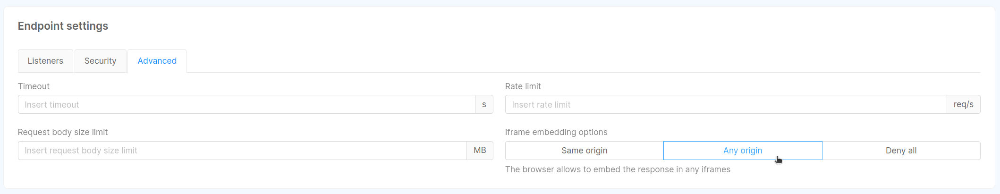

Data Catalog solution allows visualizing collected data and interact with their metadata through an ad-hoc frontend,
which communicates with [Open Lineage](/data_catalog/data_catalog_open_lineage.mdx) backend
via [Fabric BFF](/data_catalog/data_catalog_fabric_bff.mdx) component.

This frontend enables the user to:

- search among their datasets for a specific dataset (System of Record), a table or a column, which are Data Catalog assets
- visualize metadata (_description_, _tags_, _custom properties_) associated to data assets collected by Data Catalog

> Data Catalog solution embedded in Mia-Platform Console, with visibility at Company level.

## Configuration

In this section is explained how the Control Plane service should be configured in order to properly satisfy the requests.

### Environment Variables

Data Catalog UI can be customized using the following environment variables:

| Name        | Required | Description                                           | Default Value    |
|-------------|----------|-------------------------------------------------------|------------------|
| `BASE_PATH` | &check;  | Path prefix to be added to all the frontend resources | `/data-catalog/` |

As effect of them, by default the Data Catalog application exposes its frontend over the `/data-catalog/` base path.
This value can be overridden by changing the environment variable `BASE_PATH` with `/<your-base-path>/` as value.

Bear in mind that changing the `BASE_PATH` environment variable requires to change also the [rewrite base path](/development_suite/api-console/api-design/endpoints.md#about-rewrite-base-path)
of exposed endpoint to `/<your-base-path>`.

### Endpoints

In order to allow incoming traffic from outside to Data Catalog Frontend, it is necessary to configure the main service endpoint.
This can be configured in the `Endpoints` page of Console Design area, as explained [here](/development_suite/api-console/api-design/endpoints.md).

| Endpoint        | Rewrite Base Path | Microservice      | Description                                 |
|-----------------|-------------------|-------------------|---------------------------------------------|
| `/data-catalog` | `/data-catalog`   | `data-catalog-fe` | Base path from which the frontend is served |

:::tip
Please, ensure that:
- in case `BASE_PATH` environment variable has been changed on the service, the Rewrite Base path must be changed accordingly
- in case the security layer is enabled, remember to flag the `Authetication required` checkbox
:::

### Embed as Console Extension

Data Catalog UI can be embedded as an extension of Mia-Platform Console using [Mia-Platform Platforge](/release-notes/mia-platform-v13.mdx#platforge-enhance-extensibility).
In this manner, Data Catalog UI can be accessed seamlessly through the same interface without requiring your Console users to open another application in their browser.

In order to achieve so, Mia-Platform Console offers an integrated tool for [managing extensions](/console/company-configuration/extensions.md)
that streamlines the registration procedure. The main information needed for registering Data Catalog UI as extension is the production URL
where the frontend is served. In case it is not already known, it should be possible to retrieve it by following these instructions:

- select your project where the Data Catalog application has been configured
- navigate to `Overview > Environments` page and select your production environment
- from the opened page, press the edit button, select and copy the `Project URL`
- combine the configured Data Catalog Frontend base path with the URL obtained in the previous step

:::tip
Considering the capability of Data Catalog to manage multiple runtimes, it is recommended to embed the Data Catalog Frontend at Company level (set _Destination Area_ property to `Company Overview`).
:::

Furthermore, since at the moment a Console Extension can be added <u>only as an iFrame</u>, it is necessary to relax the Data Catalog Frontend endpoint configuration to support it in Console. As a result,
the API Gateway in front of the Data Catalog Frontend would add the proper value to the `X-Frame-Options` header. Indeed, such header is set to `SAMEORIGIN` by default to prevent embedding deployed applications in other websites.

To edit the header value, please head to the `Endpoints` page and select the main endpoint for Data Catalog Frontend. Within the `Endpoint Settings` card, select the `Advanced` tab and then choose `Any Origin` from `Iframe embedding options`, as shown in the following image:

## Features

Frontend description (To figure out whether to split across multiple pages)

### Homepage and advanced search functionality

### Navigation

### Management of custom properties

### Enrichment and management of unknown properties

### Bulk Actions
(In the future, bulk actions and more)
