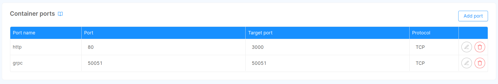

import openLineageSchema from "@site/static/schemas/data_fabric/open-lineage.config.schema.json"
import openLineageConfigExample from "@site/static/schemas/data_fabric/open-lineage.example.json"
import SchemaViewer from "../../src/components/SchemaViewer"

Open Lineage service allows to:

* search and retrieve data assets
* visualize data assets details and metadata
* update data assets metadata

Under the hood, data assets are stored adopting an extended version of [OpenLineage Dataset](https://openlineage.io/docs/spec/facets/dataset-facets/) format,
from which we borrowed the name for this component.  
It has been decided to build Data Catalog upon [OpenLineage project](https://openlineage.io/), which is an open platform that provides
an _"open standard for lineage data collection"_, to enable the possibility for future integration with lineage systems and other tools supporting it.  
In fact, we strongly believe that adopting a common standard for sharing data products description will be fundamental
to foster data products exchange among parties and ease discovering how these products are employed across the different systems.

:::note
In the following documentation, when we reference OpenLineage, we mainly intend the service we provide as a component of Data Catalog application.
Whenever we refer to [OpenLineage](https://openlineage.io/) project or standard, we will provide a link to its documentation.
:::

In the following paragraphs are described Open Lineage service configuration and communication interfaces.

## Configuration

Configuration of _Open Lineage_ is a straightforward process that involves setting up a ConfigMap and specifying essential environment variables.

### Environment Variables

Control Plane service can be customized using the following environment variables:

| Name                                  | Required | Description                                                                                                                       | Default Value                    |
|---------------------------------------|----------|-----------------------------------------------------------------------------------------------------------------------------------|----------------------------------|
| `HTTP_PORT`                           | -        | This variable determines the TCP port where the **HTTP controller** binds its listener                                            | 3000                             |
| `GRPC_PORT`                           | -        | This variable determines the TCP port where the **gRPC controller** binds its listener                                            | 50051                            |
| `LOG_LEVEL`                           | -        | Specify the centralized application log level, choosing from options such as `debug`, `error`, `info`, `trace` or `warn`          | `info`                           |
| `OPEN_LINEAGE_CONFIGURATION_FILEPATH` | -        | Set the location of the configuration file                                                                                        | `~/.fd/open-lineage/config.json` |
| `OTEL_EXPORTER_OTLP_ENDPOINT`         | -        | The URL to a GRPC endpoint of an OpenTelemetry Collector.<br/>Specifying this value enables the support for OpenTelemetry tracing |                                  |

### Config Map

The configuration of the service is handled by a JSON file whose location is defined by the `OPEN_LINEAGE_CONFIGURATION_FILEPATH`. When instantiating
\[Data Catalog application\] TODO: PUT LINK from Marketplace, Open Lineage service configuration is generated with
a dedicated Config Map, named `open-lineage-config`.  
This file contains a template configuration that should help in configuring the service.

<SchemaViewer schema={openLineageSchema} example={openLineageConfigExample} />

#### Search Cache

:::info
Currently only [Redis](https://redis.io/) is supported as search cache for storing relevant data, such as intermediate search results.
:::

Open Lineage enables searching over datasets and their metadata, which may lead to a very large result set, considering that also table's columns
can be returned. Consequently, when a user performs a search on the system, at first the system only provides a small result set while
storing on a cache the query details that are useful to progress the search operation. Whenever more records are requested, the service loads on-demand
the next batch of results leveraging the information stored in the cache.  

To configure the cache connection for Open Lineage service there exists a dedicated key, named `cache`, in the service configuration file.
Within it there is the possibility to choose the `type` (currently only `redis`) and provide the needed `configuration` property, whose main fields are:

- `url` &rarr; the connection string to your cache instance;

An example of cache configuration can be seen below:

```json
{
  "cache": {
    "type": "redis",
    "configuration": {
      "url": "redis://<redis-instance-address>:6379"
    }
  },
  // ...other control plane configurations
}
```

:::tip
The following properties support [secret resolution](/fast_data/configuration/secrets_resolution.md):
- `cache.configuration.url`
:::

:::note
When instantiating Data Catalog application, a small Redis instance is added to your project, ready for supporting Open Lineage operations. In case you would like
to adopt your own Redis instance, please update the generated configuration accordingly.
:::

#### Datasets Persistence Layer

:::info
Currently only [MongoDB](https://mongodb.com/) is supported as persistence layer for storing relevant data.
:::

:::caution
The MongoDB database selected for storing Data Catalog data **must be configured to have [`replicaSet` enabled](https://www.mongodb.com/docs/manual/replication/)**,
since Data Catalog exploits features that can be used only when a `replicaSet` is available.
:::

In order to carry out all its operations, Open Lineage requires a _persistence layer_ where relevant information are stored.
In particular, it stores data assets and their metadata.

The configuration of persistence layer can be added in the service configuration filer under the property `persistence`, where it is possible to 
select the `type` of database and provide the expected `configuration` in the dedicated field. Its main properties of the latter field are:

- `url` &rarr; the connection string to your MongoDB instance with `replicaSet` enabled;
- `database` &rarr; the database name where to search for the  collections relevant to Open Lineage service. Please notice that setting this property will **override** the database
name potentially set in the connection string;

An example of persistence configuration can be seen below:

```json
{
  // ...other control plane configurations
  "persistence": {
    "type": "mongodb",
    "configuration": {
      "url": "mongodb://<server>:27017/<default-database>?replicaSet=local",
      "database": "<data-fabric-database-name>"
    }
  },
  // ...other control plane configurations
}
```

:::tip
The following properties support [secret resolution](/fast_data/configuration/secrets_resolution.md):
- `persistence.configuration.url`
- `persistence.configuration.database`
:::

#### Service Settings

Additionally, the Open Lineage service itself has a set of properties for changing its behavior. Here are listed the available ones within `settings` properties:

- `apiPrefix` &rarr; the base path applied to all the exposed routes. It defaults to `/`;
- `auditUserHeader` &rarr; specifies in which HTTP header can be found the user identifier set by the authentication system. The value of this header will be employed to correlate requests stored by
the auditing system with the user that performed them. When using Mia-Platform Authentication and Authorization services this property can be set to `miauserid`.  
In case it is not set the auditing system does not correlate users with requests;

Here can be found a configuration example:

```json
{
  // ...other control plane configurations
  "settings": {
    "apiPrefix": "/",
    "auditUserHeader": "miauserid"
  }
}
```

### Enable gRPC communications

Some the request exchanged between Fabric BFF and Open Lineage services are performed through [gRPC](https://grpc.io/).

Thus, on Open Lineage service is necessary to advertise the port where the gRPC controller is exposed, which by default is the `50051`.
This operation can be achieved by adding the proper port to the list of [_Container Ports_](/development_suite/api-console/api-design/microservice-container-ports.md)
that can be found in the Console Design area, under the specific microservice resource. The expected list,
based on default configuration, is shown below in the image.



:::tip
When instantiating Data Catalog application, _Container Ports_ are pre-filled with all the needed ports using their default value.  
In case either the HTTP or the gRPC port chosen through [environment variables](#environment-variables) has been edited, please change the _Container Ports_ accordingly.
:::

## Endpoints

Since Open Lineage service only communicates internally with [Fabric BFF](/data_catalog/data_catalog_fabric_bff.mdx)
within the same namespace, it is not necessary to publicly expose any endpoint on the service.

### Routes

Here are described which routes Open Lineage service serves:

| Endpoint                                                   | Type | Method | Description                                                           |
|------------------------------------------------------------|------|--------|-----------------------------------------------------------------------|
| `/assets/search`                                           | REST | GET    | Search for dataset assets and their metadata                          |                                         
| `/assets/search-parents`                                   | REST | GET    | Search for name of system of record or table name                     |
| `/tags/count`                                              | REST | GET    | Count how many unique tags exists among all data assets               |
| `/tags/items`                                              | REST | GET    | List existing tags associated to data assets                          |                                                  
| `/tags/search`                                             | REST | GET    | Search for a specific tag value                                       |
| `/sors/:dataset-id`                                        | REST | GET    | Retrieve selected _System of Record_ details and metadata             |
| `/sors/:dataset-id/custom-properties/:name`                | REST | POST   | Create a custom property for selected _System of Record_              |              
| `/sors/:dataset-id/custom-properties/:name`                | REST | PATCH  | Change a custom property value for selected _System of Record_        |              
| `/sors/:dataset-id/custom-properties/:name`                | REST | DELETE | Remove a custom property for selected _System of Record_              |              
| `/sors/:dataset-id/description`                            | REST | PATCH  | Change the description associated to selected _System of Record_      |                          
| `/sors/:dataset-id/tags`                                   | REST | PATCH  | Change the list of tags associated to selected _System of Record_     |                                 
| `/tables/:dataset-id`                                      | REST | GET    | Retrieve selected _Table_ details and metadata                        |                                    
| `/tables/:dataset-id/custom-properties/:name`              | REST | POST   | Create a custom property for selected _Table_                         |            
| `/tables/:dataset-id/custom-properties/:name`              | REST | PATCH  | Change a custom property value for selected _Table_                   |            
| `/tables/:dataset-id/custom-properties/:name`              | REST | DELETE | Remove a custom property for selected _Table_                         |            
| `/tables/:dataset-id/description`                          | REST | PATCH  | Change the description associated to selected _Table_                 |                        
| `/tables/:dataset-id/tags`                                 | REST | PATCH  | Change the list of tags associated to selected _Table_                |                               
| `/columns/:dataset-id/:field-name`                         | REST | GET    | Retrieve selected _Column_ details and metadata                       |                       
| `/columns/:dataset-id/:field-name/custom-properties/:name` | REST | POST   | Create a custom property for selected _Column_                        |
| `/columns/:dataset-id/:field-name/custom-properties/:name` | REST | PATCH  | Change a custom property value for selected _Column_                  |
| `/columns/:dataset-id/:field-name/custom-properties/:name` | REST | DELETE | Remove a custom property for selected _Column_                        |
| `/columns/:dataset-id/:field-name/description`             | REST | PATCH  | Change the description associated to selected _Column_                |           
| `/columns/:dataset-id/:field-name/tags`                    | REST | PATCH  | Change the list of tags associated to selected _Column_               |                  
| `/metadata-registry/count`                                 | REST | GET    | Count how many custom properties definition exists                    |                                    
| `/metadata-registry/items`                                 | REST | GET    | List custom properties definition                                     |                                    
| `/metadata-registry/items`                                 | REST | POST   | Create a custom property definition                                   |                                    
| `/metadata-registry/items/:name`                           | REST | GET    | Retrieve the definition details of a custom property                  |                               
| `/metadata-registry/items/:name`                           | REST | PATCH  | Change the definition of a custom property (e.g. type or description) |                               
| `/metadata-registry/items/:name`                           | REST | DELETE | Remove a custom property definition                                   |
| `/metadata-registry/search`                                | REST | GET    | Search for a specific metadata registry of interest                   |