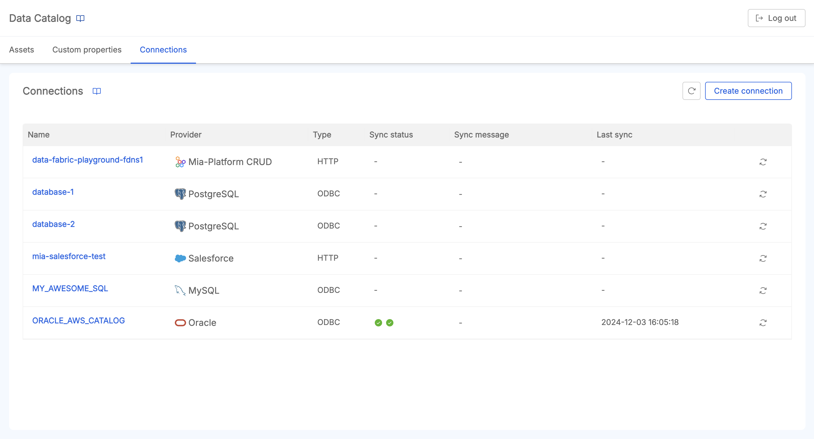
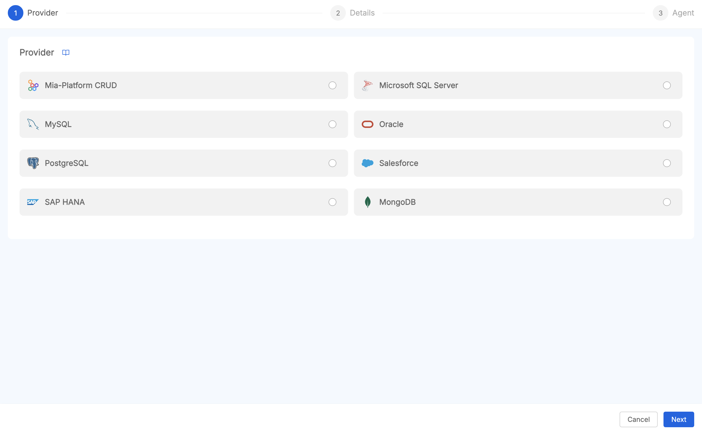
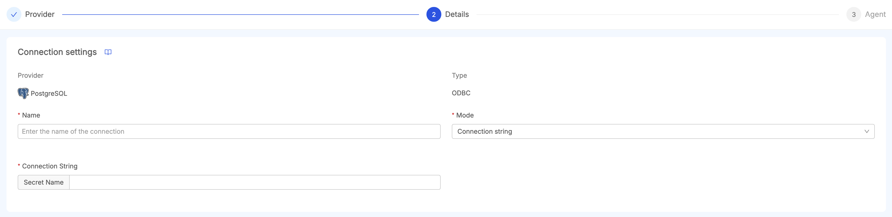
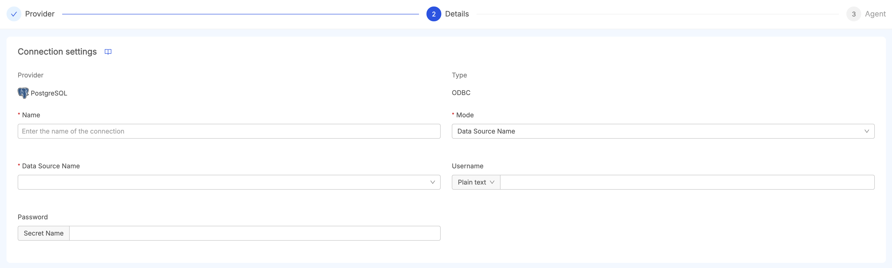
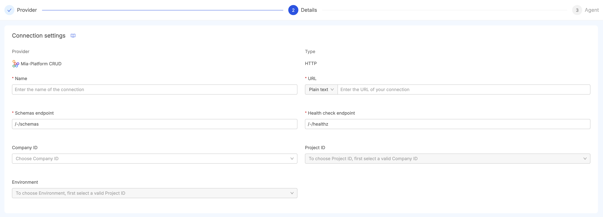
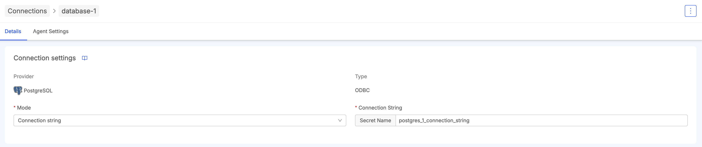
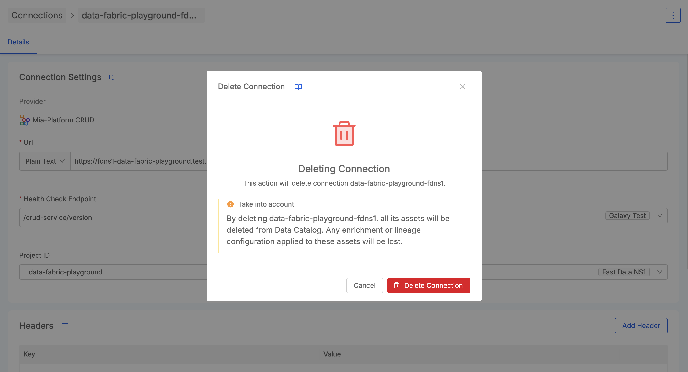
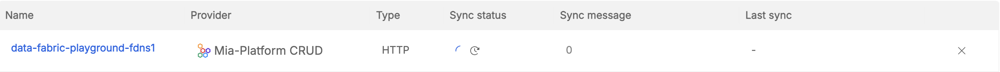
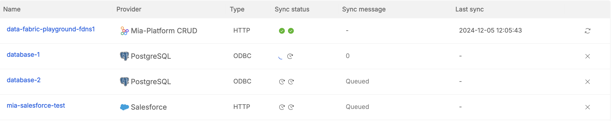
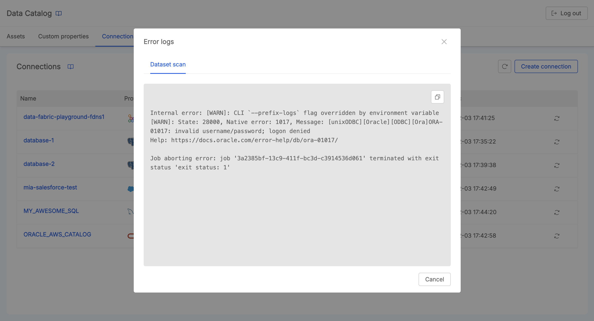

## Introduction to Connections

Connections represent the source of truth of the Data Catalog. By retrieving their metadata, is possible use their assets 
to perform actions such as [Asset Discovery](/data_catalog/frontend/data_catalog_assets.mdx) and [Lineage](/data_catalog/frontend/data_lineage.mdx).

<!---
REPLACE IMAGE
-->

  

  

The __Connections Panel__ provides the following features:

- __View and Access Connections details__: an overview lets user to provide the list of connections, including detailed information for each (identifier, resource type, connection type, settings, and configuration).
- __Create and Update Connections__: the UI provides a creation wizard that lets users define a new connection that contributes to Data Catalog assets; one created, it is possible to access its details and to update them if necessary;
- __Delete Connections__: delete existing connections that are no more needed; this action brings also to the deletion of all the retrieved assets belonging to that specific connection;
- __Import Data Assets from a Connection__: users can trigger a [Data Catalog Sync Job](/data_catalog/data_catalog_job_runner.mdx#data-catalog-sync) from the Job Runner, to import connections assets in the Data Catalog.

:::caution
This section of Data Catalog should be accessible only by administrators that have access to the connection credentials of external sources.

For such reasons, the Data Catalog application will give the permissions `admin:connections` to the underlying endpoints of the Connections Panel. 
See the [Secure Access section](/data_catalog/secure_access.mdx) to learn more about the authorization process.  
:::

### Input Management

The information useful for properly defining and configuring a connection can be of two types:

- __Plain Text__: the field is a regular text field;
  

    

    

    

  

- __Secret Name__: the field will be a text referencing a secret name defined within the _Job Runner service_ (see the [Secrets Name Configuration](/data_catalog/data_catalog_job_runner.mdx#secrets-names-configuration) paragraph for more details).
  A dropdown can provide a list of suggestions containing existing secret names retrieved from the service itself. If a secret name that does not appear in the list is provided, the service will try to read
  that name from the environment variables of the service.
  

    

    

    

  

:::info
Since a connection requires usually to provide sensible information (such as passwords, connection strings, etc...), some fields can __only__ be filled with _Secret Names_.
:::

## Create a Connection

By clicking on the `Create Connection` button, users are guided through a creation wizard that defines the parameters to properly establish a connection.

<!---
REPLACE IMAGE
-->

  

  

### Connection Providers

First of all, users need to choose the provider they want to access from Data Catalog.
The following providers are supported, which can be grouped into the following categories:

- __ODBC Connections__: storage layer that can be reached using [Open Database Connectivity (ODBC)](https://en.wikipedia.org/wiki/Open_Database_Connectivity). The following providers are supported:
  - __Oracle DB__
  - __PostgreSQL__
  - __MySQL__
  - __Microsoft Server SQL__
  - __SAP Hana__
- __HTTP Connections__:
  - __Salesforce SObjects__: storage layer provided by Salesforce;
  - __MIA Platform Crud Service__: data layer on __MongoDB__ provided by MIA Platform Console.

### Connection Details

The Connection Details step will show the connection accordingly to the chosen provider. Regardless of the provider, users have to provide a unique _name_ for the connection, which will correspond to a __System of Record__ inside the Data Catalog.

:::caution
The name of a connection is an information that **cannot be modified** once the connection has been created.
:::

Now we explore all the details for each provider Data Catalog provides support.

---

#### ODBC Connections

:::tip
Before configuring an ODBC Connection, be sure that the Job Runner Service has been configured properly for ODBC Connections.

For more details, [see the dedicated section](/data_catalog/data_catalog_job_runner.mdx#odbc-configuration).
:::
ODBC Providers can have two types of mode to perform the connection. 

- __Connection String__: users need only to pick a secret name referencing a connection string in the Job Runner Service.
  

    

    

    

  

- __Data Source Name (DSN)__: users can choose between the available DSN configured in the Job Runner Service. 
  Users can also configure the DSN's username and password if those information are not available inside the DSN. 
  Be aware that username and password are __mandatory__ for connections such as __MSSQL__ or __SAP HANA__.

  

    

    

    

  

##### Oracle Query Settings

__Oracle DB__ has also a section which can change the behavior of the underlying queries that the _Data Catalog Sync_ will
perform while retrieving assets information. The following parameters can be tuned:

- __Compatibility__: if the data source is an `ORACLE 11g` database, 
  this check should be active since the database [does not support](https://docs.oracle.com/database/121/LNPLS/release_changes.htm#LNPLS113) pagination via `OFFSET ? ROWS FETCH FIRST ? ROWS ONLY`;  
- __Query Mode__: based on this option, the [Data Catalog Sync Job](/data_catalog/data_catalog_job_runner.mdx#data-catalog-sync) will perform the scan query on a different set of views provided by Oracle. Three options are available:

  - __User__: tables `user_tables`, `user_views` and `user_mviews` will be used. This represents the __default mode__ if no option has been provided;
  - __All__: tables `all_tables`, `all_views` and `all_mviews` will be used. 
    It is __strongly suggested__ to add a comma-separeted list of schemas in the dedicated field to only pick the tables of interest;
  - __DBA__: tables `dba_tables`, `dba_views` and `dba_mviews` will be used. 
    It is __strongly suggested__ to add a comma-separeted list of schemas in the dedicated field to only pick the tables of interest.

---

#### Salesforce SObjects

To connect to [Salesforce SObjects API](https://developer.salesforce.com/docs/atlas.en-us.api_rest.meta/api_rest/intro_what_is_rest_api.htm), first
you need the basic information of the Salesforce instance, such as its __Url__ and __API Version__.

  

  

> The range of supported `apiVersion` goes from `31.0` to `59.0`.

SObjects Permissions

Make sure the user configured in the [Authentication card](#authentication) has the right permissions to retrieve all the `SObject`s you need.

If not all the `SObjects` are retrieved you will have to follow these steps to expose them through the API:

**For custom `SObjects`**

- Go to your Salesforce dashboard
- Access Setup
- Access the `Permission Sets` section
- Create a new Permission Set (e.g. API for Custom Objects) with license type `Salesforce API Integration`
- Click on `Object Settings` inside the new Permission Set, then, for each custom SObject, update the visibility in the desired way (e.g. View All, Modify All)
- Assign the new Permission Set to the user with `Salesforce Integration` user license and `Salesforce API Only System Integrations` profile

**For standard `SObjects`**

- Go to your Salesforce dashboard
- Access Setup
- Access the `Permission Sets` section
- Create a _Permission Set_ (e.g. API for Standard Objects) without specifying a license type
- Click on `Object Settings` inside the new Permission Set, then, for each standard SObject, update the visibility in the desired way (e.g. View All, Modify All)
- Assign the new Permission Set to the user with `Salesforce Integration` user license and `Salesforce API Only System Integrations` profile

##### Authentication

To configure a **Salesforce SObjects** connection you can use two authentication methods:

* __Private Key__, which configures the [OAuth2 JWT flow](https://help.salesforce.com/s/articleView?id=sf.remoteaccess_oauth_jwt_flow.htm&type=5) with the following fields:
  - `clientId`: either _plain_ or its _secret name_;
  - `username`: either _plain_ or its _secret name_;
  - `privateKey`: represents the path where the certificate is stored inside the Job Runner, it can either be _plain_ or a _secret name_ 
  
  

  
Enable JWT Authentication on Salesforce

  To be able to connect to the Salesforce API using the JWT Bearer flow you will need to follow the next steps.
  
  1. Follow the steps one and two from this guide: https://help.salesforce.com/s/articleView?id=sf.connected_app_create_api_integration.htm&type=5
  2. Then you'll need to upload your self-signed certificate in PEM format (step 5 from the guide). If you do not have a certificate follow these instructions:
     1. Generate a rsa key with the command `openssl genrsa -out tls/key.pem`
     2. Then create a request to sign the certificate with this command `openssl req -new -key tls/key.pem -out tls/sf_connect.csr`
     3. Sign the request with you private key with `openssl x509 -signkey tls/key.pem -in tls/sf_connect.csr -req -out tls/sf_connect.crt`
     4. Upload the generated certificate (`tls/sf_connect.crt`)
  3. Now you need to enable the OAuth2 mechanism following the 10th step from the guide, creating a connected app and all.
  4. Finally you need to enable the JWT access with the step 14 of the guide.
     
  Now you should have everything you need to fill out the configuration parameters.
  

* __Credentials__, which configures the [**deprecated** OAuth2 username-password flow](https://help.salesforce.com/s/articleView?id=sf.remoteaccess_oauth_username_password_flow.htm&type=5), with the following fields:
  - `clientId`: either _plain_ or its _secret name_;
  - `clientSecret`: can only be a _secret name_;
  - `username`: either _plain_ or its _secret name_;
  - `password`: can only be a _secret name_;
  - `securityToken` (optional): can only be a _secret name_.

You also need to provide the __Login Url__ of your Salesforce instance (by default is set to `https://login-salesforce.com`).
For example, if you are using a testing instance, you'll need to set this field to `https://test.salesforce.com/`.

---

#### Mia Platform

__Mia Platform__ connection enables to retrieve assets from Mia Platform Console projects having
data models stored on MongoDB and managed through [Crud Service](/runtime_suite/crud-service/10_overview_and_usage.md).

The required information to setup the connection are:

- the __Url__ where the CRUD Service is located;
- the [__Schemas Endpoint__](/runtime_suite/crud-service/10_overview_and_usage.md#get-schemas) (usually `/-/schemas`) to retrieve the collections assets;
- the __Health Check Endpoint__ (usually `/-/healthz`) to retrieve the version of the CRUD Service.

Additionally, it is possible to define the project and the environment where the CRUD Service is located in a Mia Platform Project
by choosing a Company.

<!---
REPLACE IMAGE
-->

  

  

If a Company has been configured, this connection can be read by the [Fast Data Jobs Sync](/data_catalog/data_catalog_job_runner.mdx#fast-data-jobs-sync) from the Job Runner,
to generate Open Lineage Jobs from [Fast Data Pipelines of the Control Plane](/fast_data/runtime_management/overview.mdx). This means that the selected CRUD Service must be deployed in a project having Control Plane configured.
:::tip
To choose a Company, be sure that Fabric BFF has Console communication enabled. See [here](/data_catalog/data_catalog_fabric_bff.mdx#console-communication) for a detail explanation on how to setup this feature.
:::

##### Headers

Users can also add additional headers to the request that will be executed by the Connection to retrieve assets.

To do so, click on the `Add Header` button to choose a key-value pair to add to the headers list. The value can also be a _secret name_ reference. 

:::info
There is no need to add the header `"accept": "application/x-ndjson"` since it's managed internally by the Job Runner service. 
:::

##### TLS

In case the CRUD Service needs a custom root CA or an insecure HTTPS connection, 
it's possible to set the connection as `insecure` and set a custom certificate if needed.

---

### Agent Settings

Once the main details of a connection has been defined, you can also tune runtime parameters
of the [Agent Dataset Scan Job](/data_catalog/data_catalog_job_runner.mdx#agent-dataset-scan) from the Job Runner. Here you can choose:

- the __Batch Size__, a number that defines the number of assets that can be paginated in a query;
- the __Column Batch Size__, a number that defines the amount of columns that are expected to be processed by each batch iteration.

This section comes already with the values that will used by default in the Job Runner. Once you have clicked on the `Finish button`,
a success message will redirect you to the [Connection Overview](#connection-overview) of the newly connection.  

  

  

<!---
INSERIRE INFO PER PUNTUALIZZARE CHE PER IL CRUD CONNECTION E' DISABLED
-->

## Access Connection details

After having created the connection, it is reachable inside the list of connections displayed in the Connection Panel.  
Then it is possible to access its Details pege.

  

  

Here, you can edit both [Connection Details](#connection-details) and [Agent Settings](#agent-settings) by choosing the appropriate tab: 
when a field is changed correctly, the connection will be updated accordingly and the next execution of the Job Runner will use the latest 
parameters provided by the user. 

### Delete Connection

From the menu button on the top-right corner of the page, it is possible to click `Delete Connection` 
and start the procedure to remove a connection from the Data Catalog.

<!---
REPLACE IMAGE
-->

  

  

:::danger
This action __will remove any assets that has been imported from that connection in the Data Catalog__, by leveraging the [Connection Cleanup Job](/data_catalog/data_catalog_job_runner.mdx#connection-cleanup) of the Job Runner.  
Please be careful when performing this action.
:::

## Import Data Assets from a Connection

Once a connection has been properly defined, the connection administrator can start importing its data assets synchronize them into the Data Catalog.

In the overview of the Connections Panel where all available connections are listed, user can click the `sync button` and schedule an [Agent Dataset Scan Job](/data_catalog/data_catalog_job_runner.mdx#agent-dataset-scan) from the Job Runner.
Once the action has been executed, the table entry of that connection will be accordingly updated by the Job Runner with information about the triggered job status. 

<!---
REPLACE IMAGE
-->

  

  

Once the _[Agent Dataset Scan Job](/data_catalog/data_catalog_job_runner.mdx#agent-dataset-scan)_ is completed, a _[Data Catalog Sync Job](/data_catalog/data_catalog_job_runner.mdx#data-catalog-sync)_ will be executed automatically to store the assets retrieved from the data source into the Data Catalog.  

<!---
REPLACE IMAGE
-->

  

  

Only one connection at a time will perform the synchronization: If more than one connection is synced at the same time, 
the ones that are still not executed will be in a `Queue` state.

<!---
REPLACE IMAGE
-->

  

  

Once the synchronization has been completed, user has evidence about the Job completion. Moreover, it is possible to have evidence of the last sync time.

<!---
REPLACE IMAGE
-->

  

  

If an error occurs during the process, it will be possible to access the Job Runner logs to better inspecting the causes of the failure.

<!---
REPLACE IMAGE
-->

  

  

