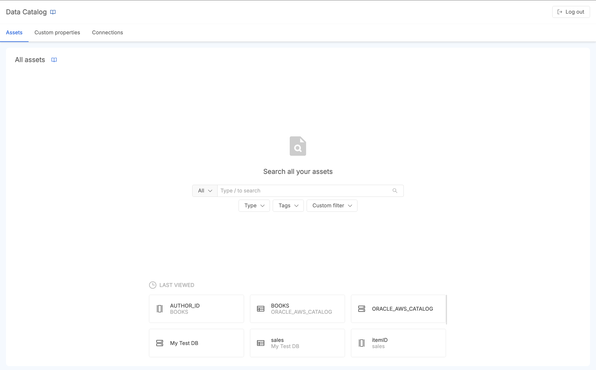
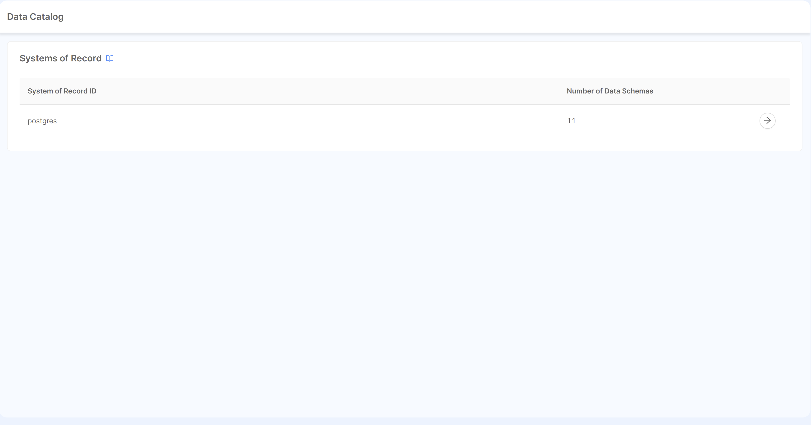
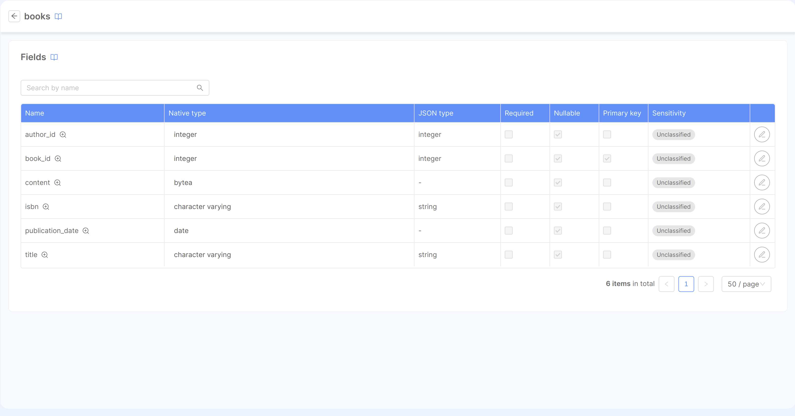

Describe here the NEW Data Catalog overview

## TODO

- Introduce what is a Data Catalog and which problems it solves
- What's special with our Data Catalog
- Introduce the concept of Data Catalog assets (SoR, Table, Column | what are each of them in the context of Data Catalog) 
- Remember to link the doc to Data Catalog Agent
- Remember to introduce the Data Catalog Agent as a fundamental component of the system (without it no data schema is retrieved)
- Should we move the documentation of Data Catalog Agent from the Agent to this group?
- Add link to each of the doc page (interesting links - as it happens on runtime management page)
- Add simple images here - in the Frontend page let's put a screenshot for each page (home, search result, custom properties, metadata enrichment page, custom properties vs unknown properties)

---

---

## OLD MATERIAL

A Mia-Platform Console Project can be configured to work as a Data Catalog, that is a centralized
location where it is possible to collect metadata concerning all the data assets of an organization.
:::tip
The Mia-Platform Console Project can be configured to work as a Data Catalog if you configure a Data Catalog Agent in your project. Refer to the [documentation](/runtime_suite_templates/data-catalog/10_overview.md) to understand how to set it up.
:::
Within the project, it is possible to [set up](/runtime_suite_templates/data-catalog/20_configuration.md) our Data Catalog Agent, which can be configured to connect to different sources,
such as:

- Oracle Database
- Postgres Database
- MySQL Database
- Microsoft SQL Server Database
- Mia-Platform CRUD Service
- Salesforce SObjects API

This agent is in charge of extracting metadata regarding the several tables and data structures existing on configured
sources (System of Record) and forward them to Mia-Platform Console for storing them in the dedicated project.
Example of metadata are the tables' names, their fields' names and their corresponding type.

Once the Data Catalog Agent has run for the first time and it has extracted at least one System of Record, in the design section
of the specific Console project, it will be possible to explore these set of System of Record under the Data Catalog page,
which replaces the Systems of Record page in this particular case.  
Within this page, which is shown in the figure, it will be possible to see the list of System of Record that have
been generated starting from the metadata extracted by the Data Catalog Agent.

Selecting a specific System of Record it is possible to observe which tables are associated with the system and for
each table it is visible which fields compose it, alongside the field types and their properties.

As a user, it will be then possible to edit _description_ and _GDPR regulation_ properties of each table field, which are retained upon saving
the project. These changes, executed on the _user-defined_ properties, are preserved across multiple metadata synchronizations performed by
the Data Catalog Agent so that the source systems can add or remove fields without affecting existing ones.

An example of a table view is displayed in the figure below, which allows to editing description and GDPR regulation fields:

