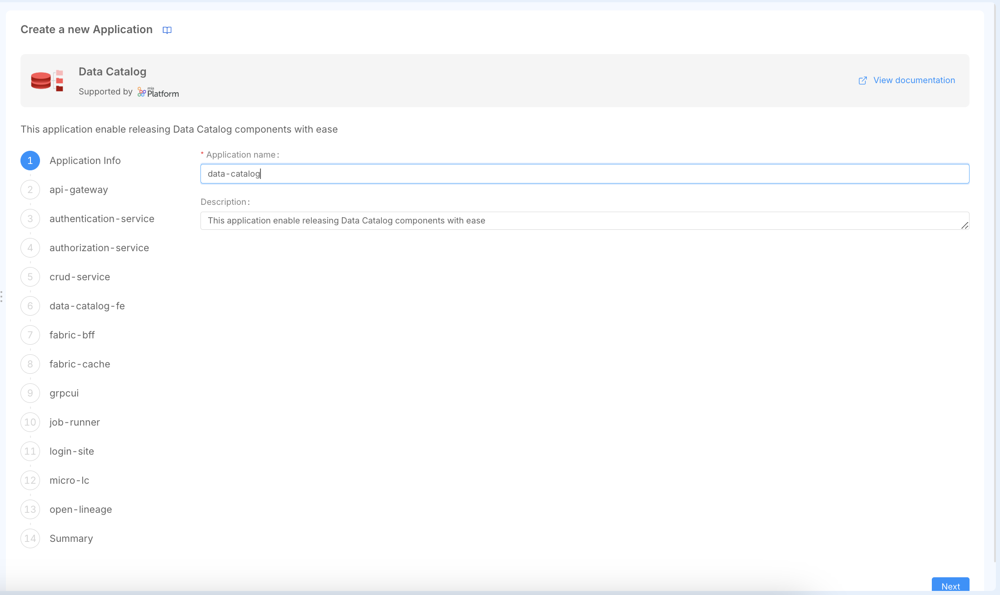
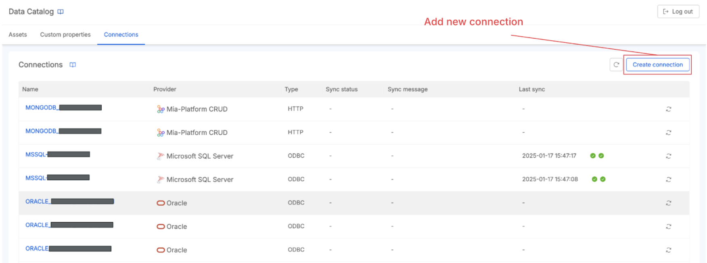
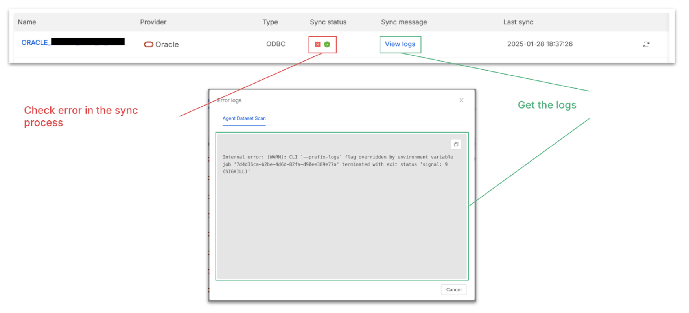
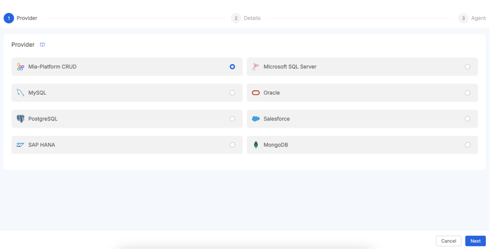
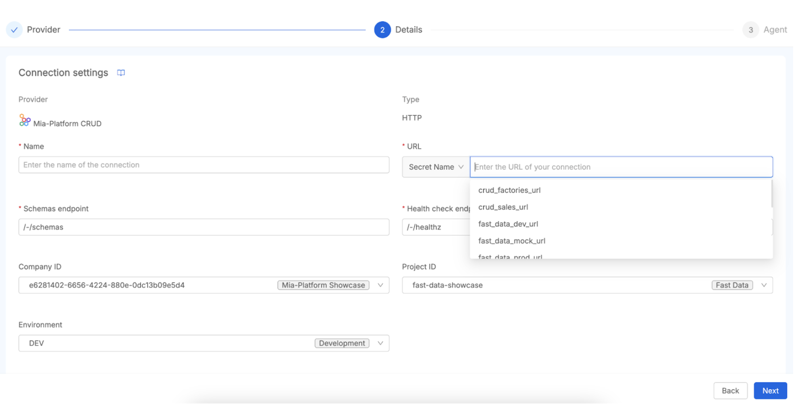
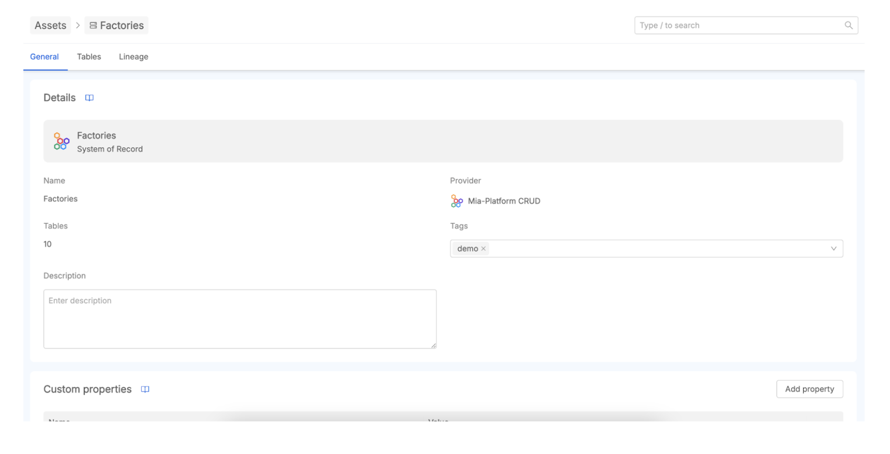
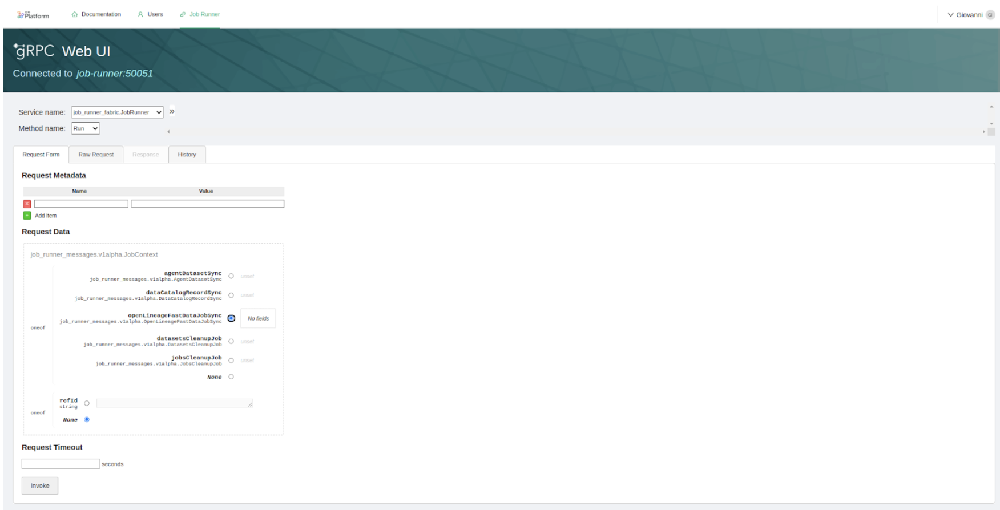
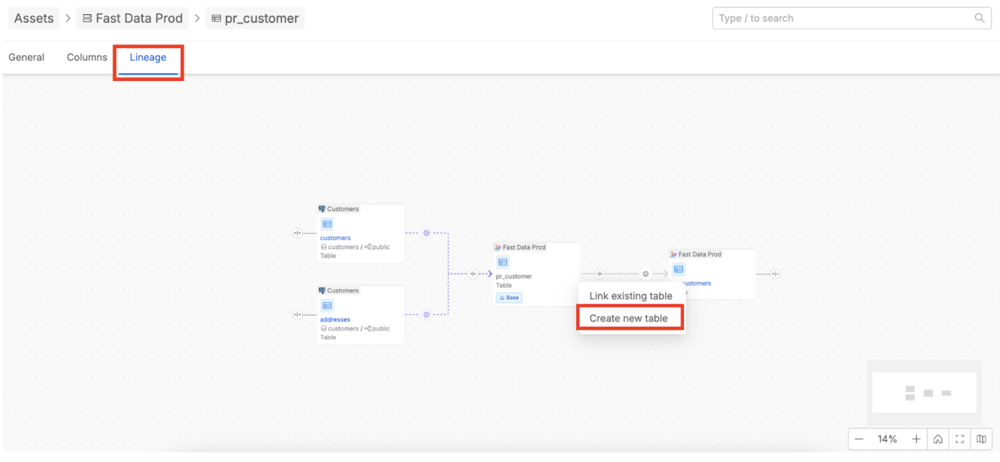
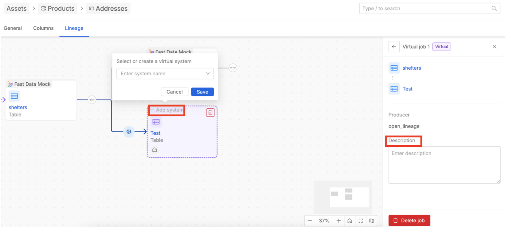

# Getting Started with Mia-Platform Data Catalog

## Introduction: What We'll Cover in This Tutorial

This tutorial serves as a guide for understanding and utilizing the [Mia-Platform Data Catalog](/products/data_catalog/overview.mdx). It is designed for users seeking to effectively catalog their organization's data assets, comprehend data lineage, and enhance data governance practices within the Mia-Platform ecosystem. The primary objective is to equip users with the foundational knowledge and practical steps needed to begin leveraging the Data Catalog's capabilities.

The tutorial will cover the following key areas:

- An brief explanation of what the Mia-Platform Data Catalog is and its operational principles.
- Essential information regarding the installation and configuration processes.
- Guidance on establishing connections to data sources, with specific examples for OracleDB and Mia-Platform Fast Data v1, including the process of metadata scraping.
- A detailed explanation of Data Lineage: its definition, significance, and how it functions within the platform.
- An overview of how data lineage is visualized and how virtual elements can be created to enrich lineage information.

Upon completion of this tutorial, users will obtain a solid knowledge of the Data Catalog's core features and will be prepared to perform initial setup and basic operations. While this guide aims to be comprehensive in its coverage of fundamental aspects, it is important to recognize that it provides a starting point. For the most detailed, up-to-date information, and advanced configurations, users should read the [official documentation](/products/data_catalog/overview.mdx). This approach ensures users feel empowered to begin their journey with the Data Catalog, while also being aware of resources for more specialized requirements.

## Data Catalog: What It Is and How It Works

The Mia-Platform Data Catalog is a centralized metadata repository that organizes and describes your organization's data assets, including their origins, characteristics, and relationships.  
At its core, the Data Catalog provides significant benefits for Data Governance by ensuring accuracy, consistency, and regulatory compliance. It enhances Data Discovery through efficient search tools that reduce the time spent locating specific data assets across your organization. It supports compliance efforts by tracking data origins and flows, which is essential for meeting GDPR and other regulatory requirements. Additionally, it ensures policy adherence by helping organizations follow established company data policies consistently across all data management activities.

### Key Features

- **Data Cataloging**: Organizes systems of records, tables, and columns for easy discovery
- **Metadata Management**: Enables custom properties and enrichment for better data understanding
- **Search and Discovery**: Advanced queries and filters based on tags and properties
- **Collaborative Environment**: Centralized platform for knowledge sharing and asset enrichment
- **Access Control**: Customizable data classification levels and user permissions
- **Data Lineage**: Tracks data flow and transformations (detailed in [Section 5](#what-is-data-lineage-and-how-does-it-work))
- **Connections Management**: Manages external data source integrations (covered in [Section 4](#creating-a-new-connection-oracle-database-and-fast-data))

### Architecture Overview

A high-level overview of the architecture reveals several interconnected components:

- **[Data Catalog Frontend (UI)](/products/data_catalog/frontend/overview.mdx)**: This is the primary interface through which users interact with the catalog.
- **[Fabric BFF (Backend for Frontend)](/products/data_catalog/data_catalog_fabric_bff.mdx)**: This component manages connections configured from the frontend and communicates with other backend services.
- **[Job Runner](/products/data_catalog/data_catalog_job_runner.mdx)**: This service is responsible for scheduling and executing tasks, such as metadata extraction (via "Agent Dataset Scan") and lineage data retrieval (e.g., "Fast Data Sync").
- **[Open Lineage service](/products/data_catalog/data_catalog_open_lineage.mdx)**: This service manages the assets and lineage jobs, providing the features necessary to retrieve and present lineage data.

These components work in concert: the Fabric BFF handles requests from the UI, particularly for connection configurations; the Job Runner executes tasks to scan data sources or collect lineage information from systems like [Mia-Platform Fast Data](/products/fast_data/what_is_fast_data.md); and the Open Lineage service stores and serves this data to be displayed in the UI. This architecture underscores that the Data Catalog is not merely a passive repository but an active system whose utility is amplified by the quality and context of the information fed into it, both automatically and through user enrichment. The Mia-Platform Data Catalog supports metadata acquisition from a variety of Systems of Records. Supported Systems of Records for [Metadata Acquisition](/products/data_catalog/frontend/data_catalog_connections.mdx#connection-providers):

- Oracle Database
- Postgres Database
- MySQL Database
- Microsoft SQL Server Database
- Mia-Platform MongoDB CRUD Service
- Salesforce SObjects API
- SAP HANA
- MongoDB

## Data Catalog: Installation and Configuration Requirements

Before setting up the Mia-Platform Data Catalog, certain prerequisites must be met. A running [Mia-Platform Console](/products/development_suite/overview-dev-suite.md) instance is fundamental, as the Data Catalog Application is sourced from the Mia-Platform Marketplace and its configuration is managed within the Console environment. It is also crucial for users to consult the [compatibility matrix](/products/data_catalog/compatibility_matrix.md) to ensure their existing infrastructure and services are equipped to support the Data Catalog solution.

### Database Preparation

The Data Catalog solution relies on a set of collections to carry out most of its tasks, namely storing data asset definitions and their associated metadata. To provide a performant and reliable system, the database must be configured accordingly to support application execution.

To properly set up the database, please refer to the following [documentation page](/products/data_catalog/database_setup.mdx) that describes how to configure the `fabric-admin` CronJob.

For the complete configuration of its manifest, please insert:
* <URL_TO_CONTAINER_REGISTRY> → the URL to your Container Registry of reference;
* <NAME_CONTAINER_REGISTRY_SECRET> → name of the secret containing the credentials for connecting to your Container Registry;
* {{MONGODB_ADMIN_URL}} → refers to the secreted value that contains the connection string to your MongoDB database.

Once configured, deploy it to your runtime environment and then [launch the cronjob](/products/development_suite/monitoring/resources/cronjobs.md#manually-launching-a-cronjob) for database preparation.

When launched, the `fabric-admin` creates the necessary MongoDB collections and indexes for the Data Catalog.

Once the database setup phase is completed, you can move to the following phase regarding the Data Catalog Application configuration.

### Data Catalog Application configuration

The Data Catalog Application belongs to the Mia-Platform Runtime Components suite. This application is a pre-configured bundle of resources designed for straightforward instantiation and deployment of a functional Data Catalog product. The availability of the Data Catalog as a pre-configured package in the Marketplace simplifies deployment, allowing organizations to achieve faster time-to-value by avoiding manual setup of all components from scratch.

To configure the Data Catalog, you must first initialize the Data Catalog Application. To do so, navigate to the "Application" section in the Design Area of a Mia-Platform Project and search for the "Data Catalog" application. Then, follow all the steps to complete the initial setup. These steps will create all the necessary microservices and routes. 

Once the application is successfully installed, you have to do some manual configuration to successfully configure the application.

The effective setup of the Data Catalog involves not only deploying the application but also ensuring that the surrounding Mia-Platform environment, including network paths, security settings, and API Gateway features like WebSocket support, is correctly configured. This interconnectedness means users may need a basic understanding of Mia-Platform's architectural concepts.

When you create the Data Catalog application, a comprehensive bundle of resources is automatically generated to support both **security management** and **core data catalog functionality**.

The microservices created can be logically grouped into two main categories:

### Authentication & Authorization Services

These services handle security, access control, and user management:
- **api-gateway**: Entry point, routing and authentication
- **authentication-service**: OAuth2/OIDC authentication flows  
- **authorization-service**: Access control and permissions (ACL)
- **login-site**: Authentication frontend interface
- **micro-lc**: Management interface orchestrator
- **crud-service**: User collection and CRUD operations

### Core Data Catalog Services

These services implement the main Data Catalog capabilities:
- **data-catalog-fe**: Main user interface for data assets
- **fabric-bff**: Backend orchestrator for frontend-to-services communication
- **open-lineage**: Data lineage tracking and metadata management
- **job-runner**: Data processing pipelines and job execution
- **fabric-cache**: Redis cache for performance optimization
- **`grpcui`**: Web interface for Job Runner management

Then, the application creates the following **endpoints**:
- **Authentication endpoints** (7): `/apps`, `/authorize`, `/logout`, `/oauth/token`, `/refreshtoken`, `/userinfo`, `/authz/users`
- **Frontend endpoints** (3): `/data-catalog`, `/data-catalog/.well-known/openid-configuration`, `/data-catalog/configuration`
- **API endpoints** (4): `/api/connections`, `/api/data-catalog`, `/api/job-runner`, `/api/open-lineage`
- **Management endpoints** (2): `/mgmt`, `/micro-lc-configurations`
- **Utility endpoints** (2): `/ui/job-runner`, `/web-login`

Finally, the application creates the following **other resources**: in particular, 1 **collection** (`users`) for user management and various **public variables**.

Now, users can start finalizing the configuration of the application workloads to be properly deployed.

#### Authentication & Authorization Services

In the Data Catalog documentation, there is a [Secure Access documentation page](/products/data_catalog/secure_access.mdx) that guides users through configuring the authentication and authorization flows and securing and managing user access.

Once you have completed all the steps outlined in the Secure Access documentation page, you have achieved the goal of securing your Data Catalog application.

:::note
In this tutorial, Okta has been chosen as the Identity Provider for managing user identities. Any other Identity Provider supported by the Mia-Platform [Authentication Service](/runtime_suite/authentication-service/10_overview.md) can be adopted in place of Okta by following the same guide steps.
:::

Now, we can proceed to finalize the configuration of the core Data Catalog services.

#### Data Catalog Frontend Service

The Data Catalog Frontend serves the main user interface for browsing and managing data assets.

In the `data-catalog-fe-config` ConfigMap, ensure that you have properly configured the variable present in the `openid-configuration.json` file that allows correct handling of user logout.

For more info about Data Catalog Frontend Service, visit the following [documentation page](/products/data_catalog/frontend/overview.mdx#configuration).

#### Fabric BFF Service

The Fabric BFF (Backend for Frontend) orchestrates communication between the frontend and backend services.

In the `config.json` file of the `fabric-bff-config` ConfigMap, replace `<CONFIGURE_ME>` with your MongoDB connection string by using an environment variable reference: `{"type": "env", "key": "MONGODB_URL_DC"}`.

For more info about Fabric BFF Service, visit the following documentation page (/data_catalog/data_catalog_fabric_bff.mdx).

#### Fabric Cache Service

The Fabric Cache service provides Redis caching for improved performance.

If you have already followed the [Secure Access documentation page](/products/data_catalog/secure_access.mdx) previously mentioned in this tutorial, no additional actions are required.

#### gRPC UI Service

The gRPC UI service provides a web interface for the Job Runner gRPC API.

If you have already followed the [Secure Access documentation page](/products/data_catalog/secure_access.mdx) previously mentioned in this tutorial, no additional actions are required.

#### Job Runner Service

The Job Runner service executes data processing pipelines and manages job scheduling.

In the `config.json` file of the `job-runner-config-folder` ConfigMap, replace `<CONFIGURE_ME>` with your MongoDB connection string by using an environment variable reference: `{"type": "env", "key": "MONGODB_URL_DC"}`.

The Data Catalog Job Runner can trigger the execution of different jobs that can update the state of the Data Catalog solution.
To discover more about all the capabilities offered by this service, refer to the following [documentation page](/products/data_catalog/data_catalog_job_runner.mdx).

#### Open Lineage Service

The Open Lineage service exposes APIs to handle Catalog features and Data Lineage features for the Data Catalog UI.

In the `config.json` file of the `open-lineage-config` ConfigMap, replace `<CONFIGURE_ME>` with your MongoDB connection string by using an environment variable reference: `{"type": "env", "key": "MONGODB_URL_DC"}`.

For more information about the Open Lineage service, visit the following [documentation page](/products/data_catalog/data_catalog_open_lineage.mdx).

### Deploy Data Catalog!

You have successfully configured your Mia-Platform Data Catalog application!
Now it is ready to be deployed in the same runtime environment where you previously deployed the `fabric-admin` cronjob.

Check that all pods are up and running, and start performing your first login to the Mia-Platform Data Catalog!

### First Access

After successful deployment, you can access your Data Catalog at:

- **Main Interface**: `{{DC_BASE_URL}}/data-catalog/`
- **Management Interface**: `{{DC_BASE_URL}}/mgmt/`
- **Authentication**: `{{DC_BASE_URL}}/web-login/`

:::caution
Refer to **The First User** [documentation paragraph](/products/data_catalog/secure_access.mdx#the-first-user), which explains what actions to perform as the first accessing user and how to manage user permissions!
:::

For the moment, the Data Catalog is up and running but is not showing any content because, obviously, no assets from your organization's data landscape have been retrieved into it yet.

:::info
The Data Catalog UI can also be embedded as an extension within the Mia-Platform Console using [Mia-Platform Platforge Extensions](/products/console/console-extensibility/overview.md). This provides seamless access to the Data Catalog through the same interface as other Console functionalities. The primary information needed for this registration is the production URL where the Data Catalog frontend is served. It is generally recommended to embed the Data Catalog Frontend at the Company level within the Console. To enable embedding in an iFrame, the `X-Frame-Options` header for the Data Catalog Frontend endpoint must be relaxed from its default `SAMEORIGIN` to `Any Origin` in the Endpoint Settings.
:::

The next step will therefore be to **start retrieving data assets** into the Data Catalog, and to do this, you will need to **establish your first connection** to a system of record from which you want to import data structures.

## Creating a New Connection (Oracle Database and Fast Data)

[Connections Management](/products/data_catalog/frontend/data_catalog_connections.mdx) is a core feature of the Mia-Platform Data Catalog, allowing users to add, edit and synchronize external data sources to retrieve their assets. These connections are typically configured from the Data Catalog's frontend interface, and the Fabric BFF component is responsible for managing these configurations.

The Data Catalog **Job Runner** plays a crucial role in populating the catalog with metadata. It schedules tasks, such as an "Agent Dataset Scan", to connect to configured data sources, retrieve metadata about their structure (like tables and columns), and store this information as data assets within the Data Catalog. Configuration details for the Job Runner should be available in its dedicated [documentation](/products/data_catalog/data_catalog_job_runner.mdx). 
In the next paragraphs, there is an example of how to connect to an **OracleDB** Database.

To properly establish a connection to an OracleDB, follow the configuration steps for the Job Runner [here reported](/products/data_catalog/data_catalog_job_runner.mdx##odbc-configuration). Then, release the Job Runner configuration updates in the runtime environment.

Now, begin by navigating to the **Connections** tab on the main page of the Data Catalog UI, then click the **Add Connection** button, choose the **OracleDB** connection provider among theavailable options, and fill out the form with the required data like the **connection name** and **connection string**. 

Once the connection is established, you can start importing its data assets into the Data Catalog. In [this documentation paragraph](/products/data_catalog/frontend/data_catalog_connections.mdx#import-data-assets-from-a-connection) is well described how to trigger the Agent Dataset Scan Job and the Data Catalog Sync. If you want to see how to navigate and trigger the asset retrieval from a connection, take a look at [this guided video tutorial](https://youtu.be/sfMxhWrHwmw?si=fGymSvTVi_TaTlZz).

The **Connection** page allows you to check all available connections. From here, for each System of Record, you can force a new sync of metadata from its data sources. If problems occur, you can also get the sync status and access the logs to troubleshoot.

Integrating Mia-Platform Data Catalog with other components of the Mia-Platform ecosystem, such as Mia-Platform CRUD services and Mia-Platform Fast Data v1, allows to unlock the synergies between the Mia-Platform products and to acquire a even more comprehensive view of your data landscape, encompassing both data at rest and data in motion. 

[Mia-Platform Fast Data](/products/fast_data/what_is_fast_data.md)'s data products (Fast Data Single Views) are stored in MongoDB collections. If these MongoDB collections are managed and exposed by a [Mia-Platform CRUD Service](/runtime_suite/crud-service/10_overview_and_usage.md), the Data Catalog can connect to this CRUD Service to retrieve the metadata of the resulting data schemas. This allows you to document and discover the data that has been processed by your Fast Data pipelines.

Conceptually, the process unfolds through several steps. Firstly, it's crucial to **ensure data is accessible via CRUD Service**. This means verifying that the data intended for cataloging is indeed stored in a MongoDB collection. Subsequently, this MongoDB collection must be exposed via a Mia-Platform CRUD Service. This involves configuring the CRUD Service within your Mia-Platform project to manage that specific collection, carefully defining its schema, and exposing the necessary endpoints. For comprehensive details on setting up a CRUD service, the relevant Mia-Platform Console [tutorials and documentation](/runtime_suite/crud-service/10_overview_and_usage.md) serve as invaluable resources.

Once the CRUD service is ready, you would **navigate to connections management in Data Catalog**. Within the Mia-Platform Data Catalog UI, you'll find a "Connections" or "Connections Management" section, which is the designated area for managing all your data source connections. Here, you will **add a new connection for the Mia-Platform CRUD Service**. When initiating this process, you'll select "Mia-Platform MongoDB CRUD Service" as the connection type from the comprehensive list of supported Systems of Record.  

To connect the Data Catalog with your Mia-Platform CRUD Service, you will need to provide specific configuration details. First, establish a unique name for this particular connection. Next, you must specify the base URL or endpoint of the CRUD Service. This URL can also be taken from a secret name defined within the `secret.json` config map of the Job Runner service.

In addition to the connection details, you will need to identify the Fast Data Project you wish to import data from by providing its Company ID, Project ID, and Environment. To enable this, you must ensure that the Fabric BFF has console communication enabled and is properly configured with a service account, as described in the [relevant documentation page](/products/data_catalog/data_catalog_fabric_bff.mdx#console-communication).

Finally, the process involves **Scheduling Metadata Scraping**. After the connection is configured and saved, the Data Catalog Job Runner takes on the responsibility of scraping the metadata from the specified CRUD Service. This is typically executed by an "Agent Dataset Scan" task. This task connects to the CRUD service, meticulously inspects the exposed collection schemas (including fields, data types, etc.), and then imports them into the Data Catalog. As a result, the scraped collections will manifest as data assets within the Data Catalog, readily available for discovery, enrichment, and incorporation into lineage mapping.

By meticulously configuring these connections, you can fully leverage the Data Catalog not only to inventory data exposed by CRUD services (which may indeed include Fast Data outputs) but also to visualize and deeply understand the Fast Data processing pipelines themselves. This synergy provides a far more holistic and comprehensive view of your data's entire lifecycle managed by Mia-Platform software components.

## Metadata Scraping and Enrichment

Once retrieved from an established connection, the data assets are organized in a structured manner to facilitate discovery and understanding. This organization, coupled with robust metadata enrichment capabilities, transforms the catalog from a simple inventory into a powerful tool for centralized data governance and collaboration.

The Data Catalog typically organizes imported metadata hierarchically, reflecting the structure of the source systems. This generally includes:  

- **Systems of Record (SoR)**: The highest level, representing the originating data systems themselves (e.g., a specific PostgreSQL database, a Salesforce instance). The SoR is mapped with a 1:1 relationship with the connection you created, so the SoR name is equal to the connection name.
- **Tables**: Within each SoR, assets are further organized into logical groupings like database tables, datasets, or collections (in the case of NoSQL databases like MongoDB). These represent distinct sets of related data.  
- **Columns**: The most granular level, detailing the individual columns within a table, fields in a document, or attributes of a data entity. This includes information about data types, and potentially other technical metadata scraped from the source.  

Users can navigate this hierarchical structure in an easy way in the Data Catalog UI. This interface allows users to browse and search for specific assets across different connected systems and the advanced search capability allows users to perform a granular discovery of the data assets.

While automated metadata scraping provides a foundational layer of technical information, its true value is unlocked through **metadata enrichment**. This is the process of enhancing the existing metadata with additional contextual, business-relevant information. The Mia-Platform Data Catalog provides full management capabilities through its UI.

Key aspects of metadata enrichment include:

- **Adding Descriptions**: Users can add detailed descriptions to SoRs, tables, and columns to explain their purpose, business context, origin, or how they are used. This is crucial for data understanding, especially for non-technical users.  
- **Assigning Tags**: Tags are keywords or labels that can be associated with assets for classification, categorization, or to improve searchability.  
- **Defining Custom Properties**: The Data Catalog allows for the management of custom properties that can be assigned to assets. This enables organizations to capture specific metadata attributes relevant to their unique business needs or governance frameworks, which might not be covered by standard metadata (e.g., "Data Owner," "Refresh Frequency," "Quality Score", "Data Classification", "Sensitivity Level", ...).  

:::info
We invite you to read the [Data Catalog Asset Discovery documentation](/products/data_catalog/frontend/data_catalog_assets.mdx) to learn how to navigate assets, apply custom properties, use bulk actions, perform advanced searches. Moreover, you can take a look at [this guided video tutorial](https://youtu.be/sfMxhWrHwmw?si=fGymSvTVi_TaTlZz).
:::

## What is Data Lineage and How Does It Work?

[Data Lineage](/products/data_catalog/frontend/data_lineage.mdx) allows you to understand, document, and visualize data as it flows from its origin to its destination across various systems and transformations. It essentially provides a map of the data's journey, tracking the origin and flow of data through systems to help understand how data are transformed and used through various business processes. Data lineage seeks to answer critical questions such as: Where does this data come from? What changes or transformations has it undergone? And where is it ultimately used or stored?

The Mia-Platform Data Catalog provides a **Data Lineage** section for visualizing data flows and transformations at different granularity levels:

- **Table-Level Lineage**: Tracks data movement between specific tables, useful for data engineers investigating accuracy issues or schema changes.
- **System of Record (SoR) Lineage**: Provides high-level overview of data source interactions across the organization, beneficial for architects and governance teams.

Mia-Platform Data Catalog implements Data Lineage by leveraging the Open Lineage standard, an open specification for collecting and structuring data lineage information. The [Open Lineage service](/products/data_catalog/data_catalog_open_lineage.mdx) is a core backend component responsible for managing data assets and lineage jobs (processes acting on these assets). Lineage relationships between assets conform to the OpenLineage `Job` format, where a `Job` represents a process occurring between two or more assets.  
Adopting this open standard is a strategic choice that promotes interoperability with a broader ecosystem of data tools that also support OpenLineage, helping to avoid vendor lock-in and enabling more comprehensive lineage views across heterogeneous environments.

Beyond cataloging data at rest, it is profoundly important to understand the journey of data, how it is processed and transformed.  
The Mia-Platform Data Catalog achieves this by integrating with **Fast Data v1** to import information about data processing pipelines, representing them as "Lineage Jobs" within the catalog. This provides invaluable visibility into your complex data flows.

The mechanics of this integration generally involve a few key stages. Firstly, you must **ensure the Data Catalog Job Runner is operational**, as this component is central to automating tasks within the Data Catalog, including the crucial synchronization of lineage information. Then, you will need to **Configure and Schedule a [Fast Data Sync](/products/data_catalog/data_catalog_job_runner.mdx#fast-data-jobs-sync-configuration) Task**. Within the Data Catalog's Job Runner configuration—a task typically managed via the Mia-Platform Console or through specific configuration files for the Job Runner—a dedicated task for Fast Data integration must be established. This is often referred to as a "Fast Data Sync" task.  

This "Fast Data Sync" task is specifically designed for **connection to the Fast Data Control Plane**. The [Control Plane](/products/fast_data/runtime_management/control_plane.mdx) is the component that manages the configurations and definitions of your Fast Data pipelines and aggregation projects. During its execution, the sync task performs the **Retrieval of Pipeline Definitions** by querying the Fast Data Control Plane to gather information about the configured data processing pipelines, including any aggregations and transformations defined within your Fast Data Projects.

To launch the Fast Data Jobs Sync procedure you have to manually invoke the gRPC method. Data Catalog Application is shipped with an already pre-configured `grpcui`, that is exposed under proper permissions as part of the [Secure Access microfrontend](/products/data_catalog/secure_access.mdx#microfrontend-composer).

From there, you can pick the **JobRunner** service, choose the **Run** method and then pick the `openLineageFastDataJobSync` option as request. You need also to specify the name of the **producer** as a string parameter: this information will be displayed in the [Data Catalog UI Job Details section](/products/data_catalog/frontend/data_lineage.mdx#job-details).

The final step is the **registration as lineage jobs**. The retrieved Fast Data pipeline definitions are then intelligently translated and registered within the Data Catalog as "Lineage Jobs". These Lineage Jobs effectively represent the processing steps and transformations that occur within your Fast Data environment. Consequently, these imported Fast Data jobs become visible on the Data Lineage canvas in the Data Catalog UI, allowing users to clearly see how data flows through these processing stages and how they connect to various data assets.

## Data Lineage: Visualization and Creation of Virtual Elements

Automated data discovery and lineage capture are powerful, but they may not always capture the entirety of an organization's data landscape, especially where manual processes, legacy systems not directly connected, or conceptual data flows exist.  

To address this, Mia-Platform Data Catalog supports the creation of **virtual assets** and **virtual jobs**. Virtual elements are user-defined entities that can be manually added to the lineage graph to respectively represent data assets or processes not automatically discovered through standard connections.  
For detailed information on creating and managing virtual elements, refer to the [Assets: Real and Virtual](/products/data_catalog/frontend/data_lineage.mdx#assets-real-and-virtual) and [Jobs: Real and Virtual](/products/data_catalog/frontend/data_lineage.mdx#jobs-real-and-virtual) sections in the Data Lineage documentation.

To create virtual elements, navigate to an asset within your data catalog, such as a System of Record (SoR) or a Table, and then select the "Lineage" tab.

Here, on the right-side of an asset element displayed in the lineage flow, you will find a plus button. Click this button and use the “Create new table” option to add a virtual asset. Once the virtual table is created, you can associate it with an already available virtual SoR or create a new virtual one. Virtual jobs are automatically created in the process to connect the assets and can be enriched simply by adding a description.

The primary value of virtual elements is their ability to enrich the automated lineage graph with human-curated information. This feature empowers users to formally document segments of the data flow that would otherwise remain as unrecorded "tribal knowledge."

By incorporating these user-defined elements, organizations can ensure the lineage graph provides a comprehensive, **end-to-end view** of how data moves across all systems and processes, thereby increasing the accuracy and trustworthiness of the entire lineage record.

## Conclusion

The Mia-Platform Data Catalog emerges as a pivotal tool for organizations aiming to harness the full potential of their data assets. This tutorial has navigated through its core functionalities, from understanding its fundamental purpose as a centralized metadata repository to exploring its advanced capabilities in data lineage.

The journey covered the initial setup and configuration within the Mia-Platform Console, the process of establishing connections to diverse data sources, and the critical role of metadata scraping in populating the catalog. A significant focus has even placed on data lineage: its definition, operational mechanics, visualization at different levels (Table-level and SoR-level), and the usage of virtual elements to capture a complete and accurate data journey.

For further in-depth information, specific use-case implementations, and advanced configuration options, users are encouraged to consult the [official documentation](/products/data_catalog/overview.mdx). 