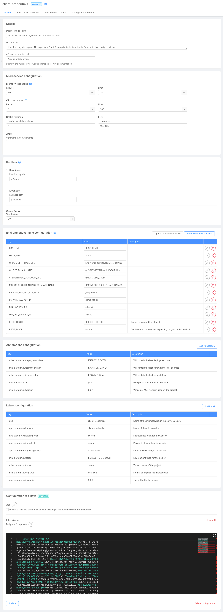
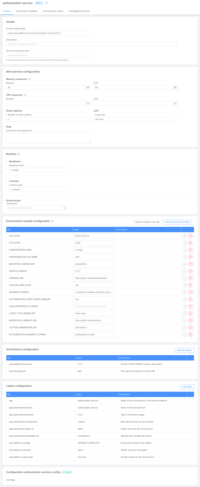
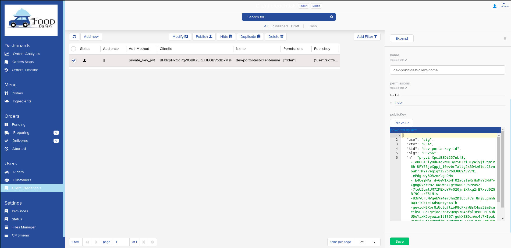

## Introduction

To ensure maximum flexibility and to respect the internal architectural logic of each client company, the management of requests that individual users fill in for access to one or more APIs of the marketplace is completely free from preconfigured mechanisms.

However, if you want to adopt a safe system, you can follow the guide below that explains the configuration of the Client Credentials service, that effectively allows you to generate and manage the various access tokens for different APIs or groups of APIs and build the flow that manages the access at the resources that you expose in the Developer Portal.

One of the many advantages of our Developer Portal is the possibility of displaying the APIs of different Console projects in one single place.

:::note
However, given that each Console project is architecturally independent, it is necessary to configure this authorization system **in each different project that you want to include in the dev portal** to manage the requests for its respective APIs.
:::

In this way and following this flow, the **Developer Portal user** who wants to request access to a particular resource can do so by inserting a Public Key in every single access request.

:::note
Finally, it is important to underline how the configuration of this authorization flow can be considered as separate from the Developer Portal, as it is only a mechanism to protect the individual APIs of a project.

**The developer portal does nothing but exploit this mechanism to facilitate access requests.**
:::

## Client credentials service

First of all, if it has not already been done, install the [`Client Credentials service`](/runtime_suite/client-credentials/20_usage.md) in every project in which you are interested in managing accesses for the Developer Portal. 
This service is used to store and manage your client credentials.

Below there are the APIs that you will need to manage the authorization:
- [`/register`](/runtime_suite/client-credentials/20_usage.md#post-register): this API is used to generate a new `client_id` using the public key provided by the Developer Portal user.  
**For security reasons, we suggest to use the `private_key_jwt` as `token_endpoint_auth_method`**;
- [`/oauth/token`](/runtime_suite/client-credentials/20_usage.md#post-oauthtoken): this API will be used by the Developer Portal user to obtain the Bearer token used to authenticate his requests.  
**For security reasons, we suggest to use the `private_key_jwt` as `token_endpoint_auth_method`**;
- [`/tokeninfo`](/runtime_suite/client-credentials/20_usage.md#get-tokeninfo): this API is used by the `Authorization service` to verify your token.

[On this page](/runtime_suite/client-credentials/10_configuration.md) you will find all the information to correctly configure the service and its related environment variables.

Furthermore, it's suggested to read the [authentication flow diagram](/runtime_suite/client-credentials/20_usage.md#supported-authentication-flow) in order to better understand what is described here and in the rest of the document.

In the end, your configuration should look like this:

:::danger
In the above screenshot, the RSA key has been provided as `ConfigMap` only for test purposes.  
We always suggest configuring it as **secret**.
:::

## Authorization service

After that, **and always for every project in which you are interested in managing accesses for the developer portal**, it is necessary to install the [`Authorization Service`](/runtime_suite/authorization-service/10_overview.md), if not already installed. 

This service works as a bridge between the `API Gateway` and the `Client credentials service`. It is invoked by the `API Gateway` on an income request and uses the `Client credentials service` to check if the provided token is valid: if everything is ok, the request is forwarded to the destination microservice in order to be processed.

To configure the service, check the [dedicated documentation](/runtime_suite/authorization-service/20_configuration.md).
For a better configuration, is also suggested to set the following environment variables as follows:
- `AUTHORIZATION_HEADERS_TO_PROXY`: `authorization,cookie`;
- `CUSTOM_PERMISSIONS_KEY`: `permissions`;
- `USERINFO_URL`: it depends on how you named the `Client credentials service`.  
If you named it `client-credentials`, for example, the value must be: `http://client-credentials/tokeninfo`.

In the end, your configuration should look like this:

## Project requests management

Using the [`/register`](/runtime_suite/client-credentials/20_usage.md#post-register) endpoint of the `Client Credentials service`, for example from the API Portal, you can create a new `client_id` that you must provide to your users to allow them to access to your resources;
the invocation of this API store the credentials in the collection configured in the [CRUD_CLIENT_BASE_URL](/runtime_suite/client-credentials/10_configuration.md#environment-variables) variable.

In order to facilitate the management of the permissions associated with the credential, you can configure the CMS to expose a new page for the collection used to store them.

The following is an example of this page:

## Usage flow

When you created the `client_id` and correctly set the associated permissions, your user is now able to call the [`/oauth/token`](/runtime_suite/client-credentials/20_usage.md#post-oauthtoken) API:
with the Bearer token returned by it, the user will be able to access the requested resource by simply inserting the `Authorization` header; for example:

`Authorization: Bearer eyJhbGciOi...`
