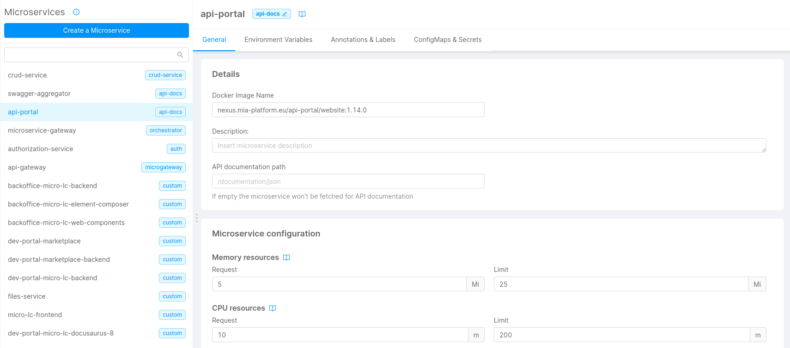

Creating the Developer Portal using the Mia-Platform Console is extremely simple, you just need a few clicks to create the necessary microservices with almost zero configuration.

Creating the Application using the Marketplace is the first fundamental requirement for a correct dev portal configuration.

## Integration requirements

To integrate the `Dev Portal`, you only need to access the project from which you want to expose it.

## Integration steps

The following steps need to be performed on the Mia Platform Console, and they will lead to the deploy a Dev Portal configured instance.

### 1. Application creation for Dev Portal

Here you are going to create an instance of the `Dev Portal application`.

1. Go to the `Application` section;
2. Create a new application using the `Dev Portal` application available in the `Core Plugins - Dev Portal` section of the marketplace;

   

3. Configure the name and description of the application and all its components;
4. Complete the creation of the `Dev Portal Application` instance;

### 2. Configure `dev-portal-micro-lc-backend`

1. Go to the `Microservices` section, and open the detail of the microservice initially named `dev-portal-micro-lc-backend`;
   
2. In the `ConfigMap` section, edit the [theming](../business_suite/microlc/core_configuration.md#theming) section of the file `configuration.json`, to customize the portal with your logos;
   
   :::caution
   The remaining configurations are already set for the `Dev Portal`: to know more about their purpose, please consult the [`Core Configuration`](../business_suite/microlc/core_configuration.md) section of `micro-lc`. 
   :::

### 2. Configure `api-portal`

1. Go to the `Microservices` section, and open the `api-portal` microservice;
   
2. Move to the `Details` card and make sure the version specified in the docker image name is at least 1.14 (e.g. `nexus.mia-platform.eu/api-portal/website:1.14.0`).

## Final result

At the end of these steps, the situation should be similar to the following:

