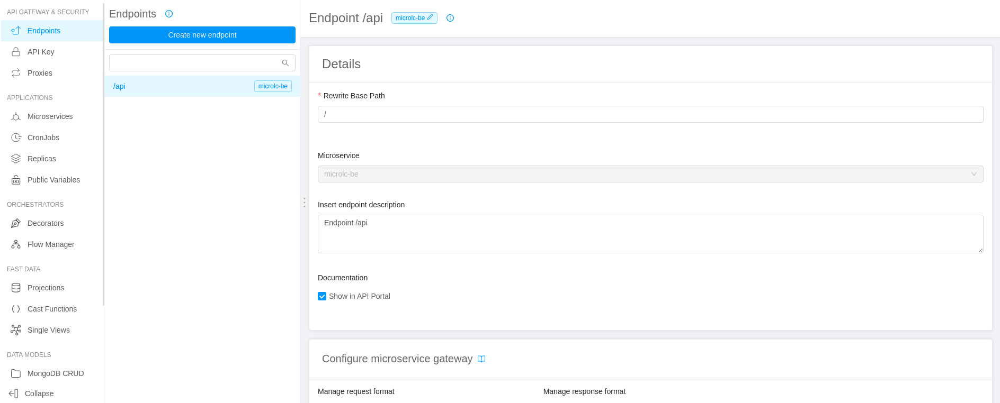
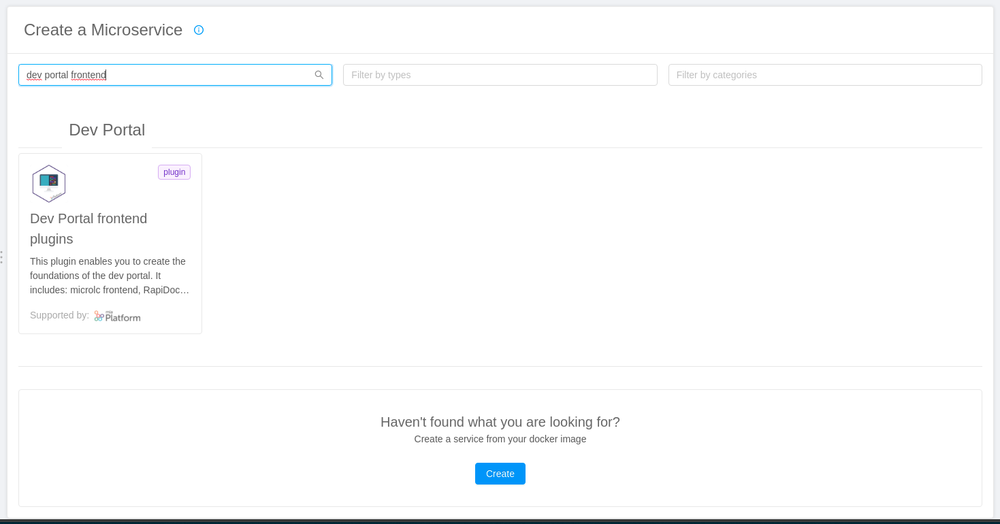

It is possible to integrate the Dev Portal inside the Mia-Platform Console with almost zero configurations.

## Integration requirements

To integrate the `Dev Portal`, you only need to access to the project on which you want to expose it.

## Integration steps

Following steps must be made on Console and will deploy a Dev Portal configured instance.

### 1. Microservice creation for Dev Portal configuration

Here you are going to create an instance of the `Dev Portal backend`.

1. Go to the `Microservices` section;
2. Create a new microservice using the `Dev Portal backend` plugin available in the `Dev Portal` section of the marketplace;
   
3. Configure the microservice with a custom name and description;
4. Complete the creation of the `Dev Portal backend` instance;
5. In the `ConfigMap` section, edit the [theming](../business_suite/microlc/core_configuration.md#theming) section of the file `configuration.json`, to customize the portal with your logos;
   :::caution
   The remaining configurations are already set for the `Dev Portal`: to know more about their purpose, please consult the [`Core Configuration`](../business_suite/microlc/core_configuration.md) section of `microlc`. 
   :::

At the end of this step, the situation should be similar to the following:

### 2. Endpoint configuration for Dev Portal backend

1. Create a new endpoint;
2. As `Base path`, use `/api/v1/microlc`;
   :::caution
   The endpoints exposed by the `Dev Portal backend` microservice must always be reachable at `/api/v1/microlc/...`: 
   as in the microservice we defined the environment variable `SERVICE_PREFIX=/`, here `/api/v1/microlc` is enough.
   :::
3. As type, use `Microservice`;
4. Select the microservice name used for the `Dev Portal backend`;
5. Complete the creation.

### 3. Microservice creation for Dev Portal frontend plugins

1. Go to the `Microservices` section;
2. Create a new microservice using the `Dev Portal frontend plugins` plugin available in the `Dev Portal` section of the marketplace;
   
3. Configure the microservice with a custom name and description;
4. Complete the creation of the `Dev Portal frontend plugins` instance;

### 4. Endpoint configuration for Dev Portal frontend plugins

1. Create a new endpoint;
2. As `Base path`, use `/`;
3. As type, use `Microservice`;
4. Select the microservice name used for the `Dev Portal frontend plugins`;
5. Complete the creation.

### 5. Docusaurus deploy

To deploy docusaurus, you can use the plugin `Microlc Docusaurus Template` available on the marketplace and follow these instructions:

1. Go to the `Microservices` section;
2. Create a new microservice using the `Microlc Docusaurus Template` in the `Dev Portal` category of the marketplace;
   
3. Configure the microservice with a custom name and description;
4. Complete the creation to deploy an instance of the template.

### 6. Docusaurus endpoint configuration

1. Create a new endpoint;
2. Define the `Base path` as `/docusaurus-template/`.
3. As type, use `Microservice`;
4. Select the microservice name used for `Docusaurus`;
5. Complete the creation.

### 7. Docusaurus assets configuration

1. Create a new endpoint;
2. Define the `Base path` as `/documentation/assets`.
3. As type, use `Microservice`;
4. Select the microservice name used for `Docusaurus`;
5. Complete the creation;
6. Assign to `Rewrite Base Path` the value `/assets`.

## Final result

After the configuration of [Docusaurus](docusaurus.md) and [RapiDoc](rapidoc.md), your final result should be similar to this:

