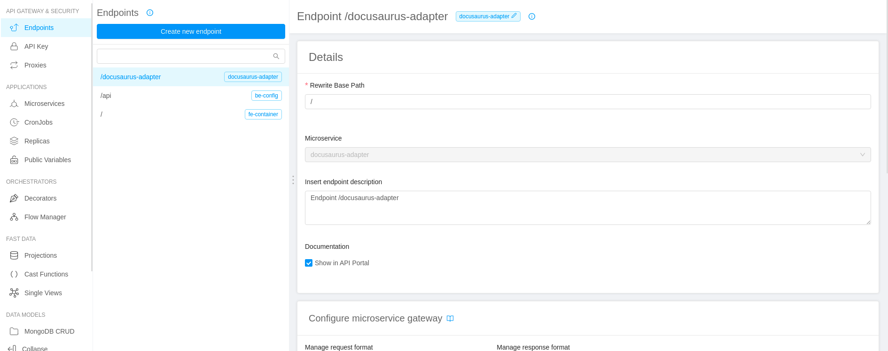
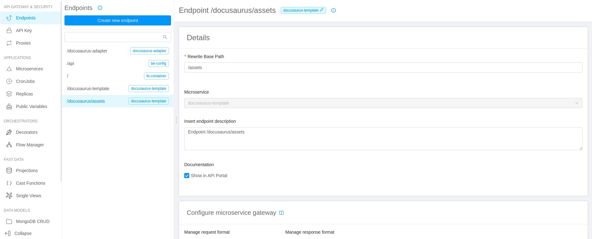

[Docusaurus](https://docusaurus.io/) is a performant static site generator and can be used to create common
content-driven websites extremely quickly.

In the dev portal, `Docusaurus` is used to create the documentation writing just [markdown](https://guides.github.com/features/mastering-markdown/) files.

## Integration into microlc

As Docusaurus hide its root component, we first need an `adapter` that expose the `microlc`'s required lifecycle methods:
its purpose is to correctly include `Docusaurus` inside `microlc`.

## Docusaurus adapter

The `adapter` come as `microlc` plugin, whose configuration structure can be found in the
[dedicated section](../business_suite/microlc/core_configuration.md#plugins).

### Adapter configuration

In addition to the standard `qiankun` plugin configuration you **must** include the following `props`:

- _docusaurusUrl_: the complete url where docusaurus will be exposed, it is generally composed by the host and the exposed endpoint.

Here follows a full configuration example:

```json {10}
{
  "id": "docusaurus-adapter",
  "label": "Docusaurus",
  "icon": "fas fa-book",
  "order": 1,
  "integrationMode": "qiankun",
  "pluginRoute": "/docusaurus/",
  "pluginUrl": "https://plugin-url.com",
  "props": {
    "docusaurusUrl": "https://docusaurus-url.com/docusaurus-template/"
  }
}
```

:::caution
To have a correct routing, the `Docusaurus' baseUrl` and the `pluginRoute` must have the same value.
:::

### Adapter deploy

To deploy the adapter, you can use the plugin `Microlc Docusaurus Adapter` available on the marketplace and follow these instructions:

1. Go to the `Microservices` section;
2. Create a new microservice using the `Microlc Docusaurus Adapter`, available in the `Dev Portal` category of the marketplace;
   
3. Configure the microservice with a custom name and description;
4. Complete the creation to deploy an instance of the adapter.

### Adapter endpoint configuration

1. Create a new endpoint;
2. Define the `Base path` where you want to expose the adapter (e.g. `/docusaurus-adapter`);
3. As type, use `Microservice`;
4. Select the microservice name used for the adapter;
5. Complete the creation.

After that, the situation should be similar to the following:



## Docusaurus website

The docusaurus website instance does not require any configuration and can be deployed separately.

### Docusaurus deploy

To deploy docusaurus, you can use the plugin `Microlc Docusaurus Template` available on the marketplace and follow these instructions:

1. Go to the `Microservices` section;
2. Create a new microservice using the `Microlc Docusaurus Template` in the `Dev Portal` category of the marketplace;
   
3. Configure the microservice with a custom name and description;
4. Complete the creation to deploy an instance of the adapter.

:::note
By default, it is configured to use `/docusaurus/` as base url:
to change it, edit the value exported in the `baseUrl.js`, placed on the root of the project repository.
:::

### Docusaurus endpoint configuration

1. Create a new endpoint;
2. Define the `Base path` where you want to expose `Docusaurus` (e.g. `/docusaurus-template`).  
   **NOTE**: it must be different from the `pluginRoute` that will be defined in the adapter;
3. As type, use `Microservice`;
4. Select the microservice name used for `Docusaurus`;
5. Complete the creation.

### Docusaurus assets configuration

1. Create a new endpoint;
2. Define the `Base path`, that must adhere the format: `/{docusaurusAdapterPluginRouteValue}/assets`.  
   **e.g.** if you set `/docusaurus/` in the [adapter configuration](docusaurus.md#docusaurus-adapter), 
   the `Base path` must be defined as `/docusaurus/assets`;
3. As type, use `Microservice`;
4. Select the microservice name used for `Docusaurus`;
5. Complete the creation;
6. Assign to `Rewrite Base Path` the value `/assets`.

After that, the situation should be similar to the following:



## Result

After a deployment, your new Dev Portal should be exposed at the `/` path of your host (e.g. `https://your-host-com/`), 
and should be similar to the following:


