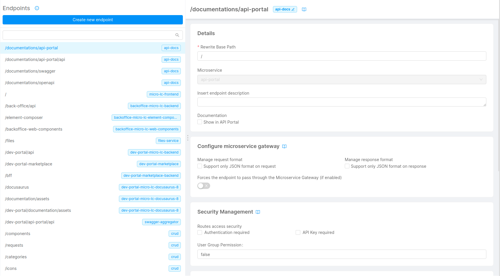

In this paragraph, we will describe the endpoints that must be configured to correctly use the dev portal.

We divided the configuration into macro areas: all these actions must be done in the `Endpoints` section of the console.

## General configuration

### Microlc frontend

1. Create a new endpoint called `/`;
2. Point this URL to the microservice that exposes the `aggregated-dev-portal-frontends`;
3. Use `/` as _Rewrite Base Path_.

## Backoffice configuration

### Backoffice backend

1. Create a new endpoint called `/back-office/api`;
2. Point this URL to the microservice that exposes the `backoffice-micro-lc-backend`;
3. Use `/` as _Rewrite Base Path_.

### Files Service

1. Create a new endpoint called `/files`;
2. Point this URL to the microservice that exposes the `files-service`;
3. Use `/` as _Rewrite Base Path_.

## Dev portal configuration

### Dev portal backend

1. Create a new endpoint called `/dev-portal/api`;
2. Point this URL to the microservice that exposes the `dev-portal-micro-lc-backend`;
3. Use `/` as _Rewrite Base Path_.

### Marketplace backend

1. Create a new endpoint called `/bff`;
2. Point this URL to the microservice that exposes the `dev-portal-marketplace-backend`;
3. Use `/` as _Rewrite Base Path_.

### Docusaurus template

1. Create a new endpoint called `/docusaurus`;
2. Point this URL to the microservice that exposes the `dev-portal-micro-lc-docusaurus`;
3. Use `/` as _Rewrite Base Path_.

### Docusaurus assets

1. Create a new endpoint called `/documentation/assets`;
2. Point this URL to the microservice that exposes the `dev-portal-micro-lc-docusaurus`;
3. Use `/assets` as _Rewrite Base Path_.

### Dev Portal assets

1. Create a new endpoint called `/dev-portal/documentation/assets`;
2. Point this URL to the microservice that exposes the `dev-portal-micro-lc-docusaurus`;
3. Use `/assets` as _Rewrite Base Path_.

### Api documentation

1. Create a new endpoint called `/dev-portal/api-portal/api`;
2. Point this URL to the microservice that exposes the `swagger-aggregator`;
3. Use `/assets` as _Rewrite Base Path_.

## CRUD configuration

Expose the following CRUD endpoints, in order to make the marketplace elements configurable on the backoffice:
- `/components`
- `/categories`
- `/requests`
- `/icons`

For each endpoint:
1. Create a new endpoint called as specified;
2. Point this URL to the CRUD with the corresponding name;
3. Use `/` as _Rewrite Base Path_.

## Advanced configuration

For this configuration step, move to the **Advanced** section of the console and select the `api-gateway` microservice.

:::info
These endpoints allow the two micro-lc instances, created respectively for the backoffice and dev portal sections, to exist simultaneously without conflicts.
:::

Search for the following files and paste the content below:

- **maps-proxyUrl.before.map**
```json
// micro-lc dev portal
"~^\w+-/dev-portal/.+/api/v1/microlc(?<path>[/\?].*|$)$" "/v1/microlc$path";

// micro-lc backoffice
"~^\w+-/back-office/.+/api/v1/microlc(?<path>[/\?].*|$)$" "/v1/microlc$path";

// micro-lc user info
"~^\w+-/.+/userinfo(?<path>[/\?].*|$)$" "/userinfo$path";
```

- **maps-proxyName.before.map**
```json
// micro-lc dev portal
"~^(secreted|unsecreted)-1-GET-/dev-portal/.*/api/v1/microlc/.*" "dev-portal-micro-lc-backend";

// micro-lc backoffice
"~^(secreted|unsecreted)-1-GET-/back-office/.*/api/v1/microlc/.*" "backoffice-micro-lc-backend";

// micro-lc user info
"~^(secreted|unsecreted)-1-\w+-/.*/userinfo([/\?].*|$)$" "auth0-client";
```

- **root-location-extension.conf**
```json
location = / {
  include /etc/nginx/customization.d/header-debug.conf;

  return 302 '$original_request_scheme://$original_request_host/dev-portal/';
}

location = /dev-portal {
  include /etc/nginx/customization.d/header-debug.conf;

  return 302 '$original_request_scheme://$original_request_host/dev-portal/';
}

location = /back-office {
  include /etc/nginx/customization.d/header-debug.conf;

  return 302 '$original_request_scheme://$original_request_host/back-office/';
}
```

<br/>

:::caution
Please ignore any red feedback that may appear when pasting this content within the advanced section files.
:::

## Final result

At the end of this configuration, the situation should look like this:


