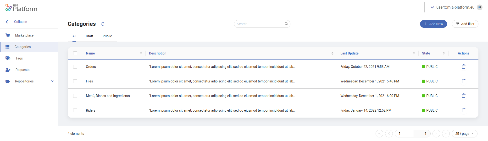

Once you successfully followed the [steps](./application_creation.md) to create the Dev Portal application, you can start adding all the information characterizing your organization at the endpoint `/back-office/`. 

Through the **Backoffice** section of the Dev Portal, you can edit and manage all the data that will be shown in the Dev Portal Marketplace.

## Configure APIs and Events

The marketplace can show a preview of all the APIs and events of your organization, divided into different categories. 

By selecting a specific API or event, the user will be able to visualize a short overview and a longer description to gain more insight into it. A series of actions will also be able to the user. In particular, the user will be able to:

- Move to the API or event official documentation
- Move to the Api Portal 
- Request the Api Token

## The Marketplace Page

For the aforementioned reasons, the Backoffice section will contain a specific page to populate all the necessary information about APIs and events, the Marketplace page.

:::note
On the marketplace page, you will find an already populated list with all the APIs and events of your organization, automatically inferred from your Swagger or OpenAPI specifications.
:::

### Overview

From this page, you will be able to set all the details regarding a specific API or event. 

In particular, you will be able to set the following properties:

- **Title**: The name of the component you want to display on the marketplace card and at the top of the detail page;
  
- **Icon**: The icon to be displayed next to the component title;

- **Type**: The component type: API or event;
  
- **Category**: The business level category you want to associate your component to. Each category will be displayed as a separate cluster of components on the home page (Please refer to the categories page [section](#the-categories-page) for further details about creating and modifying categories);

- **Overview**: A short description of your component, to be displayed both on the home page and on the detail page;

- **Description**: A longer description of your component, to be displayed only on the detail page;

- **Link to Documentation**: The link to a specific page of the Docusaurus Dev Portal plugin. It can be used to refer the API or event to a part of your documentation;

- **Link to Api Portal**: The link to the APi Portal corresponding specification.

### Create Modify and Publish

In order to display an API or event in the Marketplace section of the Dev Portal, you will eventually need to perform one of these actions.

- To **Create** a new entry in the Marketplace Page, simply 
  press the `Add New` button at the top-right angle of the page. 

  :::info
  Please consider custom created entries in the Marketplace table **cannot be automatically mapped** to your Swagger or OpenApi specifications
  :::

- To **Modify** an existing API or event, simply click on the corresponding row inside the table. Depending on your Dev Portal configuration, a drawer or a modal will be shown, where you will be able to edit each field of your component.

- To **Publish** your modifications, select with the tick boxes the corresponding rows you want to publish. If the rows you selected belong to the same publication status (all `DRAFT` or `PUBLIC`) you will be able to update their status with a button appearing at the bottom of the page. 

  :::caution warning
  **DRAFT** entries will not be displayed in the Marketplace section. Please make sure to publish all the entries you want to visualize.
  :::

## The Categories Page

In order to subdivide APIs and events into different business logics or classifications, the Marketplace allows the creation of different categories in which components can be clustered.

Therefore, the Backoffice section contains a specific page to populate all the necessary information about categories, the Categories page.

### Overview

From this page, you will be able to set all the details regarding a specific category. 

In particular, you will be able to set the following properties:

- **Title**: The name of the category you want to display as a section title on the home page;

- **Description**: A description of the category you want to display. It will not appear as a visual element on the Marketplace but can be used to catalog with more precision each category.

### Create Modify and Publish

In order to be able to select a specific category from the Marketplace Page, you will eventually need to perform one of these actions.

- To **Create** a new entry in the Categories Page, simply 
  press the `Add New` button at the top-right angle of the page.

- To **Modify** an existing category, simply click on the corresponding row inside the table. Depending on your Dev Portal configuration, a drawer or a modal will be shown, where you will be able to edit the selected category.

- To **Publish** your modifications, select with the tick boxes the corresponding rows you want to publish. If the rows you selected belong to the same publication status (all `DRAFT` or `PUBLIC`) you will be able to update their status with a button appearing at the bottom of the page. 

  :::caution warning
  **DRAFT** entries will not be displayed on the Marketplace Page. Please make sure to publish all the entries you may want to associate to an API or event.
  :::
  
