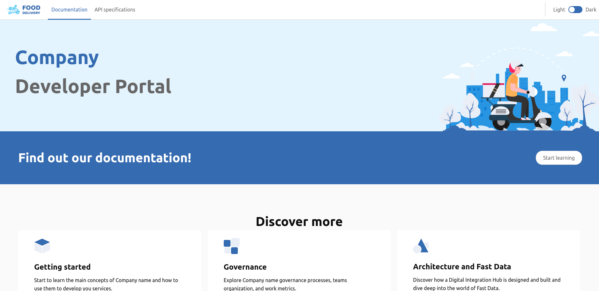

Dev portal is the interface between a set of APIs, SDKs, or other interactive digital tools and their various stakeholders.  
The portal can play several roles to achieve the business goals of an organization.

Mia built the dev portal using [`microlc`](https://github.com/mia-platform/microlc): its open source product to easily deploy web application using the micro-frontends technology.

Dev portal encloses in a single-page application, the following tools:

- _[Docusaurus](https://docusaurus.io/)_: used to create documentation section;
- _[ReDoc](https://github.com/Redocly/redoc/blob/master/README.md)_: used to display the OpenAPI/Swagger-generated API reference documentation.

For more details about the configurations of these tools, refer to the following pages.

## Expected final result

After the configuration of [Docusaurus](docusaurus.md) and [ReDoc](redoc.md), your final result should be similar to this:

