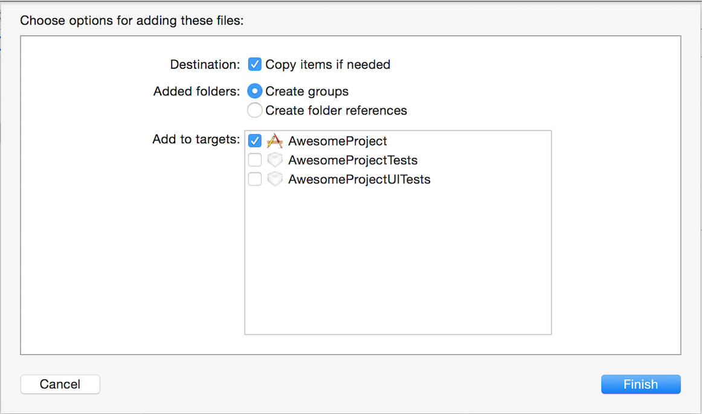

# SDK iOS

Mia-Platform provides an SDK that works as intermediator to permit the interactions between the application and the platform. In this document we will guide you to add the Mia-Platform SDK to your project, initialize it and explain the most common actions available to you.

## General information and requisites

* The latest version of **Xcode** - [download](https://itunes.apple.com/it/app/xcode/id497799835?mt=12)
* The latest version of the Mia-Platform SDK - [download](download/Mia-Platform-iOS-SDK.zip)
* The SDK is compatible with **iOS 9** or above

## SDK Modules

The SDK project is divided in modules:

* mkApp - *Core Framework*
* MIASync
* MIAAnalytics - *Coming soon*

The main one, which we will refer as **Core framework**, will give you access to the CRUD functionality of the BaaS backend, the SSO login and the analytics for your projects.

The second one is the **MIASync** framework; this module is optional for your project and rely on the **Core framework** to work and will add the sync data between BaaS and local database functionality to your project.

The following paragraph will describe in detail the usage of each module.

## Core Framwerork

### Add the Core module to your Xcode project

Extract the content of the SDK from the zip file and drag and drop the **mkApp.framework** file inside your Xcode project. Pay attention that the copy flag is checked!



**Pay attention:** the  two options **Copy items if needed** and **Create Groups** must be selected!

Your file project tree must look like this:


Go to the **Build Phases** section of your project, click on the **+** button on the upper-left corner and select **New Run Script Phase**


A new **Run Script** voice should appear in the list. Rename it **Embedded SDK**, then expand it and add the following line of code:

```
./mkApp.framework/embed-sdk 'mkApp.framework'
```


Lastly, go to **Build Settings**, search **Enable Bitcode** and set it to **No**.

Now you can safely import the mkApp framework in all the files where you want to use its functionality with the familiar statement:

```
Objective-C

#import <mkApp/mkApp.h>
```

```
Swift

import mkApp
```

### Initialization

In order to use the SDK, you have to initialize it. This operation must be done as soon as the application start (for example in the **AppDelegate**). In order to initialize it, write the following line of code:

```
Objective-C

MKAppInstance *appInstance = [MKAppInstance sharedInstance];

// Ask your App Angel to have your Project Name and Secret
appInstance.projectAPIname = @"<YourProjectName>";
appInstance.APISecret = @"<YourAPISecret>";
```

```
Swift

let appInstance = MKAppInstance.sharedInstance

// Ask your App Angel to have your Project Name and Secret
appInstance.projectAPIname = "<YourProjectName>"
appInstance.APISecret = "<YourAPISecret>"
```

The project API name and the API secret will be handed over by your App Angel when the team’s BaaS will be created.

### Create Read Update Delete

In this SDK, the CRUD operations can be performed through the usage of MKCollection and MIAQuery classes, or also their derived classes.

#### MKCollection

Storing data on the remote database is built around the **MKCollection** class. Each **MKCollection** contains key-value pairs of JSON-compatible data. This data is schemaless, which means that you don’t need to specify ahead of time what keys exist on each **MKCollection**. But in order to see your data on the BaaS dashboard you have to configure the column’s name and type (see the BaaS Dashboard section for more details).

For example, let’s say you’re tracking data of a picture taken by a user :

```
userName : "mario"
pictureName : "image51.jpg"
pictureDate : "2014-03-22 17:05:40.351"
flashMode : NO
```

Keys must be alphanumeric strings. Values can be strings, numbers, booleans, dates or arrays – anything that can be JSON-encoded. Each **MKCollection** has a class name that you can use to distinguish different sorts of data.

For example, we could call the Picture Data Object **PictureData**. The code below is an example of how to create and populate the **PictureData object**, then save it:

```
Objective-C

MKCollection* picData = [MKCollection collectionWithName:@"picturedata"];
[picData setObject:@"mario" forKey:@"username"];
[picData setObject:@"image51.jpg" forKey:@"picturename"];
[picData setObject:[NSDate date] forKey:@"picturedate"];
[picData setObject:[NSNumber numberWithBool:NO] forKey:@"plashmode"];
NSError *error = nil;
[picData save:&error];
```

```
Swift

var picData = MKCollection(name: "picturedata")
picData.setObject("mario", forKey:"username")
picData.setObject("image51.jpg", forKey:"picturename")
picData.setObject(NSDate(), forKey:"picturedate")
picData.setObject(NSNumber(value: false), forKey:"plashmode")

do {
    try collection.save()
} catch (error) {
    print(error)
}
```

The **save** method run on the Main Thread and perform a network request. For this reason, if it is executed on the Main Thread, it blocks the application. You have two possibilities: run this method on another thread or use **saveInBackgroundWithBlock**, which also provide additional logic which will run after the save is completed.

Every collection contains a set of basic properties that will be filled directly by the BaaS:

* **Id** is a unique identifier for each saved collection
* **createdAt** and **updatedAt** represent the time that each collection was created and last modified in the database
* **creatorId** and **updaterId**, similarly, represent the **Id** (yes the id related of the User Collection) of the user that has performed the last operation on this data

Each of these fields is filled in by the BaaS automatically, so they don’t exist on a MKCollection instance until a save operation has been completed.

If you need to refresh a collection you already have with the latest data from the remote database, you can use the **refresh**, **refreshInBackground** or **refreshInBackgroundWithBlock** methods.

Updating a collection is simple: enter some new data into a collection and use one of the save functions.

Deleting is even simpler:

```
Objective-C

NSError *error = nil;
[picData delete:&error];
```

```
Swift

do {
    try collection.delete()
} catch (error) {
    print(error)
}
```

or

```
Objective-C

[picData deleteInBackgroundWithBlock:^(MKCollection *collection, NSError *error) {
  //Perform some actions
}];
```

```
Swift

collection.deleteInBackground({ (mkCollection: MKCollection?, error: Error*) in
  //Perform some actions
  })
```

**Warning:** check the ACL configuration of your Collection in your Baas console. It could be necessary to login with MKUser’s methods before any CRUD operation on the data of your Collection!

#### MIAQuery

Reading the data from the BaaS can be done using **MIAQuery** class in both synchronous or asynchronous way. For example, if you want to retrieve an MKCollection with a specific If, you can proceed as follow:

```
Objective-C

MIAQuery *query = [MIAQuery queryWithCollectionName:@"picturedata"];
[query getObjectWithId: @"004b44b9182c19e2" withCompletionBlock:^(id  _Nullable object, NSError * _Nullable error) {
  // Do something with the returned object (the object could be nil if there is an error. Always check the error variable)
  if (error == nil && [object isKindOfClass:[MKCollection class]]) {
    MKCollection *picData = (MKCollection *)object;
    NSString *name = [picData objectForKey:@"username"];
    NSString *fileName = [picData objectForKey:@"picturename"];
    NSDate *pictureDate = [picData objectForKey:@"picturedate"];
  }
  }];
```

```
Swift

let query = MIAQuery(collectionName: "picturedata")
query.getObjectWithID("004b44b9182c19e2") { (object: Any?, error: Error?) in
  // Do something with the returned object (the object could be nil if there is an error. Always check the error variable)
  guard error == nil, let picData = object as? MKCollection else {
      return
    }
    let name = picData.object(forKey: "username")
    let fileName = picData.object(forKey: "picturename")
    let pictureDate = picData.object(forKey: "picturedate")
}
```

There are many other ways to retrieve data with **MIAQuery**. The general pattern is to create a **MIAQuery** instance, put conditions on it and then retrieve a Array of matching MKCollection using either **findObjects** or **findObjectsWithCompletionBlock**. The method **findObjectsWithCompletionBlock** assures the network request is done without blocking, and run the block/callback in the main thread. The **findObjects** method instead blocks the calling thread – use it only if you are already running it in a background thread.

For example:

```
Objective-C

MIAQuery *query = [MIAQuery queryWithCollectionName:@"picturedata"];
query.limit = 10;
[query addFilterForKey:@"updatedAt" relatedBy:MIAQueryRelationGreaterThan toObject:dateLastDownload]; //dateLastDownload is an instance of NSDate
[query addSortKey:@"picturename" ascending:YES];
[query findObjectsWithCompletionBlock:^(NSArray * _Nullable objects, NSError * _Nullable error) {
    if (!error && objects) {
        // The find succeeded.
        NSLog(@"Successfully retrieved %@ pictures.", objects.count);
        // Do something with the found collections
        for (MKCollection *collection in objects) {
            NSLog(@"%@", collection.collectionId);
        }
    } else {
        // Log details of the failure
        NSLog(@"Error: %@ %@", error, [error userInfo]);
    }
}];
```

```
Swift

let query = MIAQuery(collectionName: "picturedata")
query.limit = 10
query.addFilter(forKey: "updatedAt", relatedBy: .greaterThan, to: dateLastDownload) //dateLastDownload is an instance of Date
query.addSortKey("picturename", ascending: true)
query.findObjects { (objects:[Any]?, error: Error?) in
    guard error == nil, let mkcollections = objects as? [MKCollection] else {
        return
    }
    for collection in mkcollections {
        print(collection.collectionId)
    }
}
```

There are several ways to put constraints on the collections found by a **MIAQuery**:

```
Objective-C

[query addFilterForKey:@"updatedAt" relatedBy:MIAQueryRelationGreaterThan toObject:dateLastDownload];
[query addFilterForKey:@"updatedAt" relatedBy:MIAQueryRelationGreaterThanOrEqual toObject:dateLastDownload];
[query addFilterForKey:@"updatedAt" relatedBy:MIAQueryRelationLessThan toObject:dateLastDownload];
[query addFilterForKey:@"updatedAt" relatedBy:MIAQueryRelationLessThanOrEqual toObject:dateLastDownload];
[query addFilterForKey:@"updatedAt" relatedBy:MIAQueryRelationEqual toObject:dateLastDownload];
[query addFilterForKey:@"updatedAt" relatedBy:MIAQueryRelationNotEqual toObject:dateLastDownload];

//more than one (the field key could also be an array)
[query addFilterForKey:@"picturename" containedInArray:@[@"image51.png",@"image52.png"]];
[query addFilterForKey:@"picturename" notContainedInArray:@[@"image51.png",@"image52.png"]];
[query addFilterForKey:@"picturename" containsAllObjectsInArray:@[@"image51.png",@"image52.png"]]; // the field key must be an array

//queries on strings
[query addFilterForKey:@"username" whereHasPrefix:@"mar"];
[query addFilterForKey:@"username" whereHasSuffix:@"mar"];

//You can give multiple constraints, and collections will only be in the results
//if they match all of the constraints.
//In other words, it's like an AND of constraints.

//You can limit the number of results by setting limit. The maximum is 500.
query.limit = 100; // only the first hundred collections will be returned

//You can skip the first results by setting skip. This can be useful for pagination
query.skip = 100; // only return collections over the first hundred

//For sortable types like numbers, strings and dates,
//you can control the order in which results are returned
[query addSortKey:@"picturename" ascending:YES];
[query addSortKey:@"picturename" ascending:NO];

//You can restrict the fields returned by calling
[query includeKeysInResults:@[@"picturename",@"username"]]; // only specified keys are returned
[query excludeKeysFromResults:@[@"picturename",@"username"]]; // all keys are returned exept the specified ones
```

```
Swift

query.addFilter(forKey: "updatedAt", relatedBy: .greaterThan, to: dateLastDownload)
query.addFilter(forKey: "updatedAt", relatedBy: .greaterThanOrEqual, to: dateLastDownload)
query.addFilter(forKey: "updatedAt", relatedBy: .lessThan, to: dateLastDownload)
query.addFilter(forKey: "updatedAt", relatedBy: .lessThanOrEqual, to: dateLastDownload)
query.addFilter(forKey: "updatedAt", relatedBy: .equal, to: dateLastDownload)
query.addFilter(forKey: "updatedAt", relatedBy: .notEqual, to: dateLastDownload)

//more than one (the field key could also be an array)
query.addFilter(forKey: "picturename", containedIn: ["image51.png","image52.png"])
query.addFilter(forKey: "picturename", notContainedIn: ["image51.png","image52.png"])
query.addFilter(forKey: "picturename", containsAllObjectsIn: ["image51.png","image52.png"]) // the field key must be an array

//queries on strings
query.addFilter(forKey: "username", whereHasPrefix: "mar")
query.addFilter(forKey: "username", whereHasSuffix: "mar")

//You can give multiple constraints, and collections will only be in the results
//if they match all of the constraints.
//In other words, it's like an AND of constraints.

//You can limit the number of results by setting limit. The maximum is 500.
query.limit = 100 // only the first hundred collections will be returned

//You can skip the first results by setting skip. This can be useful for pagination
query.skip = 100 // only return collections over the first hundred

//For sortable types like numbers, strings and dates,
//you can control the order in which results are returned
query.addSortKey("picturename", ascending: true)
query.addSortKey("picturename", ascending: false)

//You can restrict the fields returned by calling
query.includeKeys(inResults: ["picturename","username"]) // only specified keys are returned
query.excludeKeys(fromResults: ["picturename","username"]) // all keys are returned exept the specified ones
```

**Warning:** Check the ACL configuration of your Collection in your Baas console. It could be necessary to login with MKUser’s methods before quering data of your Collection!

#### mkCollectionFile

**MKCollectionFile** lets you store application files in the cloud that would otherwise be too large or cumbersome to fit into a regular **MKCollection**. The most common use is storing images but you can also use it for documents, videos, music, and any other binary data.
Getting started with MKCollectionFile is easy. First, you’ll need to have the data in **NSData** form and then create a MKCollectionFile with it.

```
Objective-C

//get picture in NSData format starting from a UImage
NSData *myData = UIImagePNGRepresentation(image);
MKCollectionFile *file = [MKCollectionFile fileWithName:@"picture.png" data:myData];
```

```
Swift

//get picture in NSData format starting from a UImage
let myData = UIImagePNGRepresentation(image)
let file = MKCollectionFile(name: "picture.png", data: myData)
```

Notice in this example that we give the file a name of **picture.png**. There are two things to note here:

* You don’t need to worry about filename collisions. Each upload gets a unique identifier so there is no problem with uploading multiple files named picture.png.
* It’s important that you give a name to the file that has a file extension. This lets **BaaS** figure out the file type and handle it accordingly. So, if you’re storing PNG images, make sure your filename ends with .png.

Next you’ll want to save the file to the cloud. As with MKCollection, there are different versions of the save method you can use.

```
Objective-C

NSError *err = nil;
[file save:&err];
```

```
Swift

do {
    try file.save()
} catch {
    print(error)
}
```

**Note:** You might want to use **saveInBackgroundWithBlock** to provide additional logic which will run after the save completes and to prevent lock of UI in the Main Thread.

Finally, after the save is completed, you can associate a **MKCollectionFile** id onto a **MKCollection** just like any other piece of data:

```
Objective-C

MKCollection *post = ... //a collection
[post setObject:file.collectionId forKey:@"postImage"];
```

```
Swift

var post = MKCollection(name: "a collection")
post?.setObject(file.collectionId, forKey: "postImage")
```

#### Advanced Network settings

In the case you cannot use the classes provided by the SDK to make your network requests, the SDK provides more tools. It exposes a **NSURLSessionTask** instance that point to the same URL with which the SDK has been initialized and it injects automatically the secret and the sid, if the user is logged.

For example, you can create a **NSURLSessionDataTask** to perform **GET** requests as follow:

```
Objective-C

NSURLSessionDataTask *dataTask = [MKAppInstance.sharedInstance.network getDataTaskWithRelativePath:@"geocoding/geo" queryParameters:queryParameters error:&networkError completionHandler:^(NSData * _Nullable data, NSURLResponse * _Nullable response, NSError * _Nullable error) {
        // perform actions
    }];
```

```
Swift

let dataTask = MKAppInstance.shared().network.getDataTask(relativePath:"geocoding/geo", queryParameters:queryParameters, completionHandler:^(data: Data?, response: NSURLResponse?, error: Error?) {
        // perform actions
    })
```

where **queryParameters** is a dictionary which contains the query parameters for the request. The key of the dictionary corresponds to the name of the parameter, the value of the dictionary corresponds to the value of the parameter.

It is possible also to create a **NSURLSessionDataTask** to perform **GET** requests which automatically returns in the completion block the data as a **Dictionary** (if a JSON file is expected) or as a **MKCollection** array. The core module also exposes methods to create NSURLSessionTask for **POST** and **DELETE** actions.

### Basic analytics

The core framework provides also some basics analytics as the installation and the daily use. More sophisticated analytics are provided in the analytics module. The track of the installation and the daily use of your application is done automatically by the core module. No action is requested by the developer.

### Login, registration and restore user sessions

The SDK provides the **MKUser** class responsible of managing the user login data, the user registration data and the password recovery

#### Login

The login activity is managed by the SDK through the **MKUser** class. To perform this action it is possible to call the following static method with email and password of the user to login:

```
Objective-C

[MKUser logInWithEmailInBackground:"email" password:"password" storeUserLocaly:YES block:^(MKUser *user, NSError *error) {
        // perform some actions
    }];
```

```
Swift

MKUser.logInWithEmail(inBackground: "email", password: "password", storeUserLocaly: true) { (user: MKUser?, error: Error?) in
            // perform some actions
        }
```

The MKUser instance of the callback is the user that has been logged.

**NOTE**: if **storeUserLocally** is true, user will be saved locally on keychain for future login.

#### Registration

In order to perform the registration of a new user, it is necessary to create a new **MKUser** instance and fill the required parameters, which are the email an the password, then perform a save on the user. A complete example is proposed below.

```
Objective-C

MKUser *user = [MKUser user];

[user setObject:@"my username" forKey:@"username"];
[user setObject:@"my name" forKey:@"user_name"];
[user setObject:@"my surname" forKey:@"user_surname"];
[user setObject:@"my email" forKey:@"email"];
[user setObject:@"my password" forKey:@"password"];

[user saveInBackgroundWithBlock:^(MKCollection *collection, NSError *error) {
      // perform some actions
    }];
```

```
Swift

var user = MKUser()

user?.setObject("my username", forKey: "username")
user?.setObject("my name", forKey: "user_name")
user?.setObject("my surname", forKey: "user_surname")
user?.setObject("my email", forKey: "email")
user?.setObject("my password", forKey: "password")

user?.saveInBackground({ (user: MKCollection?, error: Error?) in
    // perform some actions
})
```

#### Restore user session

If the user already exist in the device, the session can be restored without the need of performing the login again.

```
Objective-C

[MKUser loginWithLocalStoredUser:^(MKUser *user, NSError *error, BOOL localCredential) {
  // perform some actions
  }];
```

```
Swift

MKUser.login { (user: MKUser?, error: Error?, localCredential: Bool) in
            // perform some actions
        }
```

In the completion block are returned three parameters:

* an istance on MKUser, that can be null if there aren't logged users or if there was an error
* an instance of NSError, that can be null if there aren't errors
* a boolean that is true if for some reasons it was not possible to check online if the session of the user is still valid, it is false if the server has checked the session of the returned user

## MIASync Framwerork

MIASyncro is a class for syncing  data from BaaS into the local database and viceversa. The local database is represented and referenced by a NSManagedObjectContext.

The sync behaviour is inspired by git: there are a pull action first and then a push action. Changes from BaaS have greater priority than local changes so, if a conflict is present, changes from BaaS will replace local changes.

In particular values from BaaS that have updatedAt greater than updatedAt of local objects, these local objects will be updated (replaced) or deleted, depends on the status.

### Add the Core module to your Xcode project

Extract the content of the SDK from the zip file and drag and drop the **MIASync.framework** file inside your Xcode project. Pay attention that the copy flag is checked!


**Pay attention:** the two options **Copy items if needed** and **Create Groups** must be selected!

**NOTE:** This framework doesn't work if the core framework hasn't been added to your project.

Go to the **Build Phases** section of your project and add the following line of code to the click on the **Embedded SDK** script:

```
./mkApp.framework/embed-sdk 'MIASync.framework'
```

You should see something like this:


Lastly, check in **Build Settings** if **Enable Bitcode** is setted to **No**.

Now you can safely import the MIASync framework in all the files where you want to use its functionality with the familiar statement:

```
Objective-C

#import "MIASync.h"
```

```
Swift

import MIASync
```

### Initialization

In order to use the MIASync framework, you have to initialize it. This operation must be done as soon as the application start (for example in the **AppDelegate**). In order to initialize it, write the following line of code after the MKApp initialization:

```
Objective-C

MKAppInstance *appInstance = [MKAppInstance sharedInstance];

// Ask your App Angel to have your Project Name and Secret
appInstance.projectAPIname = @"<YourProjectName>";
appInstance.APISecret = @"<YourAPISecret>";

NSURL *pathString = [[NSBundle bundleForClass:[self class]] URLForResource:@"TestModel" withExtension:@"momd"];
NSManagedObjectModel *managedObjectModel = [[NSManagedObjectModel alloc] initWithContentsOfURL:modelURL];
MIASyncro *miaSyncro = [[MIASyncro alloc] initWithManagedObjectModel:managedObjectModel];

[miaSyncro sync:@[News.class,Author.class]];
```

```
Swift

let appInstance = MKAppInstance.sharedInstance

// Ask your App Angel to have your Project Name and Secret
appInstance.projectAPIname = "<YourProjectName>"
appInstance.APISecret = "<YourAPISecret>"

guard
    let pathString = Bundle.main.path(forResource: "TestModel", ofType: "momd"),
    let managedObjectModel = NSManagedObjectModel.init(contentsOf: URL(fileURLWithPath: pathString)),
    let miaSyncro = MIASyncro(managedObjectModel: managedObjectModel) else {
      fatalError("Unable to init NSManagedObjectModel")
}

miaSyncro.sync([News.self, Author.self])
```

In order to be instantiated, MIASync need to have a managed object model where to save the collection to sync. MIASync will create a default managedObjectContext using this mode. It is also possible to create by yourself a managed object context and initialize the MIASync with it. After that an instance of MIASync has been created, it is necessary to declare which collections must be synced.

It is possible to do it by assigning an array of classes to the **sync** variable. Each class must have the same name and the same variables of the collection that must be synced from the BaaS. For example, if on the BaaS there is a collection called **News** with **title** and **text** fields, to sync it we must create a class called **News** in the project with two properties **title** and **text**.

## MIAAnalytics Framwerork
*Coming soon*
