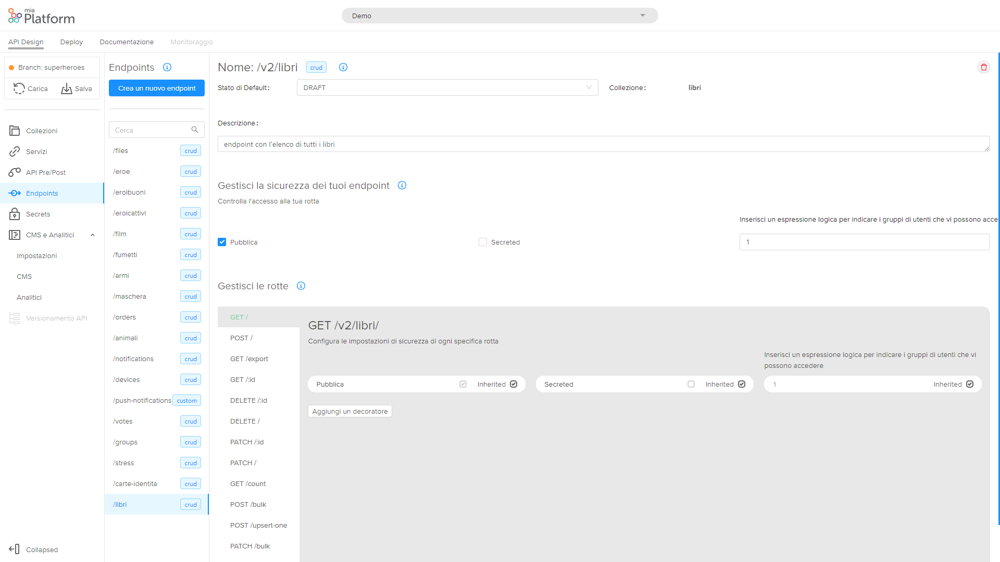

## Come creare una Rest API in 5'min ##

In questa guida scoprirai come creare ed esporre una Rest API con semplicità.
Quello che ti occorre è l'API Console e il CMS.

!!! info
    Assicurati di avere i permessi su GIT per rilasciare e di avere installato sia l'API Console che il CMS.

Ti guideremo passo a passo nella creazione di una API di tipo CRUD.
Useremo come esempio la creazione di un endpoint **/libri** immaginando di avere un sito della biblioteca.

Gli step da seguire sono i seguenti:

1. creare la collezione
2. esporre l'endpoint

##Creare una nuova collezione
Immaginiamo quindi di dover creare una nuova collezione che contenga i libri di una biblioteca e andiamo a capire quali sono i passaggi da svolgere.

Per creare una nuova collezione bisogna selezionare **Collezioni** sulla menù a sinistra dell'Api Console e selezionare **Crea una collezione**.

Per prima cosa è necessario inserire il nome della collezione in camelCase, nel nostro caso inseriremo "libri".

Di default compariranno dei campi che non possono essere modificati: _id, creatorId, createdAt, updaterId, updatedAt, _STATE_

A questo punto dobbiamo creare il nostro schema del DB andando a creare le proprietà della nostra collezione. L’utente potrà aggiungere una nuova proprietà selezionando **aggiungi riga**. Dopodichè dovrà completare i seguenti campi:

* **Nome**: inserire il nome della proprietà, in camelCase, nel nostro caso inseriremo “titolo”, "autore", "anno" etc.

* **Tipo**: le proprietà possono essere di diversi tipi: *string* se è una classica stringa di testo (oppure un immagine); *number* se è un numero; *date* se è una data con gg/mm/aaaa; *boolean* se può essere solo true o false;*Geopoint* se si desidera salvare un luogo preciso; *Array* se si desidera salvare come un insieme ordinato di proprietà; *Object* se si desidera inserire un oggetto.

* Se selezioni **required** la proprietà è obbligatoria.

* Se selezioni **crypted** il dato verrà criptato nel database. Consigliamo di adottare questa pratica per dati sensibili o riservati.

* Se selezioni **nullable** è possibile dare al dato il valore *null*.

* Nel campo **descrizione** è possibile inserire una breve descrizione facoltativa.

Per creare la collezione a questo punto basta selezionare **crea**.

!!! Warning
    la collezione **non è ancora salvata** è necessario premere **salva**. Ti conviene però completare l'endpoint e poi salvare tutto il lavoro

Se si desidera eliminare una proprietà selezionare la riga e selezionare **cancella** (vicino ad "aggiungi riga").

Per **modificare una collezione** è sufficiente selezionare la collezione desiderata tra l’elenco in “collection” e modificare i campi nella schermata che viene visualizzata.

##Creare un endpoint
A questo punto dovrai aggacniare alla tua collezione di libri appena creata un endpoint.

Per creare un endpoint selezionare **Endpoints** e quindi **Crea un nuovo Endpoint**.

**Basepath**: è il prefisso della rotta. Si può impostare come l'indirizzo base alla quale è servita l'Api, relativo all'host (nome o ip) che fornisce l'endpoint. Nel nostro caso ad esempio potremmo inserire “/libri”.

**Tipo**: L’endpoint può essere di diversi tipi:

* *Crud*: aggancia il tuo endpoint direttamente ad una delle tue collezioni.
* *External*: aggancia il tuo endpoint a uno dei servizi esterni censiti nella sezione servizi.
* *Custom  Microservices*: aggancia il tuo endpoint ad un servizio con logiche interamente create da te.

In questa sezione creeremo un endpoint di tipo CRUD al quale agganceremo la nostra collezione

**Collezione**: selezionare la collezione di cui l'endpoint fa parte. Nel nostro caso "libri"

**Descrizione**: descrizione facoltativa dell’endpoint

Dopodichè selezionare *Crea*.
A questo punto abbiamo creato il nostro endpoint!

Ora puoi configuare il tuo endpoint attribuendo permessi e modificando la sicurezza.
I parametri che puoi configurare sono i seguenti:

###Nome dell'Endpoint
**Stato di Default**: Con Default State potrai scegliere se gli elementi presenti nella Collezione saranno resi pubblici sugli applicativi appena verranno creati e avranno quindi status Public o se avranno invece come status Draft e dovranno quindi essere resi pubblici dal CMS prima di essere pubblicati.

**Collezione**: viene visualizzata la collezione di cui l'endpoint fa parte.

**Descrizione**: breve descrizione facoltativa

###Gestisci la sicurezza dei tuoi endpoint
Se la rotta è **pubblica**, non c’è bisogno di essere loggati per poterla chiamare. Se invece non è pubblica e viene chiamata da un utente non loggato, restituisce 401.
Se è **secreted** per poterla chiamare bisogna settare l’header Secret con il valore corretto (puoi vedere i secret nell’omonima schermata)

**Gruppi di utenti che vi possono accedere**: E’ un’espressione logica per determinare i gruppi che hanno i permessi di chiamare una determinata rotta. Può anche essere impostata a 0 (nessuno) oppure a 1 (tutti). Se l'espressione risulta vera, allora l'utente può accedere alla rotta.

###Elenco verbi
In questa sezione visulizzi tutti i path che possono essere chiamati di un endpoint di tipo CRUD. Selezionando i diversi verbi nella sezione management è possibile dettagliare ulteriormente chi ha i permessi di fare determinate azioni.

Se **inherited** è attivo il campo erediterà il comportamento dell’endpoint base, de-selezionandolo puoi impostare regole specifiche legate a questa rotta.

Per esempio possiamo impostare che la post può essere riservata solo ad un gruppo specifico di utenti.  

## Salva ##

Adesso abbiamo quindi creato la collezione, agganciato un endpoint e definito i permessi.
Abbiamo quindi creato la nostra Rest API.
Non ci resta che salvare e rilasciare in un ambiente.

Bisogna quindi premere salva e committare il lavoro fatto e poi accedere all'area deploy e scegliere un ambiente su cui rilasciare.

Per popolare la collezione o per cominciare a testare l'API puoi o direttamente andare nell'area **Documentazione** e testare la tua API con lo Swagger oppure [creare una nuova pagina del CMS](\configurator/api_console_configcms.md) e sfruttare la tua API dal CMS.
