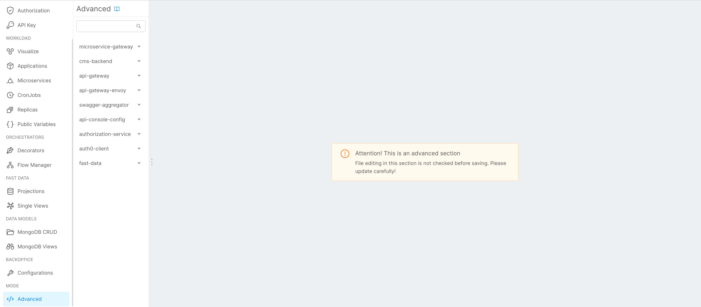

In the advanced section is possible to extend some features of the Mia-Platform components.

In this section you will find all the information to give more power to your platform.

:::info
To change all the advanced settings, you have to access to the Console and go to the Advanced Section from the menu in the left sidebar of the Design Area.
:::

The resources are grouped in several categories containing files, such as:

* [api-console-config](/development_suite/api-console/advanced-section/dev-console-config.md): gives the opportunity to edit parameters about core services;
* [api-gateway](/development_suite/api-console/advanced-section/api-gateway/how-to.md): add custom NGINX directives to the API Gateway
* [api-gateway-envoy](/development_suite/api-console/advanced-section/api-gateway-envoy/extensions.md): add extensions to the API Gateway based on Envoy.
* [swagger-aggregator](/development_suite/api-console/advanced-section/swagger-aggregator/configuration.md): edit the configuration of the [Swagger Aggregator plugin](/runtime_suite/swagger-aggregator/10_overview.md);
* [authorization-service](/development_suite/api-console/advanced-section/authorization-service/configuration.md): edit the configuration of the [Authorization Service plugin](/runtime_suite/authorization-service/10_overview.md);
* [auth0-client](/development_suite/api-console/advanced-section/auth0-client/configuration.md): edit the configuration of the [Auth0 Client plugin](/runtime_suite/auth0-client/10_overview_and_usage.md).

:::caution
Advanced area is accessible if you have loaded your project in API Console both from a branch or from a tag. If you have loaded it from a tag, it will be in read-only mode and you will not be able to save any edit to advanced files.
:::
