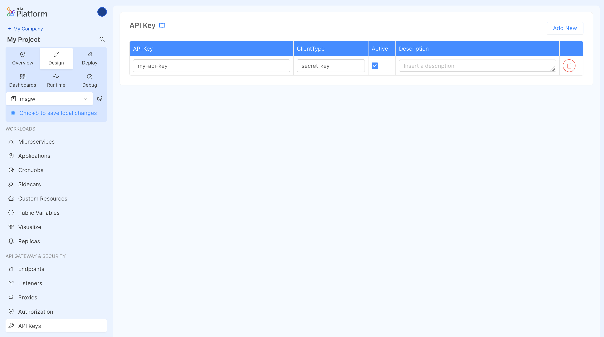

## What is an API Key

An API key allows you to protect your endpoints. You can create API keys for different clients and [manage the security of your endpoints](/development_suite/api-console/api-design/endpoints.md#manage-the-security-of-your-endpoints) to allow call them only passing an API Key belong to specific clients.

This feature is also useful to identify the client that has called the endpoint.

## Create a new API Key

In order to create a new API Key, open the dedicated section in the *Design area*, select `Add New` and enter the following information:

* **API Key**: the value of API Key. You can enter any string, it must not contain blank spaces. Before creating the API Key you can click on `Generate Random API Key` to get a random value.
* **ClientType**: the client associated with the API Key. You can enter any string, it must not contain blank spaces.
* **Active**: check the flag to activate the API Key, uncheck to deactivate.
* **Description**: optional description of the API Key.



## How to use an API Key

In the **Management section of the endpoint**, for each endpoint, you can specify if protect it with an API key and for which *ClientType* to authorize calls by using the `API Key required` flag and the `User Group Permission` field.

You can call an endpoint using an API Key passing the value of the key by `secret`/`client-key` header:

```bash
curl --request GET 
  --url https://your-url/endpoint 
  --header 'accept: application/json' 
  --header 'secret: <API Key value>'
```

You can also use an API Key setting a `mia_client_key=<API Key value>` cookie:

```bash
curl --request GET 
  --url https://your-url/endpoint 
  --header 'accept: application/json' 
  --cookie 'mia_client_key=<API Key value>'
```

:::info
Check out the [manage the security of your endpoints section](/development_suite/api-console/api-design/endpoints.md#manage-the-security-of-your-endpoints) to know in detail how to write the user group expression
:::

:::tip
Remember that if you set the `client-key` header, for security reasons its content will be always evaluated, even if you are calling an "unsecured" endpoint that does not need the API Key.
For this reason, remember to always set the `client-key` header with a valid secret, otherwise **you will get an Authorization error.**

This happens because the API Key client-type evaluation is done by the `api-gateway` before the `authorization-service` security checks, as reported [here](/console/tutorials/configure-marketplace-components/auth-architecture/static-api-key.md#definition).
:::
