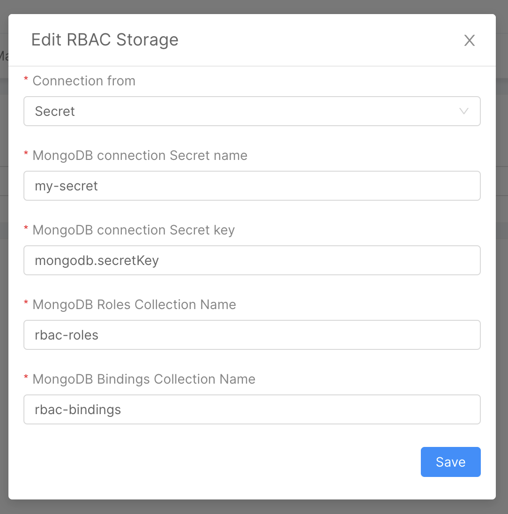

## Overview

Mia-Platform Console allows you to define custom security policies for your system. These policies can leverage both an Attribute-Based Access Control (ABAC) and a Role-Based Access Control (RBAC) approach.  
You can configure your security policies from the Authorization section (inside the Design area) and enable them for your services.

:::info
To achieve this level of security, Mia-Platform runs [**Rönd** (an open-source authorization mechanism)](https://rond-authz.io) as a sidecar container, for each of your pods.  
Find out more about Rönd in the [project documentation](https://rond-authz.io/docs).
:::

## How to configure Authorization for your project

Heading to the Authorization section (inside the Design area), you can manage Authorization configurations for your system. This section is made of four different tabs:

- [**Overview**](#overview-tab): in this tab, you can enable and configure Rönd for each service of your project;
- [**General Settings**](#general-settings-tab): in this tab, you can control shared settings between all of your Rönd instances in the project (such as the version of Rönd service or the [storage configuration](#rbac-storage));
- [**Policies**](#policies-tab): in this tab, you can write and test your own policies (policies are written using the Rego language, more info [here](https://www.openpolicyagent.org/docs/latest/policy-language/))
- [**Manual Routes**](#manual-routes-tab): in this tab, you can manually configure the policies required by your service APIs (useful when your service does not expose an OpenAPI Specification).

### Overview tab


From the Overview tab you can enable Rönd for any service that is available in your project. Moreover, since a new container will be deployed in your namespace, you can view and configure the following information:

- **Memory Request and Limit**: Memory request and Memory limit of the sidecar container
- **CPU Request and CPU Limit**: CPU request and CPU limit of the sidecar container

To enable Rönd for a specific service you have to use the **Enable Rönd** switch available in the table editing drawer. After enabling Rönd you will be able to customize resources request and limit.

Once you have enabled Rönd on one of your services, you have to define which policy is required by which of your service APIs.  
If your service exposes OpenAPI 3 Specification you can use the **custom attribute** `x-rond` [described here](https://rond-authz.io/docs/configuration#configuration-files), otherwise if your service does not expose its API documentation and you don't plan to add it you can use the [Manual Routes configuration tab](#manual-routes-tab)

:::info
**Be careful**: the value of the environment variable `LOG_LEVEL` is set by the Console with the value of the `LOG_LEVEL` environment variable of the service to which the sidecar is attached to.
:::

### General Settings Tab


Inside the General Settings tab you can:
- define the Rönd service version
- configure RBAC Storage information.

#### RBAC Storage

RBAC is configured by design to load Roles and Bindings from MongoDB. In order to properly configure MongoDB connection string and collection names head to the **General Settings** tab and change the values in the RBAC Storage card. 

For MongoDB connection you can decide whether to use variable interpolation or retrieving the value from a Secret; this second approach is far more secure and can be easily set up from the edit modal

<div style={{display: 'flex', justifyContent: 'center'}}>
  <div style={{display: 'flex', width: '400px'}}>



  </div>
</div>

:::info
These values are set by default to `{{MONGODB_URL}}`, `rbac-bindings` and `rbac-roles`. Feel free to change the names to better suite your
naming conventions and standards.  

You have to provide the collection names you wish to use in your project, when you save the configuration the new collections will be created and will be visible in the **MongoDB CRUD** section.
:::

:::caution
If you wish to change the collection names in a future moment you **must** manually delete the old ones.
:::

#### RBAC Data Models

As previously said Roles and Bindings collections are created when saving your configuration according to the ones specified in the [General Settings](#general-settings-tab).  
You can find more about the structure of the collection data models in [Rönd documentation](https://rond-authz.io/docs/policy-integration#rbac-data-model).

### Policies Tab


In the **Policies** tab you can write your own policies that will be used by Rönd service to evaluate the incoming requests.

You will find a read-only section that shows your current policies; if you want to modify them or create new ones you can click on the `Edit policies` button that will open a modal with two different editors.

In the leftmost one you may write your policies using the *Rego* language (more info [here](https://www.openpolicyagent.org/docs/latest/policy-language/)). The rightmost instead lets you write tests for your policies.

Once you had written your policies you can test them using the **Test** button.

:::info
We strongly suggest you to test your policies, you may notice that if you have written some tests you won't be able to save your changes until your tests are passed.
:::

You can find more information about writing your own policies [in the Rönd documentation](https://rond-authz.io/docs/policy-integration).

### Manual Routes Tab


If you want to apply Rönd policies, but your service does not expose any API documentation, or you don't have access to the codebase in order to implement
your own documentation API, you can set up manual routes for Rönd.

To do this, from the Manual Routes configuration tab, you can define your own routes by selecting the `Add New` button.  
Select a microservice from the list and then provide a verb and a path that identify the API invocation and at last the `Allow Policy` that should be required for that API.  
NOTE: if your service is not in the list, you have to firstly enable Rönd for that service from the [Overview tab](#overview-tab)

:::info
It is possible to add new manual route to register a permission for a group of paths using the wildcard (e.g. "/foo/*") and also to select the method ALL to register the same permission for all http methods of the inserted path, but pay attention to the [routes priority rules](#routes-priority)
:::

During or after the creation of a manual route, you will also be able to associate to it a **Rows Filter** or a **Response Filter**, described in depth in their dedicated sections:

- [**Rows filtering**](https://rond-authz.io/docs/policy-integration#rows-filtering)
- [**Response filtering**](https://rond-authz.io/docs/policy-integration#response-filtering)

To activate the filters, you can use the corresponding switch and then configuring them. In particular:
- `Rows Filtering` uses the `acl_rows` value as **headerName**  by default, but you can set a custom value to replace it.
- `Response Filtering` requires instead the name of the filter policy used to evaluate the response received by Rönd. 

:::caution
Normally Rönd will configure by itself consuming the API documentation of its target service.  
When adding a new manual route to the configuration for a microservice, the self-configuration feature will turn off. Thus you are required to register all the routes that your service exposes.
:::

From this section you can also set the value of some **route-specific options**, such as the `ignoreTrailingSlash` flag. Discover more about configuration options in the official [Rönd documentation](https://rond-authz.io/docs/configuration#route-specific-options).

### Routes Priority

When there are more manual routes that match a specific URL path, the **priority rules** help to resolve the conflict:

- **Rule1**: If the manual routes paths are different, that more specific wins.
- **Rule2**: If the manual routes paths are the same, the manual route with the most specific method wins.

```
EXAMPLE

Defined Manual routes
- GET  /foo/bar permission1
- ALL  /foo/*   permission2
- POST /foo/*   permission3
- ALL  /*       permission4

Paths to resolve
- GET /foo/bar   --> permission1 (Rule1)
- GET /foo/bar/  --> permission2 (Rule2)
- POST /foo/bar/ --> permission3 (Rule2)
```

## How to write a policy

As already mentioned, Mia-Platform authorization system uses Rönd under the hood thus the way to write policies is the same.  
Please, refer to [Rönd documentation](https://rond-authz.io/docs/policy-integration) to understand better how to write policies.

## How to test your policies
The Permission policy testing framework also leverages Open Policy Agent technology and so, in order to write valid tests, 
you have to write rego code (you can read more about it in the [Rego Testing documentation](https://www.openpolicyagent.org/docs/latest/policy-testing/)).

From the ***Policies tab***, click on the ***Edit policies*** button to open the policy editor.  
The policy editor is made of three areas:
- *Policies*: the editor where you can define your custom policies
- *Test*: the editor where you can test your policies
- *Output*: the output console, that helps you writing and debugging your policies

### Test Simple Policy

Let's test the example policy from the [Rönd documentation](https://rond-authz.io/docs/policy-integration#example-of-a-policy):  

```rego
package policies

default api_key = false
api_key {
  get_header("x-api-key", input.request.headers) != ""
}
```

For this policy we can write two tests:

```rego
package policies

# Test 1: Checks that the request is accepted.
test_api_key_allowed {
  api_key with input as {"request": {"headers": {"X-Api-Key": ["something"]}}}
}

# Test 2: Checks that the request is rejected.
test_api_key_not_allowed {
  not api_key with input as {"request": {"headers": {}}}
}
```

:::caution
If any of your tests does not pass you won't be able to save your permissions changes! 
You may still exit the modal by clicking the close icon on the top right, however all changes done will be discarded.

It is still possible to save your permissions if you have no test implemented, however this is **NOT RECOMMENDED**!
:::

### Test Filters Policy

Let's test another example of policy from the [Rönd documentation](https://rond-authz.io/docs/policy-integration#rbac-policies-for-permission-evaluation), this time using the Row Filtering:

```rego
package policies

filter_projects_example {
    bindings := input.user.bindings[_]
    resource := data.resources[_]
    resource._id == bindings.resource.resourceId
}
```

In order to test this filter policy we need to provide some additional data to both the `input` and the `data.resources` fields.  
We can do this by just mocking these fields with some testing values:

```rego
package policies

test_filter_projects_example {
    filter_projects_example
        with input as {
            "user": {
                "bindings": bindings_mock
            }
        }
        with data.resources as [
          {"_id": "resource1"}, 
          {"_id": "resource2"}
        ]
}

bindings_mock := [
    {
        "bindingId": "bind1",
        "roles": ["developer"],
        "resource": {
            "resourceType": "project",
            "resourceId": "resource2"
        }
    }
]
```


<br/>
