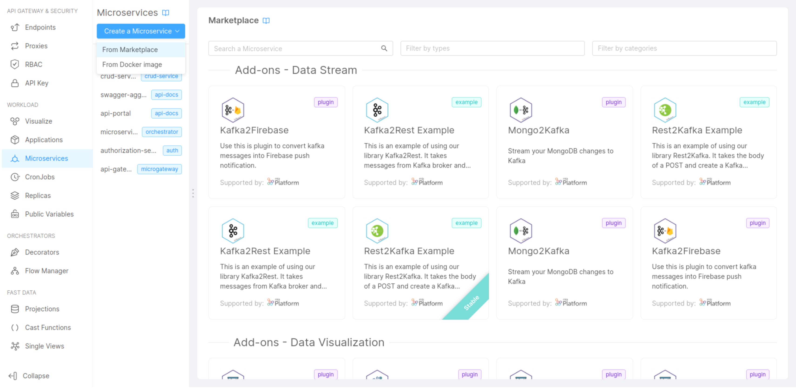

Following we will see how to create a Microservice using the [Console](/development_suite/overview-dev-suite.md).

:::info
The following guide is generic, so you can follow it to create any type of Microservice from template.  
You can read [here](/development_suite/api-console/api-design/plugin_baas_4.md) a dedicated guide about creating from the **Node.js Template**
:::

### 1. Microservice creation

In the Console, follow these steps:

 1. Go to `Design section` and click on `Microservices`
 2. Click on `Create a Microservice`:  
   
   You can search for a template, adding `Templates` to types filter. Each template belongs to specific **Category**. You can filter by category using `Filter by categories` filter.
 3. Select a Template and add the Microservice information:
      * **Name of the Microservice** (*required*): this is the internal hostname
      * **Description** (*optional*): this is the description of your Microservice
      * **GitLab Repository owner** (*required*): you have to select, from a list of options, where you want to save your microservice
      * **GitLab Repository name**: the gitlab repository name that you want for your Microservice
      * **Docker image name**: the docker image name, you can leave the default one too
 4. Then click on `Create` button

Now you have a customization interface and you can optionally customize some configuration if you want.

:::note
By default are enabled the standard kubernetes configurations, that provide the default configurations yml, but you can use your custom files by enable *Advanced configuration*
:::

In the *Environment variable configuration section* you can customize the environment variables.

### 2. Creating the endpoint

Now we need an endpoint to call to access our Microservice.

Following the steps for the creation of an endpoint:

 1. Go to `Design section` and click on `Endpoints`
 2. Click on `Create new endpoint`
 3. Insert the endpoint data:
    * **base path**: the endpoint base path
    * **type**: select __Microservice__
    * **Microservice**: select the Microservice that you have just created
    * **description**: the endpoint description
 4. Click on the `Create` button and your endpoint will be created

### 3. Save the project

Finally it's time to save our configuration, so:

1. In the main navbar, on the top, click on `Commit & Generate` button
2. Insert a commit title
3. Insert a commit message

### 4. Deploy the project through the API Console

In order to have our Microservice _up and running_ follow these steps:

1. Go to `Deploy section` and click on `Endpoints`
1. Select the environment and the branch to deploy
1. Click on the `Deploy` button
1. Wait for the end of the deploy process

Now your Microservice should be _up and running_, you can check it calling the **/-/healthz** route. You should get a response like this:  
.  
The `status` property should be *OK*.

:::note
Check out the [Microservices vademecum](/getting-started/guidelines//microservice-vademecum.md#health-routes) and [Kubernetes documentation](https://kubernetes.io/docs/tasks/configure-pod-container/configure-liveness-readiness-startup-probes/) for further details.
:::

Trough the [Log & monitoring section](/development_suite/monitoring/introduction.md) you can monitor the status of the related Microservice container
