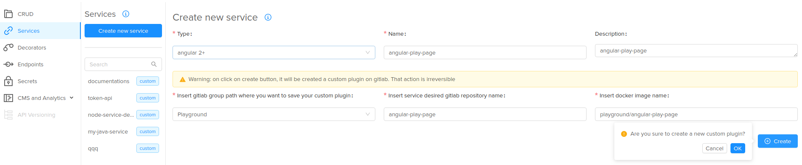
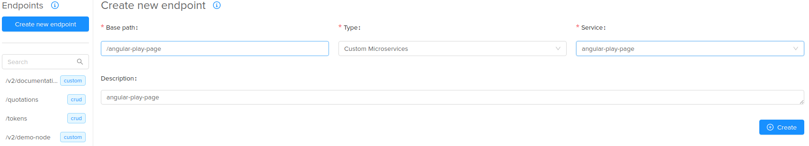
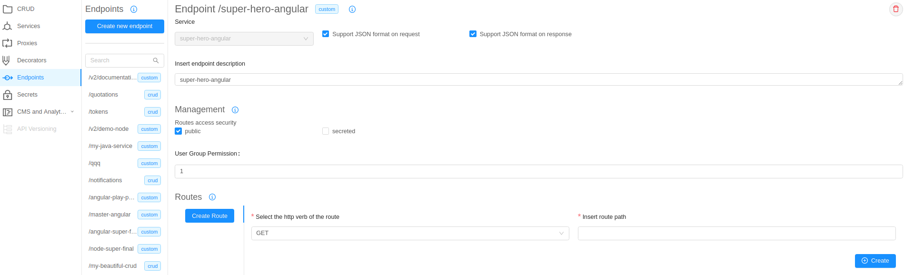
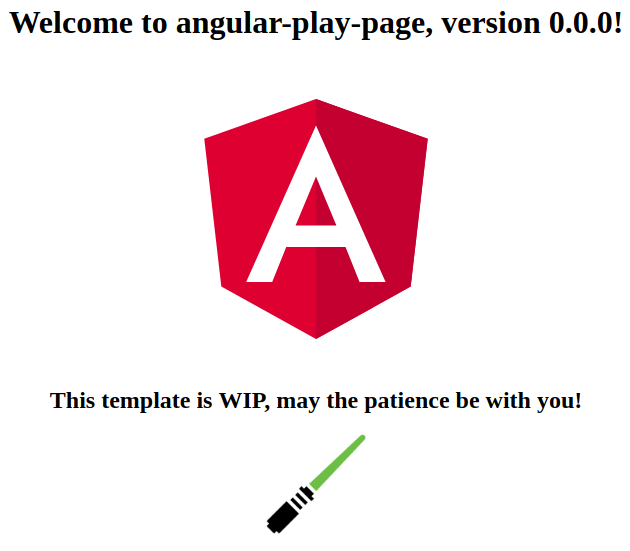

# Templates overview

The API Console allows the user to create custom microservices from a template;
it manages the following templates:

 * **node-fastify**: a ready-to-use Node.JS template that provides a server for restful services through the Mia-Platform [Custom Plugin](/development_suite/api-console/api-design/plugin_baas_4/#factory-esposta-da-custom-plugin-lib) that take advantage of the <a href="https://www.fastify.io/" target="_blank">Fastify</a> server;

 * **java spring-boot**: a ready to use Java & <a href="https://spring.io/projects/spring-boot" target="_blank">Spring Boot</a>template that provides a server for restful services through the Mia-Platform [Custom Plugin](/development_suite/api-console/api-design/plugin_baas_4/#factory-esposta-da-custom-plugin-lib);

 * **angular 2+**: a ready to use <a href="https://angular.io/" target="_blank">Angular 2+</a> template that provides a basic Angular project, already up and running and ready to be customized.

> These templates are all under the voice **CREATE FROM TEMPLATE**:
>  
> The service types can be different based on the API Console you are working on)

## Our first custom service based on template

Following we will see how to create a custom Microservice using the [API Console](/development_suite/overview-dev-suite/); this guide is generic, so you can follow it to create any type of custom microservice from template.

#### 1. Login into the API Console
To access into the API Console check the [specific page](/development_suite/api-console/accedi_apiconsole/) and, when done, keep going.

#### 2. Service creation
Once into the API Console, we have to create our service (__template-service__ from now).
To do this, follow these steps:

 1. Click on Services
 2. Click on Create new service
 3. Add the service information:
    * **type**: your favorite service under the __CREATE FROM TEMPLATE__ voice (the service types can be different based on the API Console you are working on) 
    * **name**: the service name
    * **description**: the service description
    * **gitlab group path**: the gitlab group where you want to save the service repository
    * **gitlab repository name**: the gitlab repository name that you want for your service
    * **docker image name**: the docker image name, you can leave the default one too
    * look at the result 
 4. Create the service

Now you have a customization interface and you can optionally customize some configuration if you want.

!!! note
    By default are enabled the standard kubernetes configurations, that provide the default configurations yml, but you can use your custom files by clicking, in the *Advanced configuration* section, the appropriate button: 

!!! warning
    Under the standard customizations you can customize the environment variables (*Environment variable configuration* section); this is an optional operation too, except for the *angular 2+* service, that **REQUIRES** to modify the *HTTP_PORT* variable from 3000 to **8080**, like the image: 

> <u>**NB.**</u> the API Console will show a yellow label now bacause there are unsaved changes
>
> <u>**Do not save the changes now**</u>, we will save them later.

#### 3. Creating the endpoint

Now we have our custom service repository __*already deployed__ on the Mia-Platform <a href="https://nexus.mia-platform.eu/" target="_blank">Nexus repository manager</a>, but we need an endpoint to call to access our custom service.

>__*already deployed__: it depends on the project and technologies we are working on, because we have clients that are not using the Gitlab Continuous Integration mechanism too, so we can need some other step to have the first image built after the service and repository creation. 
>**e.g.** if we use a jenkins pipeline we can need to configure a webhoook on the just created repository before continue.

Following the steps for the creation of an endpoint:

 1. Click on endpoint
 2. Click on Create new endpoint
 3. Insert the endpoint data:
    * **base path**: the endpoint base path
    * **type**: select __Custom Microservices__
    * **service**: select the microservice that you just created
    * **description**: the endpoint description
    * look at the result 
 4. Click on the create button and your endpoint will be created 

#### 4. Save the project
Finally it's time to save our modifications, so:

1. Click on the save button: 
2. Insert a commit title
3. Insert a commit message (optional)

#### 5. Deploy the project through the API Console

Before deploy the project to have our service _up and running_ we have to wait the end of the service pipeline, that will create a _Docker image_ of the service that will be deployed.

So, before deploy, navigate on the gitlab repository of the just created service and wait the end of the pipeline; when the pipeline is done you can deploy the project:

1. Login on the API Console
2. Choose the desired project and branch
3. Click on the _Deploy_ button 
4. Select the environment and the branch to deploy, then click on the _Deploy_ button 
5. Wait for the end of the deploy process

Now your service should be _up and running_, you can check it like this:

* call the **/-/healthz** path if the service uses the [Custom Plugin](/development_suite/api-console/api-design/plugin_baas_4/#factory-esposta-da-custom-plugin-lib)  

* navigate the created endpoint and see the html page (frontend services) 
* call the base endpoint should ever work for some different type, if the endpoint is not secreted and is public.
