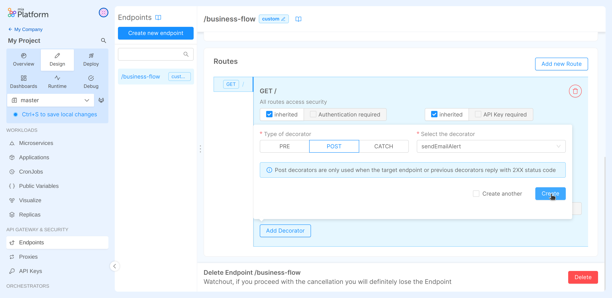

## Decorators

Decorators are special endpoint that a microservice can expose. Using the console you can manage your decorators and link them to your endpoint routes.

Decorators allow you to perform custom actions upon specific API handler invocations. There are three types of decorators:

 * **Pre**: invoked *before* the configured route handler;
 * **Post**: invoked *after* the successful execution of configured route handler (a 2xx status code is returned);
 * **Catch**: invoked *after* the failure of the configured route handler (any other error status code, 4xx or 5xx).

### Manage your decorators

Upon accessing the DevOps Console Design area and selecting the Decorators section in the left menu, you'll see the available types of decorators in the sub menu.

To add a decorator, select the desired type and enter the required information:
 
  * Name: a human-readable name that will be used to identify the decorator;
  * Protocol: the scheme to be used when invoking the decorator (http/https);
  * Microservice: the service name defined in the specific Design area section;
  * Port: the port that should be used when invoking the decorator (typically port `80` is enough since the requests are performed inside the runtime environment);
  * Path: the path where the decorator is available;
  * require request body: use this to enforce request body presence before invoking the decorator;
  * require response body (only for Post and Catch decorators): use this to enforce response body presence before invoking the decorator;
  * description: a custom field that can be used to describe the decorator usage information.

### Link a decorator to a route

Once you've designed your decorators, you can use them by linking to a route. Each route can have as many Pre and Post decorators as you wish but only one catch decorator so be sure to use them properly.

In order to link a decorator to a route use the "Add decorator" button below each route, a popup will be shown where you'll be able to select the desired decorator type and then select the decorator you wish to add by its name.

If configured, linked decorators will be shown below the button. Please note that decorators are invoked in the order they are defined for each route, for this reason the decorator list can be rearranged simply by drag and dropping the decorators in the list.

