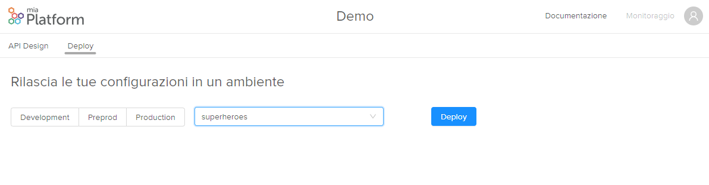

##Deploy
The API Console allows you to directly deploy your configurations in an environment.
Thanks to this automation the Continuos Deploy is more simple and immediate.
Furthermore, the deployment automatically starts the tests to verify that the branch can be released without damaging the existing project.

To release you must have **Owner** permissions on Gitlab.

To release the user will have to select the environment and the branch.

!!! info
    The branch on which the user is working is automatically selected. If the user wants to release another branch he can select another branch.

