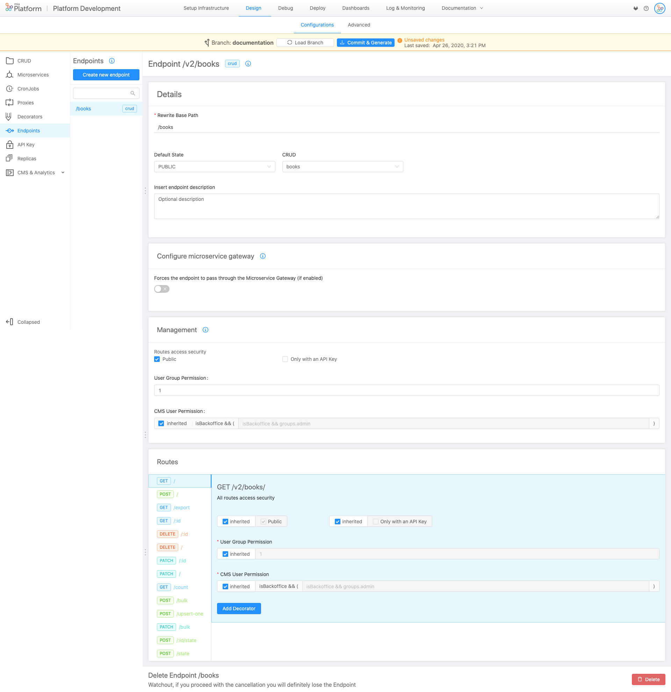
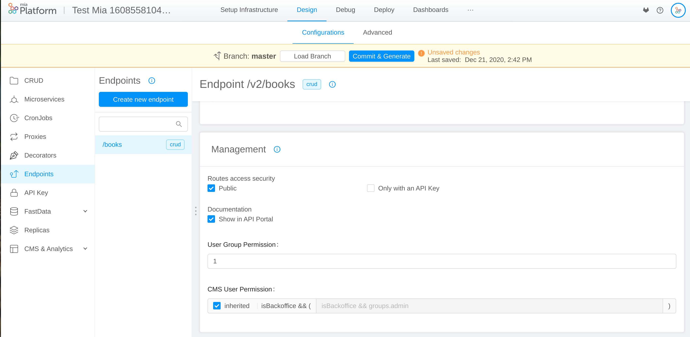
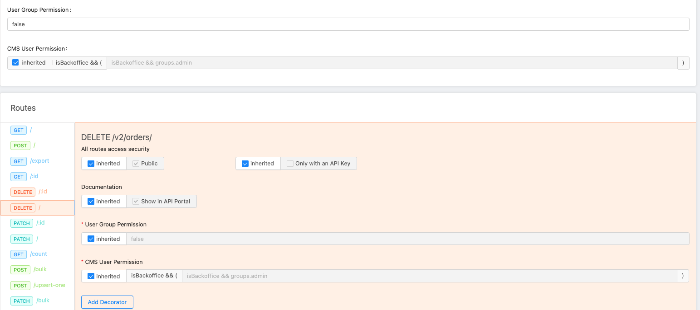

### What is an endpoint?
The endpoints allow you to expose your CRUDs or other custom services. To rapidly create an endpoint linked to a CRUD, can you follow the steps described in a [Design QuickStart](quick_rest_api.md).  
This page will delve into the endpoint types and configuration.

An endpoint can be of different types:

* **CRUD**: hook your endpoint directly to one of your CRUD.
* **Microservice**: hook your endpoint to a service with logics entirely created by you.
* **Mia-Platform BaaS**: hook your endpoint to some specific mia-platform services.
* **External proxy**: hook your endpoint to a proxy linked to a service outside of your cluster.
* **Cross Projects proxy**:  hook your endpoint to a proxy linked to another project contained in your cluster.

!!! Warning
    The type is selectable only during the creation phase. You can't change later.

### Basic configuration

The main properties of endpoint are the following:

 * **Basepath**: is the prefix of the route. It can be set as the base address to which the API is served, relative to the host (name or ip) that supplies the endpoint. 
 * **Description**: optional description of the endpoint.
 * **Microservice** (showed for all kind of endpoints except CRUD and Mia-Platform BaaS): the microservice which endpoint linked to. 
 * **CRUD** (showed only for endpoints linked to CRUD): the CRUD which endpoint linked to. 
 * **Default Status**: If you select *PUBLIC*, the elements in the Collection will be public on the applications as soon as they are created.  If you choose *DRAFT* status, the elements have to [made public by the CMS](../../../business_suite/guide_cms.md#new-content-draft-publish) before being published.

### Internal Rewrite URL

The developer can decide which basepath is associated to an endpoint by applying an internal rewrite url.

When a call enters the platform it undergoes a rewrite by the API gateway or the Microservice gateway and arrives at the service with a different path.

So for example in the case mentioned above when the API gateway enters the platform to call `/test-service-1` will call it with `/`

From this section, you can configure his own custom rewrite and, if necessary, view the default platform.

!!!Warning
     For the CRUD endpoint it's not possible to set an internal Rewrite. The Internal Rewrite is / by default.

#### Manage the security of your endpoints
In the Management section, you can manage the security and the permissions at the endpoint level.

You can configure permissions and security settings of the endpoint.  
If the route is **public**, you do not need to be logged in to be able to call it. If it is not public and is called by an unregistered user, it returns 401.
If it is **secreted** to be able to call it you need to set the Secret header with the correct value (you can see the secret in the homonymous screen)

**Groups of users that can access them**: It is a logical expression to determine which groups have permission to call a given route. It can also be set to 0 (none) or to 1 (all). If the expression is true, then the user can access the route.

## Transition through Microservice Gateway   

Thanks to this feature, you can define, in each endpoint, which route is going to pass through Microservice Gateway.

To handle the transition from Microservice Gateway, you can use, in the section Endpoints of the area Design, the Microservice Gateway configuration card, which also includes two JSON checkboxes (request and response).   

This card is equipped with a flag that, if you are enabled, allows to force the endpoint that you are editing to pass through the Microservice Gateway:

   
The Microservice Gateway service performs some checks on the content-type header:

* **Request**: If your endpoint uses content-type: *application/json* in requests, check      "Support only JSON format" on request, otherwise uncheck it. If this is unchecked, you won't be able to access the request body from decorators, if set.

* **Response**: If your endpoint uses content-type: *application/json* in response, check "Support only JSON format" on response, otherwise uncheck it. If this is unchecked, you won't be able to access the response body from the POST decorators, if set.

!!!Warning 
     If your project has the microservice-gateway disabled, the configuration of the transition through Microservice Gateway is skipped.

#### Routes
In this section you can view all the path that can be called of a CRUD endpoint. By selecting the different verbs in the management section it is possible to further detail on who has the permissions to do certain actions.

If **inherited** is active the field will inherit the behavior of the base endpoint, de-selecting it can set specific rules related to this route.

!!!example
     For example, we can set that the `DELETE/` can only be reserved for a specific group of users (admin).
     We must therefore choose not to inherit global settings. Then we de-select inherited and in the input we write: groups.admin  
     
