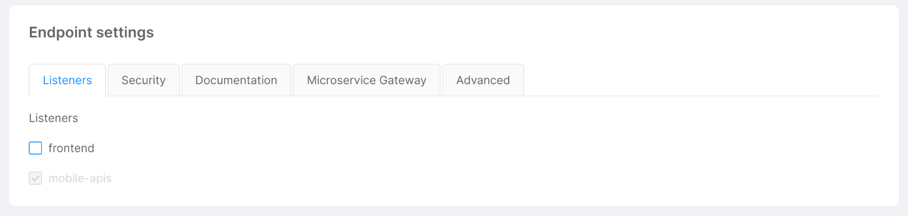
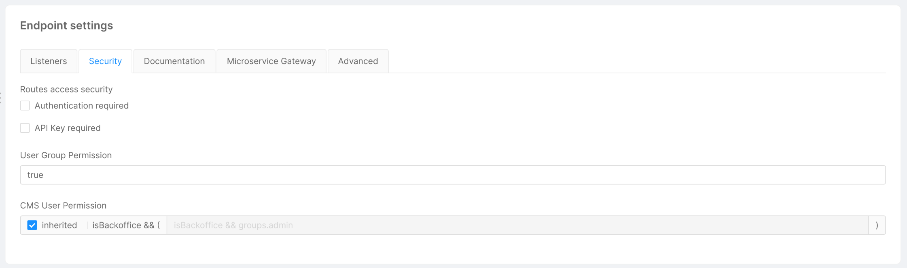
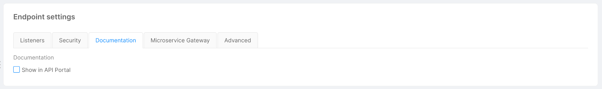
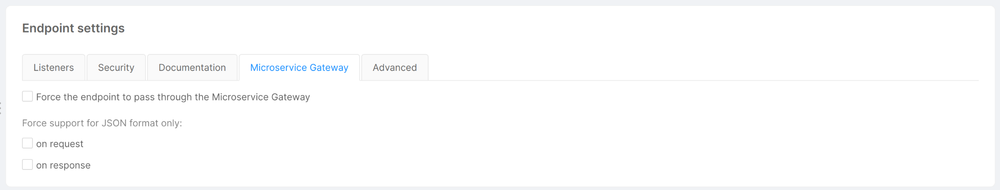
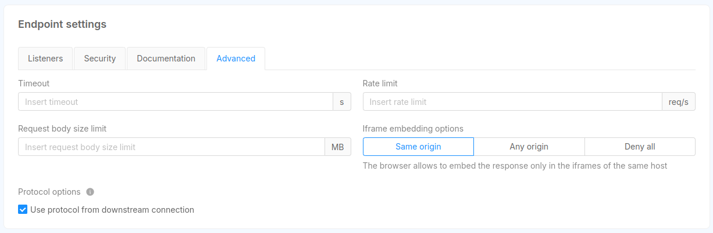

## What is an endpoint

An endpoint allows you to expose your CRUD, services, and proxies. To quickly create an endpoint linked to a CRUD, you can follow the steps described in [Design QuickStart page](/console/tutorials/configure-marketplace-components/rest-api-for-crud-on-data.mdx).

This page will delve into the endpoint types and configuration. The purpose of this page is to describe all the functionalities that you can find in the **Endpoints** section of the **Design** area of [Mia-Platform Console](/development_suite/overview-dev-suite.md).

An endpoint can be of different types:

- **CRUD**: hooks your endpoint directly to one of your CRUDs.
- **MongoDB View**: hooks your endpoint directly to one of your Mongo Views.
- **Microservice**: hooks your endpoint to a service with logics entirely created by you.
- **External proxy**: hooks your endpoint to a proxy linked to a service outside of your cluster.
- **Cross Projects proxy**: hooks your endpoint to a proxy linked to another project contained in your cluster.
- **Fast Data Projection**: hooks your endpoint to the service which exposes the Fast Data Projection. This type is visible only if Fast Data is enabled in the Console.
- **Fast Data Single View**: hooks your endpoint to the service which exposes the Fast Data Single View. This type is visible only if Fast Data is enabled in the Console.

:::warning
The endpoint type is selectable only during the creation phase. You won't be able to modify it later.
:::

The information in this section is grouped into 3 cards: _Details_, _Endpoint settings_, _Routes_.

## Details

This card provides information about properties (basic and specific) of the endpoint. For endpoints of type **Microservice** and **Fast Data Single View**, a link to the microservice or the single view is also provided.


### Basic endpoint properties

All endpoint types share the following properties:

- **Base Path**: is the prefix of the route. It can be set as the base address to which the API is served, relative to the host (name or IP) that supplies the endpoint.
- **Description**: optional description of the endpoint.

### Specific endpoint properties

#### CRUD

Upon creation of **CRUD** type endpoints, you will be able to choose any _CRUD Base Path_ from the routes that have been configured in the CRUD section.

You can find more info about how to create an internal endpoint in the [CRUD documentation](/development_suite/api-console/api-design/crud_advanced.md).

#### Microservice, External Proxy and Cross Project Proxy

These endpoint types all share the microservice property that allows you to link the endpoint to a specific microservice (or proxy) configured in your project.

Upon creation of an endpoint linked to a microservice, you will be able to edit the _Rewrite Base Path_ parameter. This path is useful to customize the base path that is used when invoking APIs exposed by the linked microservice.

#### Fast Data Projection

This endpoint type is used to read data of the [Fast Data Projection](/fast_data/configuration/projections.md).
These APIs are read-only, because they should be edited only by the [Real-Time Updater](/fast_data/architecture.md#real-time-updater-rtu).

#### Fast Data Single View

This endpoint type is used to read data of the [Fast Data Single View](/fast_data/the_basics.md#single-view-sv).
These APIs are read-only, because they should be edited only by the [Single View Creator](/fast_data/architecture.md#single-view-creator-svc).

### About Rewrite Base Path

The developer can decide which base path is associated to an endpoint by applying an internal rewrite URL.

When a call enters the platform it undergoes a rewrite by the API Gateway or the Microservice Gateway and arrives at the service with a different path.

For example, you can create an endpoint hooked to a microservice with a base path like `/hello-service` and set as Rewrite Base Path something like `/customers`.
In this way, the API Gateway (or the Microservice Gateway) will rewrite any call to `/hello-service` into `/hello-service/customers` and send it to the hooked service.

:::warning
For the CRUD endpoint it's not possible to set an internal Rewrite. The Internal Rewrite is / by default.
:::

## Endpoint settings

From this section it is possible to configure: _Listeners_, _Security_, _Documentation_, _Microservice Gateway_ and _Advanced_ settings for the Endpoint.

### Listeners



This section lets you define from which Listener your Endpoint should be exposed.  
Keep in mind that you must expose an Endpoint with _at least_ one Listener.

### Manage the security of your endpoints



In the **Security** tab, you can manage the security and the permissions at the endpoint level. All the following functionalities require the [authorization service](/runtime_suite/authorization-service/30_usage.md) and are based on its [configuration](/runtime_suite/authorization-service/20_configuration.md).

The security can be managed at three levels:

1. The `Authentication required` flag, when disabled, allows to call an endpoint **without the need to be logged in**. If it is enabled and the endpoint is invoked by an **unregistered user**, the request will receive an unauthorized error.

2. The `API Key required` flag configures the endpoint to require to set the `secret`/`client-key` header with a valid [API Key](/development_suite/api-console/api-design/api_key.md). You can also set a `mia_client_key` cookie with the value of the API Key.

:::tip Example of request passing an API Key
`curl --request GET --url <https://your-url/endpoint> --header 'accept: application/json' --header 'secret: <Api Key value>'`
:::

3. `User Group Permission` allows defining a logical expression for authorizing or not the call. If the expression validates to **true**, then the user can access the route. You can use the following properties:

   - `clientType=='<clientType associated with Api Key>` to identify the client author of the call. In this way, you can limit the access to the selected clients only, identified by the API Key passed in the `secret` or `client_secret` headers.
     E.g:

     ```js
     clientType == "apiKey" || clientType == "apiKey2";
     ```

   :::info
   If you have entered a Client Type, the endpoint will be secured by API Key even if the `API Key required` flag is disabled.
   :::

   - `groups.<group name>` or `<group name> in groups` to check the group to which the logged user belongs. In this way, you can limit the access to specified groups.
     E.g:

   ```js
   // Limit access only to users in "admin" group
   groups.admin
   "admin" in groups
   ```

   ```js
   // Limit access only to users in "admin" or "user" group
   "admin" in groups || "user" in groups
   ```

   - `permissions.<permission name>` or `<permission name> in permissions` to limit the access to entities (being users or other clients) who have the required permissions.
     E.g:

   ```js
   // Limit access only to users who have "write:orders" permission
   permissions["write:orders"]
   ```

   ```js
   // Limit access only to users who have "write:orders" or "view:orders" permission
   "write:orders" in permissions || "view:orders" in permissions
   ```

The group expression can also be set to `false` (to block all accesses to the API) or to `true` (to grant **all** accesses to the API). You can combine different expressions using logical operators `&&` (and) and `||` (or).

For example, you can create an endpoint with the following security configuration:

- **Authentication required** flag set to `false`;
- **API Key required** flag set to `false`;
- **User Group Permission** field set with the following expression: `groups.foo || clientType=="bar"`.

With this configuration, calls to this endpoint will have a different outcome depending on the credentials the user provides/has. Here is a list of possible outcomes:

- An unregistered user tries to contact your endpoint without providing any API Key: the user receives an unauthorized error because the **User Group Permission** condition is falsy.
- An authenticated user with authorization group `foo` calls your endpoint without providing any API Key: the call is successful since the first condition of **User Group Permission** is truthy and the API Key is not required.
- An unregistered user tries to contact your endpoint and provides the correct API Key value for the clientType `bar`: the call is successful since the second condition of **User Group Permission** is truthy and the endpoint is open to not authenticated calls.

If the endpoint is linked to a [CRUD](#crud) you can specify dedicated user permissions for the CMS application.
Enable the `inherited` flag to use the displayed default expression, or disable the flag to change it manually.

:::tip
If you figure out that there is some problem in how you configured the security of your endpoints, go to the [Log & Monitoring section](/development_suite/monitoring/introduction.md) to check out the logs of the [Authorization Service](/runtime_suite/authorization-service/30_usage.md). Here you can visualize the logs concerning authorization operations, and eventually any group expression errors.
:::

:::tip API Key
Check out the [API Key section](/development_suite/api-console/api-design/api_key.md) to know more about API Keys.
:::

### Manage the visibility of your endpoints



The **Documentation** tab is visible only if the API Portal is enabled, and includes the `Show in API Portal` flag, which, if enabled, allows seeing all endpoint routes in the [Documentation Portal](/console/project-configuration/documentation-portal.md) documentation. By **default**, all endpoints have this **flag enabled**. Disabling this flag for any endpoint type will guarantee that all its routes will not appear.

The visibility can also be defined at the route level in the [routes](/development_suite/api-console/api-design/endpoints.md#routes) section. In this way, it is possible to specify which routes of a specific endpoint should be visible in the API Portal and which should not.
The `inherited` flag (enabled by default) will guarantee that the selected route will inherit the visibility of its base endpoint.
Disabling this flag for a specific route will allow defining a custom behavior for that route.

Managing the visibility of the endpoints and their routes is useful if, for example, you want to show publicly exposed routes while hiding in the API Portal the ones that require special permissions that users do not possess.

:::caution
It is important to notice that changing the visibility of an endpoint or a route **will not alter its functionality**, a route will **still be contactable** even if its visibility is hidden.
:::

### Transition through Microservice Gateway



Thanks to this feature, you can define, in all endpoints of type **CRUD** or **Microservice**, which route is going to pass through the Microservice Gateway.

In the **Microservice Gateway** tab you can manage the transition through the Microservice Gateway for all requests to the endpoint you are customizing. This tab is visible only if the microservice-gateway is enabled, and it is equipped with a checkbox which allows to force the endpoint that you are editing to pass through the Microservice Gateway.

For endpoints of type **Microservice**, this tab includes also two flags related to the format of the request/response.
In particular, the Microservice Gateway service performs some checks on the **content-type** header:

- **Request**: if your endpoint uses `content-type: application/json` in requests, enable the "on request" flag. If this flag is disabled, you won't be able to access the request body from decorators, if set.

- **Response**: if your endpoint uses `content-type: application/json` in responses, enable the "on response" flag. If this flag is disabled, you won't be able to access the response body from POST decorators, if set.

:::warning
If your project has the microservice-gateway disabled, the configuration of the transition through Microservice Gateway is skipped.
:::

:::caution
- Due to an issue with microservice-gateway, content-type: `application/x-www-form-urlencoded` is converted to JSON.
- Due to another issue with microservice-gateway, if binary data (e.g. PDF files) passes through this service it could be wrongly encoded, resulting in corrupted files.
:::

### Manage advanced endpoint parameters



The **Advanced** tab is visible only if the Envoy API Gateway service is enabled, and allows to set values for some endpoint parameters. Specifically:

- **Timeout** (_integer_): the maximum amount of time (in seconds) the gateway waits while the request is processed by the upstream or downstream;
- **Rate limit** (_integer_): the maximum frequency (in terms of requests per second) with which requests are forwarded to the underlying service;
- **Request body size** (_decimal_): the maximum body size of user requests.

## Routes

This card allows to create and manage all the routes that can be called from your endpoint in order to have a more granular control over them.
Endpoints of type **CRUD** and **Fast Data Projection** have a specific set of routes and it is not possible to create new ones, but you can still manage the configuration of each of them.
For all other endpoint types, you can create a new route by clicking the `Add new Route` button. You should then specify the **http verb** and the **path** of the new route.
Regarding the http verb, you can choose among the following:

- **GET**
- **POST**
- **PUT**
- **PATCH**
- **DELETE**


Once you have created all the routes you need, you can start configuring them and even decide a different behavior for each one.
By selecting one verb in the sidebar of this section it is possible to visualize a detailed view about the configuration of the selected route.
Here, it is possible to set or unset the flags described in the other sections, but with a deeper granularity. In fact, while in the sections described before you were configuring your endpoint, in this section you are managing one specific route verb of it.
For example, if in the **Security** section, you have unchecked the **Authentication required** flag of a **Microservice** type endpoint with base path `/test` it means that **all** routes that start with `/test` will have the **Authentication required** flag unchecked too.
Instead, if in the same endpoint page, you check the **Authentication required** flag in the **Routes** section for the route `/management` with verb `DELETE` you will only change the behavior of that specific route with that specific verb.
Here we list some example routes and their behavior with the configuration explained above:

- GET '/test': **Authentication required** is `false`.
- GET '/test/management': **Authentication required** is `false`.
- GET '/test/customers': **Authentication required** is `false`.
- DELETE '/test/management': **Authentication required** is `true`.
- DELETE '/test/management/sales': **Authentication required** is `false`.

This feature is really helpful when you have to define a custom behavior for one of your routes that differs from the default one that you defined at endpoint level.

If **inherited** flag is enabled the field will inherit the behavior from its endpoint.
By unchecking it, you can set specific rules for the selected route.

:::tip
For example, we can set that the `DELETE /` route can only be reserved for a specific group of users (admin).
If it differs from the endpoint settings, we can choose not to inherit global settings. We can then uncheck the "inherited" flag and, in the input field, we are now able to write: `groups.admin`.


:::

For endpoints of type **CRUD**, **Microservice** and **Fast Data Projection** it is also possible to link decorators to the selected route verb.

:::info
For a detailed description on how to link a decorator to a route visit this [link](/development_suite/api-console/api-design/decorators.md#link-a-decorator-to-a-route).
:::
