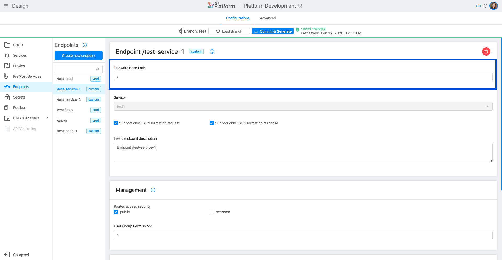

## Transition through Microservice Gateway   

Thanks to this feature, you can define, in each endpoint, which route is going to pass through Microservice Gateway.

To handle the transition from Microservice Gateway, you can use, in the section Endpoints of the area Design, the Microservice Gateway configuration card, which includes also two JSON checkboxes (request and response).. 

This card is equipped with a flag that, if you are enabled, allows to force the endpoint that you are editing to pass through the Microservice Gateway:

!!! Warning: If your project has the microservice-gateway disabled, the configuration of the transition through Microservice Gateway is skipped.
   
The microservice gateway service performs some checks on the content-type header:

* **Request**: If your endpoint uses content-type: *application/json* in requests, check      "Support only JSON format" on request, otherwise uncheck it. If this is unchecked, you won't be able to access the request body from decorators, if set.

* **Response**: If your endpoint uses content-type: *application/json* in response, check "Support only JSON format" on response, otherwise uncheck it. If this is unchecked, you won't be able to access the response body from the POST decorators, if set.

## Expose an API

To create an endpoint, select **Endpoints** and then **Create a new Endpoint**.

**Basepath**: is the prefix of the route. It can be set as the base address to which the API is served, relative to the host (name or ip) that supplies the endpoint. In our case, for example, we could insert "/books".

**Type**: The endpoint can be of different types:

* *Crud*: hook your endpoint directly to one of your collections.
* *Custom Microservices*: hook your endpoint to a service with logics entirely created by you.
* *External*: hook your endpoint to one of the external services registered in the services section.  
* *Cross-Projects* hook your endpoint to a cross-projects service

### CRUD

**Collection**: select the collection of which the endpoint is part. In our case "books"

**Description**: optional description of the endpoint

Then select *Create*.
At this point we have created our endpoint!

Now you can configure your endpoint by assigning permissions and changing security.
The parameters you can configure are the following:

#### Name of the Endpoint
**Default Status**: With Default State you can choose whether the elements in the Collection will be made public on the applications as soon as they will be created and will therefore have Public status or if they will instead have Draft status and must therefore be made public by the CMS before being published.

**Collection**: the collection of which the endpoint belongs is displayed.

**Description**: short optional description

#### Internal Rewrite URLs

For the CRUD Endpoint it's not possible to set an internal Rewrite.
The Internal Rewrite is / by default.

#### Manage the security of your endpoints
If the route is **public**, you do not need to be logged in to be able to call it. If it is not public and is called by an unregistered user, it returns 401.
If it is **secreted** to be able to call it you need to set the Secret header with the correct value (you can see the secret in the homonymous screen)

**Groups of users that can access them**: It is a logical expression to determine which groups have permission to call a given route. It can also be set to 0 (none) or to 1 (all). If the expression is true, then the user can access the route.

#### Routes
In this section you can view all the path that can be called of a CRUD endpoint. By selecting the different verbs in the management section it is possible to further detail on who has the permissions to do certain actions.

If **inherited** is active the field will inherit the behavior of the base endpoint, de-selecting it can set specific rules related to this route.

!!!example
     For example, we can set that the `DELETE/` can only be reserved for a specific group of users (admin).
     We must therefore choose not to inherit global settings. Then we de-select inherited and in the input we write: groups.admin
     

## Services

### Internal Rewrite URL

The developer can decide which basepath is associated to an endpoint by applying an internal rewrite url.

When a call enters the platform it undergoes a rewrite by the API gateway or the Microservice gateway and arrives at the service with a different path.

So for example in the case mentioned above when the API gateway enters the platform to call `/test-service-1` will call it with `/`

From this section, the user can configure his own custom rewrite and, if necessary, view the default platform.

For CRUD-type services, an internal rewrite cannot be set
