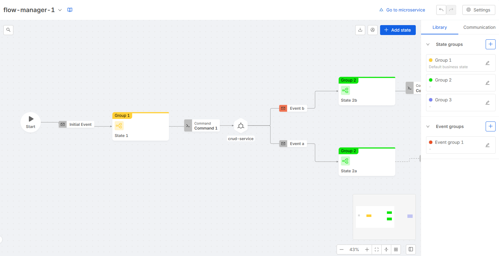
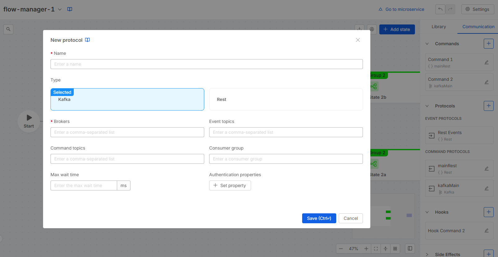
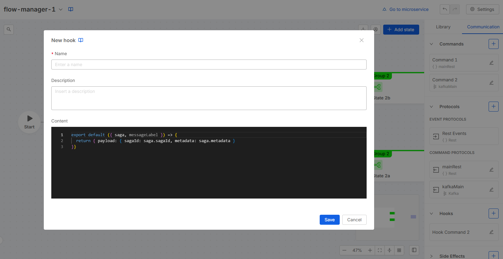
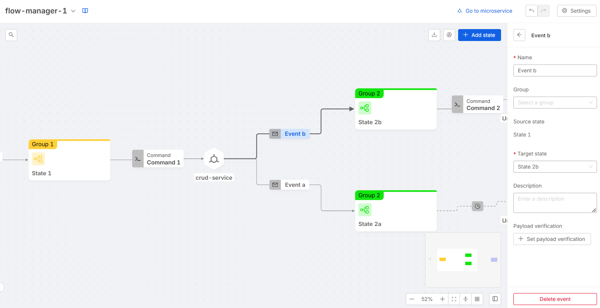

:::caution
Flow Manager Configurator is available from Console version **12.3.0**. For lower versions please refer to [Flow Manager Visualizer](/development_suite/api-console/api-design/flow-manager-visualizer.md) documentation.
:::

The following image represents what a user visualizes for a Flow Manager service linked to the Configurator.

In order to describe the functionalities of the tool let's split the interface in 3 main components:
- [Header](#header)
- [Canvas](#canvas)
- [Side Panel](#side-panel)

## Header

The header is always displayed on top of the Configurator, it provides the following features.

### Flow Selector

The flow selector component is placed on the left side of the header. It provides a dropdown menu which allows to switch from a Flow Manager service to another.

### Go to microservice

The *Go to microservice* button is placed on the right side of the header. It redirects the user to the Microservices section in Design Area, in particular to the linked Flow Manager microservice.

### History Buttons

The history buttons are placed on the right side of the header. They provide the standard history actions: *undo* and *redo*. The history is based on actions that result in configuration changes: the maximum supported length is 10 actions.

### Settings

The settings button is placed on the right side of the header. It provides a dropdown menu with the following options:
- Persistency Management
- Deep Merge (only for Flow Manager version >= `2.6.0`)
- Unlink microservice

#### Persistency Management

The persistency management modal allows to configure the persistency method used by the Flow Manager service. The displayed types depend on the Flow Manager version as described [here](/runtime_suite/flow-manager-service/changelog.md).

#### Deep Merge

The deep merge modal allows to configure the deep merge setting of the Flow Manager as described [here](/runtime_suite/flow-manager-service/30_configuration.md#settings).

:::info
This feature is available starting from Flow Manager version `2.6.0`.
:::

#### Unlink Microservice

The unlink microservice modal alerts the user before actually performing the [unlink process](/development_suite/api-console/api-design/flow-manager-configurator/overview.md#unlink).

## Canvas

The canvas component allows to actually visualize the configured flow: states are represented by nodes and events are represented by edges.

:::info
Events that link the same states are collapsed into a single edge.
:::

### Create Entities

New states can be created in the following ways:
- Click the *Add state* button placed on the top right corner of the canvas
- Double click on canvas empty space.

New events can be created in the following way:
- Drag and drop from the right handle of the source state to the left handle of the target state.

In addition, it is possible to create both a state and an event at the same time:
- Drag and drop from the right handle of the source state to an empty area of the canvas.

This will create a new state and a new event that link the source state to the new state.

### Edit Entities

Some properties of states and events can be edited directly on the canvas. In particular, both states and events position can be edited simply by dragging and dropping the entity into a new position.

Finally, states with no command offer a select to set a command.

### Control Buttons

Control buttons are placed in the top and bottom right corner of the canvas.

Button placed in the top right corner provide the following features:
- Download flow &rarr; exports an image representing the whole flow or the current view
- Highlight &rarr; enters the [highlight mode](#highlight-mode)
- Add state &rarr; creates a new state

Button placed in the bottom right corner provide the following features:
- Zoom out
- Zoom in
- Fit view &rarr; centers the flow and chooses the right zoom to visualize the entire flow
- Auto layout &rarr; auto computes and sets nodes and edge positions
- Toggle side panel visibility.

### Highlight Mode

The highlight mode allows the user to focus on a subset of states and events of the flow. The following rules are applied:
- Click on a turned off state &rarr; the state is highlighted
- Click on a turned off event (i.e. edge)
  - Case source and target states turned off &rarr; nothing is highlighted
  - Case source and target states highlighted &rarr; the event is highlighted
  - Case source state is highlighted &rarr; the event and every following state and event is highlighted up to the first bifurcation encountered
  - Case target state is highlighted &rarr; the event and every previous state and event is highlighted up to the first bifurcation encountered
- Click on an highlighted state &rarr; the state, its incoming events and every following state and event is turned off if they are not highlighted by another branch
- Click on an highlighted event &rarr; the event is turned off and every following state and event is turned off if they are not highlighted by another branch

## Side Panel

The side panel component is displayed on the right side of the Configurator, it can be collapsed using [a control button](#control-buttons) on the canvas.

The side panel can display many *scenarios* as described below.

### Library and Communication

This is the default scenario. This scenario is composed by 2 tabs: Library and Communication.

#### Library

This tab contains the State Groups and Event Groups recap. It allows to open the creation modal or the edit form for each of the entities above.

##### State Group

[State group](/runtime_suite/flow-manager-service/30_configuration.md#business-states-of-the-machine) creation modal can be opened clicking the *Plus* button placed in the [library](#library) scenario. A form placed in the side panel allows to edit or delete the selected state group.

##### Event Group

[Event group](/runtime_suite/flow-manager-service/30_configuration.md#business-events-of-the-machine) creation modal can be opened clicking the *Plus* button placed in the [library](#library) scenario. A form placed in the side panel allows to edit or delete the selected event group.

#### Communication

This tab contains the Commands, Protocols, Hooks and Side Effects recap. It allows to open the creation modal or the edit form for each of the entities above.

##### Command

[Command](/runtime_suite/flow-manager-service/30_configuration.md#states-of-the-machine) creation modal can be opened clicking the *Plus* button placed in the [communication](#communication) scenario. A wizard will help the creation process following these steps:
1. set a label and an optional description
2. set an optional hook (using an existing one or creating in place a new one)
3. set a communication protocol (using an existing one or creating in place a new one)

A form placed in the side panel allows to edit or delete the selected command. Moreover it allows to set a custom hook which is not registered in the hooks recap and thus cannot be reused elsewhere.

##### Protocol

[Protocol](/runtime_suite/flow-manager-service/30_configuration.md#communication-protocols) creation modal can be opened clicking the *Plus* button placed in the [communication](#communication) scenario. With Kafka type it is possible to create an event, command or duplex protocol; with REST type it is possible to create only command protocols.

A form placed in the side panel allows to edit or delete the selected protocol.

##### Hook

[Hook](/runtime_suite/flow-manager-service/30_configuration.md#command-hook) creation modal can be opened clicking the *Plus* button placed in the [communication](#communication) scenario. A form placed in the side panel allows to edit or delete the selected hook.

##### Side Effect

[Side effect](/runtime_suite/flow-manager-service/30_configuration.md#states-of-the-machine) creation modal can be opened clicking the *Plus* button placed in the [communication](#communication) scenario. A wizard will help the creation process following these steps:
1. set a label and an optional description
2. set an optional hook (using an existing one or creating in place a new one)
3. set a communication protocol (using an existing one or creating in place a new one)

A form placed in the side panel allows to edit or delete the selected side effect. Moreover it allows to set a custom hook which is not registered in the hooks recap and thus cannot be reused elsewhere.

### State

This form allows to edit or delete the selected [state](/runtime_suite/flow-manager-service/30_configuration.md#states-of-the-machine). It can be visualized selecting a state (i.e. a node) on the canvas.

:::info
The "Is final" toggle is automatically disabled and set to `false` when an outgoing event (targeting a different state) is created.
:::

### Initial Event

This form allows to edit or delete the [initial event](/runtime_suite/flow-manager-service/30_configuration.md#machine-definition). It can be visualized selecting the initial event on the canvas.

### Event

This form allows to edit or delete the selected [event](/runtime_suite/flow-manager-service/30_configuration.md#states-of-the-machine). It can be visualized selecting an event (i.e. an edge) on the canvas. In case the edge refers to multiple events, the scenario will display a collapsed form for each event.

