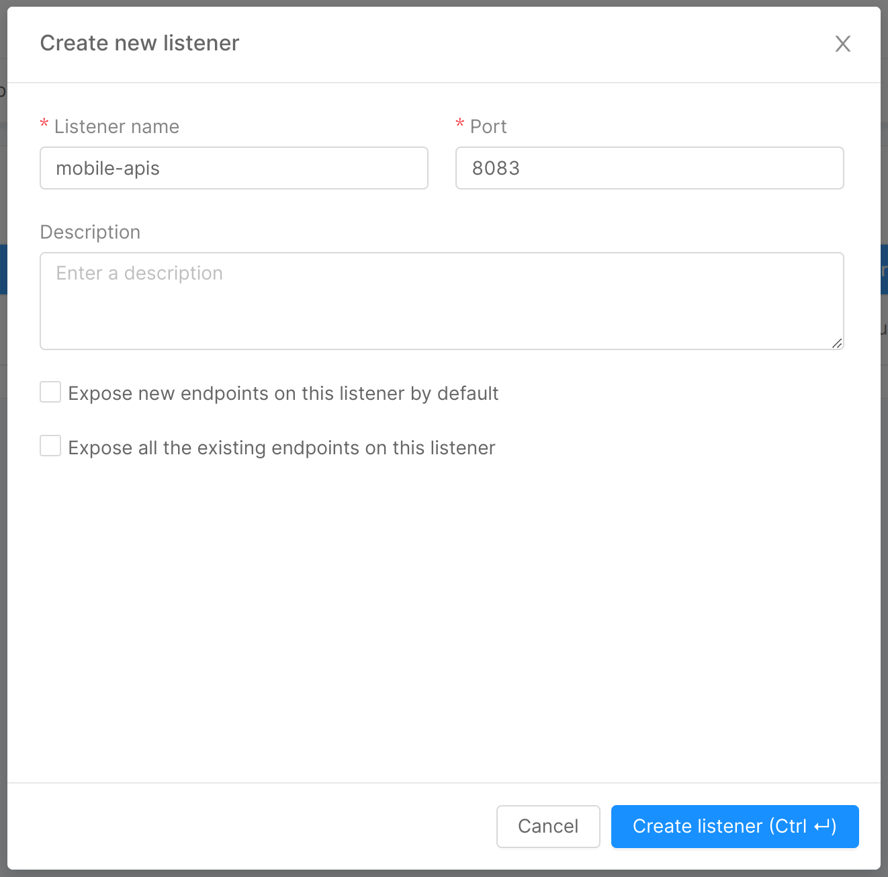

## What is a Listener

A Listener is a logical entity configured on your API Gateway that checks for incoming connection requests directed to your cluster.  
Each listener is mapped to a single port and defines rules to route incoming requests from external clients to a resource in your cluster, such as a specific microservice, exposed through endpoints.

This page describes the features of a Listener and how to configure these from the **Listeners** section of the [Design area](/development_suite/api-console/api-design/overview.md) of the Console.

:::info
Currently only Projects using configured with an [**Envoy API Gateway**](/runtime_suite/envoy-api-gateway/overview.md) can access the Listeners feature.
:::

## Create a Listener

Follow these three steps in order to create a new Listener and make an Endpoint reachable from outside the Console:
- Create the new Listener resource
- Expose the Endpoint on the Listener
- Configure the [Kubernetes Ingress Controller](https://kubernetes.io/docs/concepts/services-networking/ingress-controllers/) to make the new exposed port reachable

### Defining the Listener 

To create a new listener, just click the **Add Listener** button and specify its `name` and `port`. Both fields must be unique in the Project. 

Optionally, during listener creation, you can define whether to:
- **select the listener** by default when creating a new endpoint
- **expose all existing endpoints** on that listener

Creating a new Listener means opening the relative container port on the API Gateway too. This step is automated and in fact you can find the new port under the Container Ports section of the API Gateway.  

:::caution
Container Ports associated to Listeners cannot be deleted. To delete them firstly delete the Listener and then you can delete the port.
:::

<!-- TODO: update image with disabled buttons -->

### Exposing an Endpoint on the Listener

Once the new Listener has been created, it can be selected from the [Listener Settings section](/development_suite/api-console/api-design/endpoints.md#listeners) within the Endpoint detail page of the project.

### Configure the Kubernetes Ingress Controller

In order to receive incoming requests from the newly exposed API Gateway port, it is required to configure the [Kubernetes Ingress Controller](https://kubernetes.io/docs/concepts/services-networking/ingress-controllers/) to make the exposed port reachable.  

:::info
For example, if your Kubernetes cluster is configured to use [Traefik](https://doc.traefik.io/traefik/providers/kubernetes-ingress/) as Ingress Controller provider, you may need to define a new [IngressRoute](https://doc.traefik.io/traefik/providers/kubernetes-crd/).

For more details on configuring a new IngressRoute, please refer to [this guide](/paas/traefik#expose-an-endpoint).
:::

## Edit a Listener

From the **Listeners** section of the [Design area](/development_suite/api-console/api-design/overview.md) of the Console it is possible to update settings of a Listener.

Changes made to the port of the Listener will be reflected on the Container Ports of the API Gateway too.  
This means that changing the port of a Listener will also enable the relative port on the API Gateway. The old port of the API Gateway stays enabled and it is up to the user to disable it if needed. 

## Delete a Listener

To delete a listener just click on the delete action.

:::warning
Be aware that Endpoints that are **only exposed by** the Listener you are deleting, will be deleted as well.
:::

