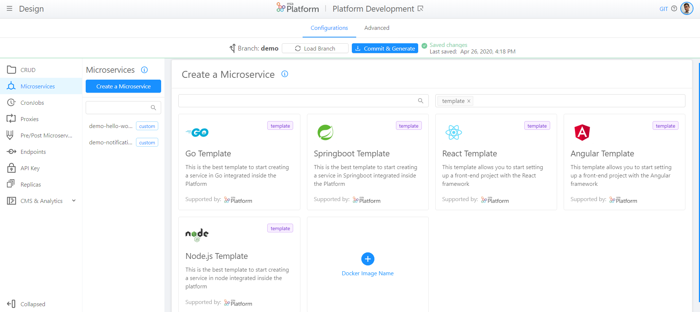
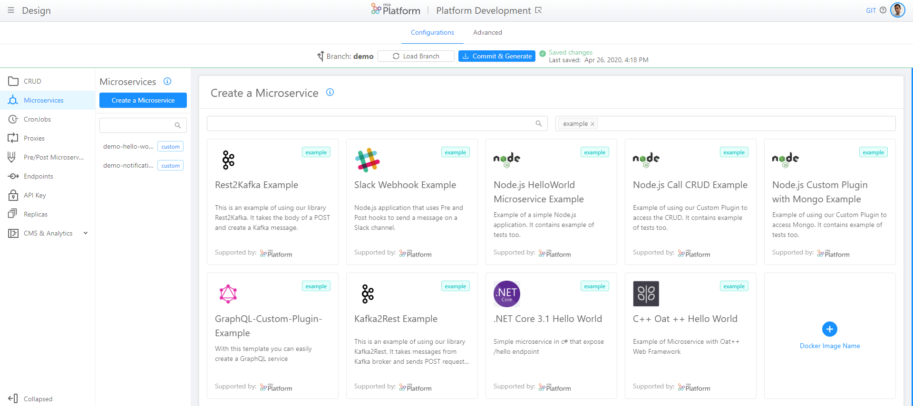

## Introduction

In this section you can learn more about the Marketplace section of Mia-Platform DevOps Console. 

To access to Marketplace, you have to access the Design area, click on Microservices on the menu of the left sidebar and push 'Create a Microservice'.

In the Marketplace you can see displayed a set of cards, representing Examples and Templates powered and supported by Mia Platform to set-up microservices with a predefined and tested function:

* **Template**: provides you a starting point or a base code from which you can start to create a new Microservice. Templates are characterized by a purple label on the top right corner of the card in the Marketplace: Template .

* **Example**: provides you an use-case of a particular application: in other words, with Examples you can use an existing and ready-to-use model to create your microservice. Examples are characterized by a blue label on the top right corner of the card in the Marketplace: Example .

!!! info

    The last card in the Marketplace allows you to create a microservice from Docker Image: you can import on DevOps Console a microservice.

At the top of Marketplace section there is a search bar, where you can look for a specific Microservice, and a filter bar, where you can filter per type (either Example or Template). 

## Templates and Examples typologies

Mia-Platform offers and supports the following list of existing and ready-to-use *Examples*:

  * **Slack Notification Example**: This is a simple Node.js application that shows you how to create Hooks with Mia Platform Custom Plugin library. It contains example of tests too. [Here](https://github.com/mia-platform-marketplace/Node.js-PrePost-Microservice-Example/blob/master/README.md) you can learn more about Node.js PrePost Example.

  * **Node.js HelloWorld Microservice Example**: Example that expose a route and reply with an HelloWorld json: it allows you to see how Node.js microservice and tests are done. [Here](https://github.com/mia-platform-marketplace/Node.js-Hello-World-Microservice-Example/blob/master/README.md) you can learn more about Node.js HelloWorld Microservice Example.

  * **Node.js Call CRUD Example**: Example of a Node.js microservice which enables to use Mia Platform Custom Plugin to access the CRUD. [Here](https://github.com/mia-platform-marketplace/Node.js-Call-CRUD-Example/blob/master/README.md) you can learn more about Node.js Call CRUD Example. 

  * **Node.js Custom Plugin with Mongo Example**: Example of using Mia Platform Custom Plugin and queries to access MongoDB: in other words, it shows how to integrate Mia Platform Custom Plugin to Mongo. [Here](https://github.com/mia-platform-marketplace/Node.js-Custom-Plugin-Mongo-Example/blob/master/README.md) you can learn more about Node.js Custom Plugin with Mongo Example. 

  * **GraphQL Custom Plugin Example**: With this Example you can easily create a GraphQL service: you can easily integrate GraphQL in a Node microservice. [Here](https://github.com/mia-platform-marketplace/GraphQL-Custom-Plugin-Example/blob/master/README.md) you can learn more about GraphQL Custom Plugin Example. 

  * **Kafka2Rest Example**: It takes messages from Kafka broker and sends POST request after filtering and processing the messages. This is an Example that helps you to use Kafka2Rest library.

  * **Rest2Kafka Example**: It takes the body of a POST and create a Kafka starting from REST messages. This is an Example that helps you to use Rest2Kafka library.

  * **C++ Oat ++ Hello World Example**: Example that shows how to use the Oat ++ library to set-up a backend. [Here](https://github.com/mia-platform-marketplace/cpp-oatpp-hello-world-microservice-example/blob/master/README.md) you can learn more about C++ Oat ++ Hello World Example. 

  * **.NET Core 3.1 Hello World Example**: This is a simple .NET microservice. [Here](https://github.com/mia-platform-marketplace/DotNet-Hello-World-Microservice-Example/blob/master/README.md) you can learn more about .NET Core 3.1 Hello World Example. 

Marketplace allows also to use the following *Templates*, supported by Mia Platform, to set-up microservices:

 * **Go Template**: Model that allows to create a backend microservice in Go, integrated inside the Platform. [Here](https://github.com/mia-platform-marketplace/Go-Template/blob/master/README.md) you can learn more about Go Template. 

 * **Springboot Template**: Best Template, that uses Mia Platform Custom Plugin library, to start creating a Java microservice, which use Springboot as framework, integrated inside the Platform. [Here](https://github.com/mia-platform-marketplace/SpringBoot-Custom-Plugin-Template/blob/master/README.md) you can learn more about Springboot Template. 

 * **React Template**: This Template provides you the base code to start setting up a front-end project with the React framework. It already contains Redux and Axios libraries. [Here](https://github.com/mia-platform-marketplace/React-App-Template/blob/master/README.md) you can learn more about React Template. 

 * **Angular Template**: Enables to start setting up a front-end project with the Angular framework. [Here](https://github.com/mia-platform-marketplace/Angular-App-Template/blob/master/README.md) you can learn more about Angular Template. 

 * **Node.js Template**: Best template, that uses Mia Platform Custom Plugin library, to start creating a service in Node, integrated inside the Platform. [Here](https://github.com/mia-platform-marketplace/Node.js-Custom-Plugin-Template/blob/master/README.md) you can learn more about Node.js Template. 
