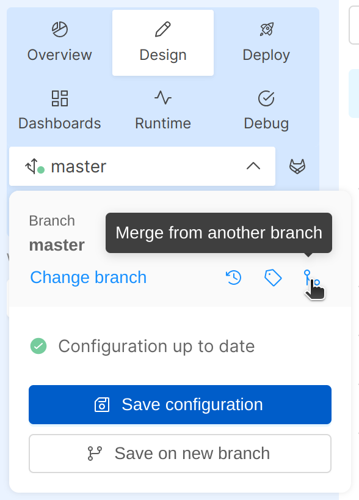

:::caution
This is a **BETA** feature and, as such, is currently under **active development**.

Always pay close attention to the changes you apply to the configuration files!
:::

Within the project, different users can concurrently work on the same branch while having visibility if someone else has made changes to the configuration.
As a matter of fact, from the Design area, and specifically through the branch action popover, it will be possible to:

- Have visibility if other users have committed new changes to the configuration of the branch you are also working on
- Be aligned to the latest changes remotely committed by starting a merge flow that will allow you to identify diffs between compared configurations and to resolve changes/conflicts
- Align the configurations of two different branches within the same project
- Have visibility of all the configuration changes made locally before committing them

Therefore, in case of a new commit available, the user can decide whether to start a merge configurations process or to save its local changes on a new branch.  

  
 

  

:::note
If you want to **save on the same branch** you must perform the merge; otherwise you'll have to discard your changes, pull the new configuration and manually apply your changes again. 
:::

## Differences between Pull and Merge

Once there is a new available commit from remote, the action popover will display two different options, Merge or Pull, based on whether you have already performed some changes or not in your local configuration.

If no local changes have been made yet, you can click on the Pull action from the action popover that will simply download the updated configuration, in order to allow you to start working on it.

  
 

  

Conversely, if you have already performed some changes, a merge modal will be opened when clicking on the Merge configuration button. This will let you start the merge process between your changes and the remote changes that another user has just saved.

  
 

  

## How to perform a Merge of configurations

In order to perform the merge, press on the _Merge Configuration_ button: this will open a modal where the different parts of the configuration are shown; each configuration part will open up two editors displaying the remote configuration saved by someone else (on the left) and your local configuration (on the right).

From the sidebar on the left, you can navigate through different sections showing different parts of your project configuration.
The items shown in the sidebar follow the grouping order used within the Design area sidebar. (For example, the user can easily identify on top the Endpoints section, moving on to the Workload section within which there are the microservices configurations, and arriving at the MongoDB CRUD section to view its collections).

Sections wherein there are changes changes, are marked with a warning so that you can review them with ease.

Entering one of them, to resolve a diff, you can:
- edit the local configuration on the right-hand editor (the left-hand editor is read-only)
- via the small arrows located between the two editors identifiable by the image above, either apply the one on the left into the editor on the right or approve your local changes by moving them to the editor on left.

  
 

  

In every section, navigate from one change to the following/previous one thanks to the related navigation buttons. If there are no changes in the current section the navigation buttons will be disabled.

When you are satisfied with your merge simply press the _Confirm Merge_ button.

:::caution
When the merge is confirmed, the content from the editor on the _right_ is taken as correct configuration and injected into your local configuration.

Please note that **you'll have to approve all changes coming from the remote configuration**, otherwise you may lose some changes.
:::

After the merge process is completed with success, press the _Continue Editing_ button in the feedback modal

  
 

  

## Merge from another branch

As an alternative to the merging process already described above, it is also possible to merge your actual configuration not only with the different remote configuration within the same branch, but also with other different branches. 

In order to perform this action, you have to click on the "Merge from another branch" icon inside the action popover: at this point, a list of all the other different available branches will appear and from this list you can choose the branch with which you want to merge your actual branch.

This will open a modal where the two different branches are shown; each branch will open up two editors displaying the other branch you have chosen (on the left) and your actual branch (on the right). Subsequently, from this modal, you can manage diffs and then confirm your merge in the same way as described above.

  
 

  

