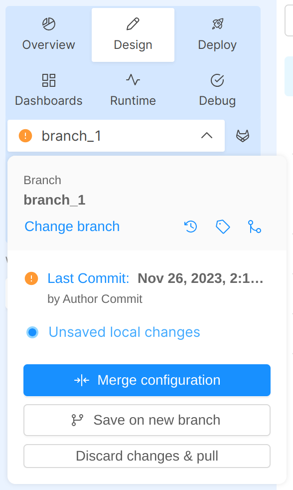

:::caution
This is a **BETA** feature and, as such, is currently under **active development**.

Always pay close attention to the changes you apply to the configuration files!
:::

When multiple people collaborate on the same configuration branch within a Project, they will be notified whenever another user has saved the configuration before them.

The branch action popover will present the information of the new commit available, allowing the user to decide whether to merge the configurations together or to save its configuration on a new branch.  

  
 

  

:::note
If you want to **save on the same branch** you must perform the merge; otherwise you'll have to discard your changes, pull the new configuration and manually apply your changes again. 
:::

## Differences between Pull and Merge

Once there is a new available commit from remote, the action popover will display two different options, Merge or Pull, based on whether you have already performed some changes or not in your local configuration.

If you haven't performed any changes yet, you can click on the Pull action from the action popover and it will simply download the updated configuration, in order for you to start working on it; conversely, if you do have already performed some changes, by clicking on the Merge action it will open the Merge modal and let you start the merge between your changes and the remote changes someone just saved.

## How to perform a Merge between configurations

In order to perform the merge, press on the _Merge Configuration_ button: this will open a modal where the different parts of the configuration are shown; each configuration part will open up two editors displaying the remote configuration saved by someone else (on the left) and your local configuration (on the right).

Use the sidebar to navigate between the different sections and the editor to resolve the changes, either by applying the one on the left into the editor on the right, or by approving your changes and moving them to the editor on left.  
Sections where there are changes are marked with a warning so that you can review them with ease.

  
 

  

In every section, navigate from one change to the following/previous one thanks to the related navigation buttons. If there are no changes in the current section the navigation buttons will be disabled.

When you are satisfied with your merge simply press the _Confirm Merge_ button.

:::caution
When the merge is confirmed, the content from the editor on the _right_ is taken as correct configuration and injected into your local configuration.

Please note that **you'll have to approve all changes coming from the remote configuration**, otherwise you may lose some changes.
:::

After the merge process is completed with success, press the _Continue Editing_ button in the feedback modal

  
 

  

## Merge from another branch

As an alternative to the merging process already described above, it is also possible to merge your actual configuration not only with the different remote configuration within the same branch, but also with other different branches. 

In order to perform this action, you have to click on the "Merge from another branch" icon inside the action popover: at this point, a list of all the other different available branches will appear and from this list you can choose the branch with which you want to merge your actual branch.

This will open a modal where the two different branches are shown; each branch will open up two editors displaying the other branch you have chosen (on the left) and your actual branch (on the right). Subsequently, from this modal, you can manage diffs and then confirm your merge in the same way as described above.

