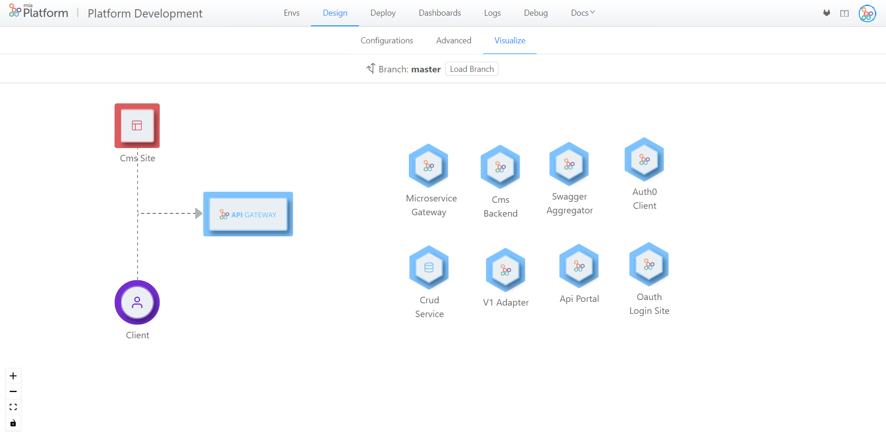
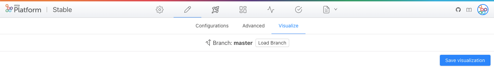

## What is Mia-Craft

Mia-Craft is a visualization tool accessible from the Design section of the console by clicking on the tab Visualize.
The aim of Mia-Craft is to help the user to obtain a graphical overview of the project architecture starting from his project's configuration and also to replicate the conceptual flow adopted during the design of the project’s configuration via the functionalities explained in the next section.

From the project configuration, Mia-Craft creates the starting visualization where the microservices are shown without connections between them except for the connection between the Client and the API Gateway (if present) and the connection between the CMS Site and the API Gateway (if both of them present in the configuration file). An example is in the following picture.

All the icons shown correspond to a specific type of microservice except for the “Client”:

| Icon      | Description |
| :-----------: | ----------- |
|       | CMS  Site     |
|       |  API Gateway       |
|     | CRUD       |
|      | Microservices which type is “core”       |
|      |  Microservices which type is “custom”       |
|      |  Client       |

## Main functionalities

The user can replicate the conceptual flow adopted during the design of the project’s configuration, by pointing out how services in the architecture communicate with each other and by changing the position of the services inside the namespace of Mia-Craft. This can be achieved via the functionalities explained in the next parts.

### Draggable microservices

The microservices, represented by their icon, can be dragged by doing a left click on them and then dragging them in the allowed area.

### Add connections between microservices

The creation of the arrow have to be between a microservice that is the source and a microservice that is the target. In order to create it, you have to go close on the icon of the first microservice (the source) and then a gray area will be shown. Subsequently, you have to do a left click and drag outside the gray area and you are going to see a line attached to your cursor that starts from the center of your microservice. Then you have to bring this line on the gray area of the target microservice. After doing this operation a new edge will appear between the two microservices.

### Delete a connection between microservices

The arrows created between the microservices can be deleted via the context menu that can be seen simply by doing a right click on the arrow that should be deleted.

:::note 
If present, the connection between the API Gateway and the Client cannot be removed
:::

### Save the visualization created

The visualization created by the user can be saved and retrieved the next time that the user access this area. This can be done via the 'Save visualization' button on the top right of the window. The new visualization is saved in the project git repository in the file 'mia-craft-config.json'.

