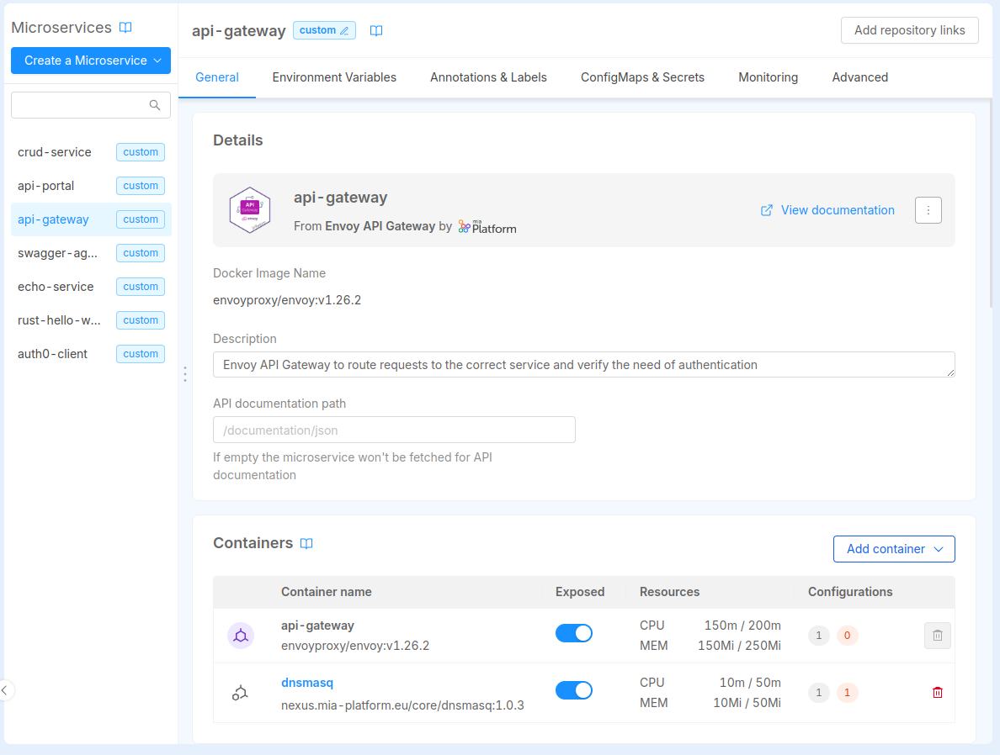
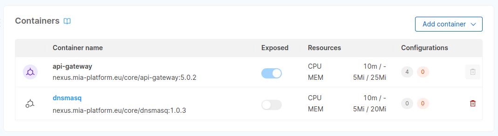

# Microservice Containers

A microservice in Console is a collection of one or more containers that solve a single yet well defined business scope. 

In general microservices define a single docker image and thus a single **main container**.

Sometimes tough, it may be useful to run another container alongside the main container to add some capabilities. Usually these kind of containers are used to avoid cluttering the main service with helper code. These containers are known as **sidecar containers**.

## Main Container

When creating a new microservice in Console, you can define a single docker image that will be used for the **main container** of your microservice. This container should contain the core business feature of the microservice itself. 

## Sidecar Containers

For several reasons although, you may want to extend the main container functionalities **without modifying** the business logic of your application.

To better understand this need, let's imagine this common scenario.  
You have a core microservice that processes user orders. This microservice is responsible for validating the order, calculating the total amount, and then sending it to the fulfillment center.

However, you now have a new requirement: adding a logging functionality to your microservice to monitor every order that is being processed.  
You could simply add the logging code to the core service source code, but sometimes this option is not viable, to name a few reasons:
- the service may be maintained by another team
- modifying the legacy core service may introduce errors

For these reasons the sidecar-pattern comes very handy. You can develop a lightweight service that specializes in logging requests to the main application and store these logs in a centralized logging system.  
You can then deploy this logging service along with the main application on the same host. This ensures that the sidecar and main service containers are always running on the same machine.

In this section we will go deeper in how you can manage this kind of containers for your microservices.

## Microservice detail page

The containers table in the microservice detail page gives an immediate overview of all the containers that your microservice is made of, indicating which is the **main container** and which is the **sidecar** one.

The table shows a summary of the containers resource request and limits for CPU and memory as well as which configmaps and secrets are used by which container. From here is also possible to add and delete sidecars to the current microservice.

### Exposing a specific container

:::info
Exposing a container means making it reachable from other workloads inside the same Project environment.

By default all the containers that specify a container port are exposed by the Console if no other changes are made.
:::

From the containers table you can decide whether to expose all your service containers or toggle only the ones you want to expose. In the example below, only the **main container** is configured to be exposed.

### Sidecar detail

Clicking on the sidecar name in the table, you enter the sidecar configuration page.  From this page you can inspect and update the configuration as well as adding configMaps, secrets, update the docker image and all the other settings, the same way as you can edit a microservice configuration.

:::info
The main container and other [special sidecar containers](#special-sidecars) cannot be removed nor modified from this section. These containers are directly managed from other sections of the Console. Read below for more.
:::

In this example you can see the same sections that are present in the microservice detail too. To correctly configure these sections check out the relative documentation:

- [General](/docs/development_suite/api-console/api-design/services#manage-microservices)
- [Environment Variables](/docs/development_suite/api-console/api-design/services##environment-variable-configuration)
- [ConfigMaps & Secrets](/docs/development_suite/api-console/api-design/services#custom-configuration)
- **Advanced:** from this section you can delete the sidecar from the currently selected service

### Special sidecars

Some sidecar configurations cannot be directly modified like other sidecars and services. These special sidecars that are marked with a different icon and can be managed from other sections of the Console.  
This is the case of [`rbac-service` sidecar](#rbac-service-sidecar): a special sidecar that can be configured from the [Authorization section](/docs/development_suite/api-console/api-design/authorization).

#### `rbac-service` sidecar

If you enabled [Rönd](https://rond-authz.io/) on your microservice, you can find the `rbac-service` container in you microservice containers table and in the [Sidecars management section](/docs/console/design-your-projects/manage-sidecars) as well. This is a special sidecar and thus its configuration can be managed from the [Authorization page](/docs/development_suite/api-console/api-design/authorization).

:::info
When Rönd is enabled on a microservice, the only container that can be exposed on a port is `rbac-service`. All other containers present in the microservice, including the main container, will remain unexposed by default. In the microservice containers table, the exposure switch will be turned off and disabled.
:::

