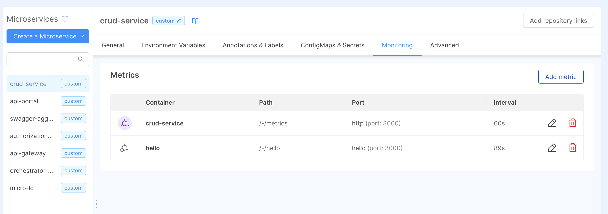

To foster application observability you can set up metrics gathering configuration for your desired monitoring system.

:::tip
Find out more about supported monitoring systems and how to [configure them in the Project Settings](/console/project-configuration/project-settings.md#runtime)!
:::

:::info
If no Monitoring system is configured for your Project you will not be able to set up any metric: head to the [the Project Settings](/console/project-configuration/project-settings.md#runtime)
or ask your Project Administrator in order to activate the feature!
:::

## Configure metrics gathering

Once the Runtime Monitoring system is configured for your Project, you will be able to define scraping rules for each of your microservices container.

In the Design section, each microservice features the Monitoring tab where you can view, update, or delete your metrics scraping endpoint.

For each container you can specify multiple metrics endpoints, defined by the following fields:

* **Path**: The path that should be contacted to gather your service metrics.
* **Port**: The port (e.g., `80` or `http`) exposed by your service.
* **Scraping Interval**: the interval at which metrics should be scraped defined in seconds (e.g. 60s).

