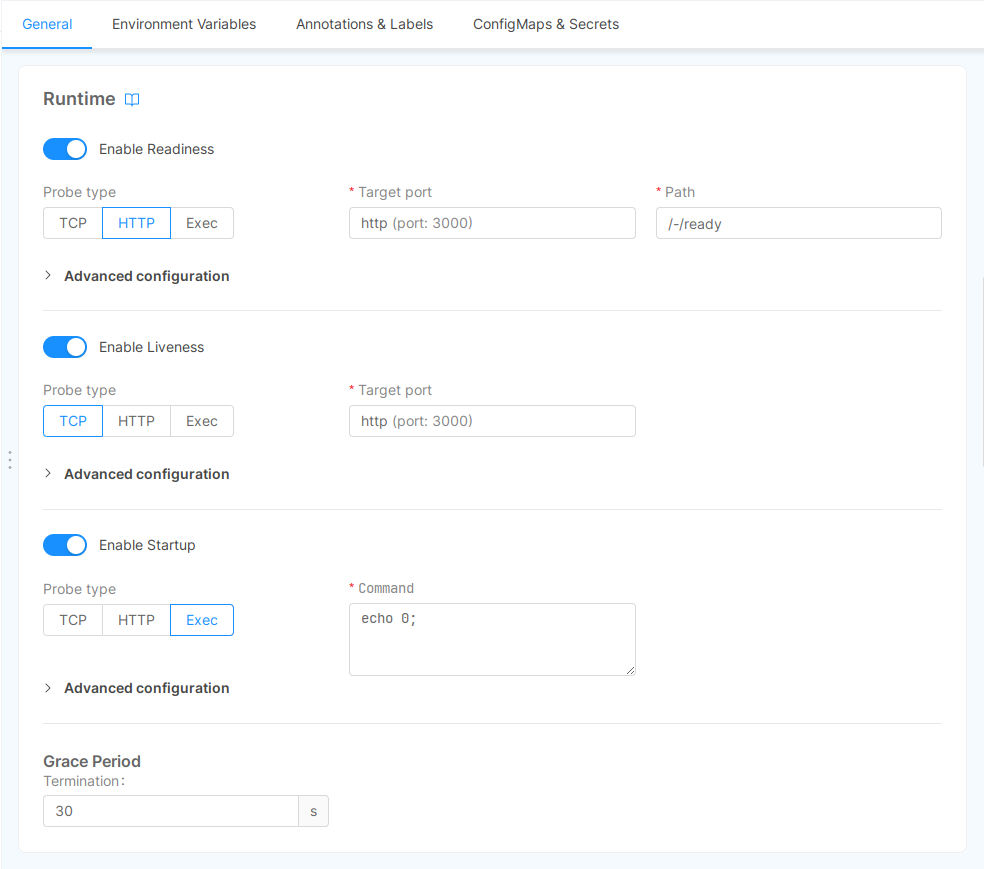

In the Runtime card, you can configure Readiness and Liveness probes, and the Termination Grace Period.

### Probes

In this section it is possible configure the following fields:

- Path
- Initial delay seconds
- Period seconds
- Timeout seconds
- Success threshold
- Failure threshold

#### Path

For Readiness field default is `/-/ready/`.
For Liveness field default is `/-/healthz/`.  
If you leave these fields empty, there will be a tcp socket on the provided microservice port.

If your probes are available on a different path you can customize them to specify the proper route to be used to access the HTTP server.

#### Port

The port used by the probes is the one specified by the environment variable `HTTP_PORT`, so make sure to define that variable even if your service does not use it.

#### Initial delay seconds

Use this value to specify the number of seconds that need to pass after the container has started before the probe is invoked for the first time.

#### Period seconds

This value controls how often the probe needs to be invoked (Kubernetes default is 10 seconds, minimum value is 1).

#### Timeout seconds

This value controls the probe timeout in seconds (Kubernetes default is 1 second, minimum value is 1).

#### Success threshold

This value controls the minimum consecutive successes for the probe to be considered successful (Kubernetes default value is 1, minimum value is 1).

:::warning
For livenessProbe this parameter has a fixed value of 1
:::

#### Failure threshold

This value controls the minimum consecutive failures for the probe to be considered failed after having succeeded. (Kubernetes default value is 3, minimum value is 1).

To learn more about probes, please visit the [Kubernetes official API documentation](https://kubernetes.io/docs/reference/generated/kubernetes-api/v1.19/#probe-v1-core).

### Termination Grace Period

When a Pod needs to be destroyed Kubernetes allow the definition of a grace period to wait before the Pod gets forcibly killed.

Technically it's the time that Kubernetes waits between sending a `SIG_TERM` and a `SIG_KILL`. Kubernetes default value is 30s.

This parameter can be configured by user into this Runtime card.
