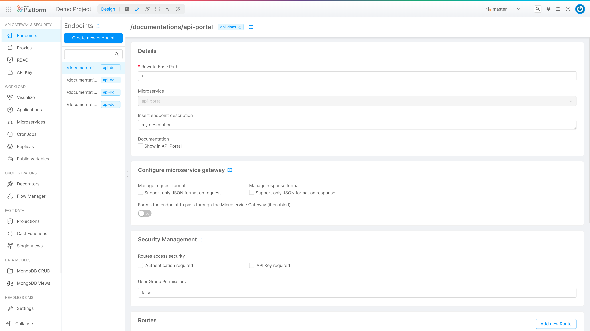
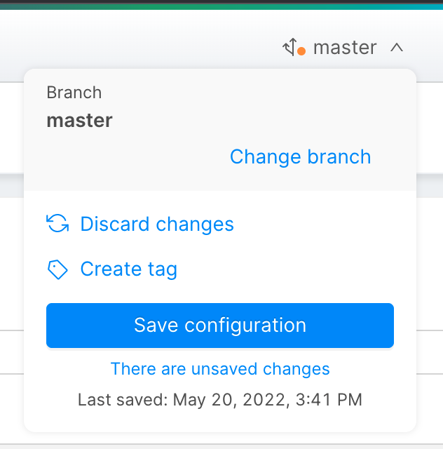
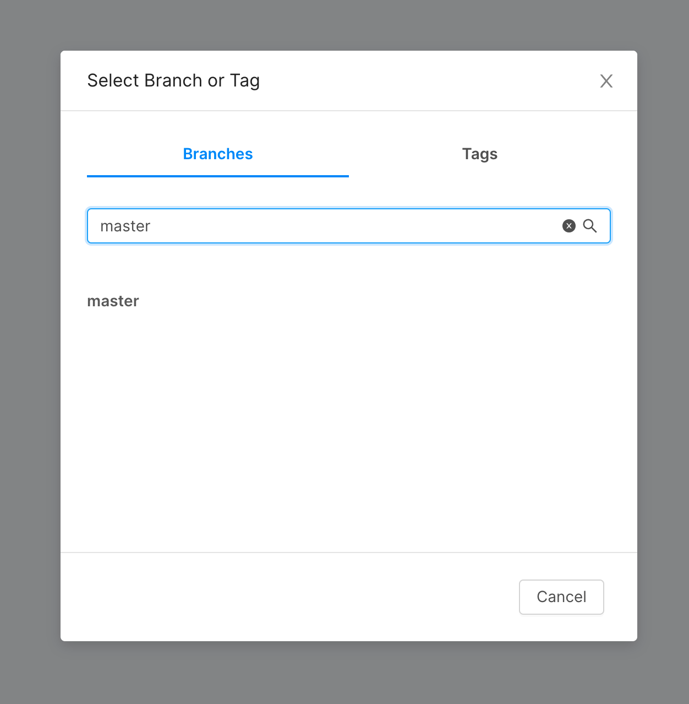

The Design section allows you to modify the configuration and architecture of your project by customizing the use of various resources such as CRUD, Microservices, Endpoints and much more.

Using the sidebar it is possible to navigate between the different sections of the Console, and design your project as you prefer.

## Manage your configuration

Mia-Platform Console allows you to manage the configuration of your project using Git branches or tags.  
Branches represent independent lines of development that can be originated starting from any commit. They are used to develop and test different configurations, as changes to one branch do not cause any changes to others, and any branch can be deployed.  

Tags are ref that point to specific commit in the Git history. Tagging is generally used to capture a point in history that is used for a specific release version. A tag is like a branch that doesn't change. Unlike branches, tags, after being created, have no further history of commits.

In the Design Area, you can use the top-right corner to switch to a specific branch or tag, create a new branch from an existing branch, create a new tag or save your work.

:::caution
Since tags should not change after being created, it is not possible to save changes made on a tag. Instead you have to create a new branch starting from the tag itself.
:::

### Branch status

The little circle on the branch icon helps you understand whether there is any unsaved change; the circle color has a specific meaning as follows:

- Green: everything you have done in the Design Area has already been saved and there is no pending change to be saved;
- Orange: there are some unsaved changes that need to be committed on your branch. Until you do such thing, if you leave the Design area or reload the page, you will lose your work;
- Red: there has been a problem while processing your configuration. You may need to reload the page or contact your Project Administrator.

### How to load a branch or tag

In order to switch to another branch or tag, you just need to click on its name to open the Load area. There you can select the new branch or tag to be loaded..

### How to save your configuration

Once the respective desired changes have been made, using the "Save Configuration" button in the branch action popover and fill the save configuration modal form.
